# Dr. Andrew Koutnik Ph.D.部落格選譯《單元3：第一型糖尿病患者如何正常化血糖值》

Dr. Andrew Koutnik Ph.D.（安德魯·庫特尼克博士）是位身兼生理學研究人員、且同樣是以Dr. Bernstein的《Dr. Bernstein's Diabetes Solution》（《伯恩斯坦醫師的糖尿病治療方法》）為藍本再加以改善並發展自己治療方法的第一型糖尿病患者。在他的個人網站中（<https://andrewkoutnik.com/>）不僅詳細說明了糖尿病的運作機制、許多實際操作的細節以及各項治療藥物的特性與整理圖表，更重要的是他還列出了完整的文獻資料供讀者一一查閱與深入研究，除了可讓人直接按圖索驥、針對有疑義之處進行第一手資料的閱讀之外，他對糖尿病（尤其是第一型）深入淺出的觀念整合與治療方法的清晰條例，對許多長期以來的錯誤醫學知識做出了簡單明確的指示與釐清，而這些知識觀念對當前以ADA為治療方法的這個醫療大環境下的糖尿病患者而言，是如清澈泉水亦如驚破警鐘；他也以過來人的身分不吝分享自己的治療狀況與成果，給人以最真實的數據表現乃至精神支持。  

Dr. Koutnik的這三篇部落格文章  

* <https://andrewkoutnik.com/part-1-what-is-type-1-diabetes/>  
* <https://andrewkoutnik.com/part-2-the-risks-and-complications-of-t1d-and-current-management-tools/>  
* <https://andrewkoutnik.com/part-3-can-you-achieve-optimal-blood-glucose-control-as-a-type-1-diabetic-2/>  

為譯者於數年前在網上看到，深覺於疾病治療上助益甚大，但因事繁雜，無時間多做整理。近期在推特上和作者本人有短暫互動並提及翻譯之事，乃陸續將文章譯出。作者亦有油管（<https://www.youtube.com/channel/UCuBoAR4gzVC5Y0e5raQLPkQ>），行有餘力者不妨表達一下支持之意。  

林詠盛(Louis)譯, louisophie@gmail.com  

* <https://x.com/louisophie_/articles>  
* <https://www.blogger.com/profile/17529498359072421715>（內分泌相關文章及選譯、Short Essays on Anything Sensible）  
* <https://louisophie.wordpress.com>  
* <https://github.com/louisophie/withinretreat/blob/main/Article-list.txt>  

#糖尿病治療 #飲食科學 #糖尿病 #中文翻譯 #diabetes #dietary #translation #RichardKBernstein #AndrewKoutnik #內分泌相關文章及選譯

---

*這三篇文章是在2018年9月時開始陸續寫出並發表的，因此裏頭可能會有許多觀點及數據會因新的文獻及相關知識的出現而需要更新，所以請讀者務必要隨時注意相關資訊並做出適當的調整。*

# 單元3：第一型糖尿病患者如何正常化血糖值
我從小就有體重方面的問題，因此我在各種的掙扎努力下積極地學習有關營養及運動方面的知識、且同時也培養了對它們的終生熱情，我的體重也成功地從114公斤減至約79公斤；有了這些知識上的積累，也讓我在被診斷出有第一型糖尿病時有了極大的承受能力。**我們知道第一型糖尿病若控制不良就會有各式的急性狀況及長期併發症（見單元2），而為了控制血糖並避免極端的波動，每天乃至每小時的飲食及藥物（胰島素）的調配與使用就變得相當重要。在單元2中所介紹的各種現有療法都沒有辦法能夠正常化血糖值，這就表示身為第一型的患者就必須去尋找其它的治療方法、而非盲目地接受這些東西。**  

其實上，只要我們對營養、運動、生活方式以及胰島素敏感度等重要生理機制有深入的了解，就能夠將疾病給控制好、並把各種急性與長期的症狀給減至最輕，而非遵從院方給的只能避免急性情況（譯注：如低血糖）之極有限的衛教資料，因為這些淺薄的醫學知識根本無法把血糖給控制好。  

本小節會聚焦在飲食這個治療關鍵，並討論兩種截然不同的飲食治療内容：常見的標準飲食指南與極低碳水化合物飲食，包括：  

1. 為何醫療院所會叫第一型糖尿病患者吃標準高碳水化合物飲食？
2. 飲食中的主要養分是如何影響一般人及第一型患者的血糖？
3. 內源性與外源性胰島素在飲食代謝上的作用有何不同？
4. 極低碳水化合物飲食在人體葡萄糖代謝與胰島素需求的影響。
5. 我自己上述兩種飲食的經驗分享。
6. 第一型糖尿病患者的極低碳水化合物飲食相關研究。
7. 其它資源。

## 標準高碳水化合物飲食
儘管目前對於第一型患者的飲食建議已著重在個人特製化的營養攝取（Franz, Boucher, & Evert, 2014），但實際上在病人罹病初期，絕大多數仍被院方要求吃既定的東西：高碳水化合物、適量蛋白質、低脂質的飲食（Franz et al., 2014; Franz et al., 2010; Oza-Frank, Cheng, Narayan, & Gregg, 2009），也就是一般所熟知的標準飲食指南（American Diabetes, 2018b; Health, 2011; USDA, 2018a）：  

**一天3餐**  

* 每餐60\~75克的碳水化合物
* 低升糖碳水為主
* 每餐都要有蛋白質以維持血糖值
* 少脂
* 有需要時每天可吃2次零食
  * 少至適量的水果，如蘋果、半根香蕉、橘子等等。

**雖然這種高碳水、適量蛋白質、低脂質的飲食是第一型患者在罹病時最常被要求的治療建議，但迄今並無任何臨床試驗能夠證實它對血糖控制有任何正面的幫助，因此我們不禁要問：為何這種飲食方法會被拿來治療第一型糖尿病患者呢？**  

### 三大原因
1. **此大多數人的飲食範本**：對於一般人而言，高碳水、低脂肪的攝取常被視為「標準飲食」（American Diabetes, 2018b; Health, 2011; USDA, 2018a）、且被各醫療群體的多數人視為「健康」首選（儘管這並非共識；Feinman et al., 2015），因此它也被推薦給第一型患者作為飲食上的要求標準；且目前尚未有足夠多可以統一訂製專一飲食的臨床試驗證據，造成多數醫師不願意採取其它種類的飲食給病人以免自找麻煩。更不用說醫師不一定有相關的營養專業及人體代謝的知識，因此難以有效指導患者從事非傳統的飲食治療。

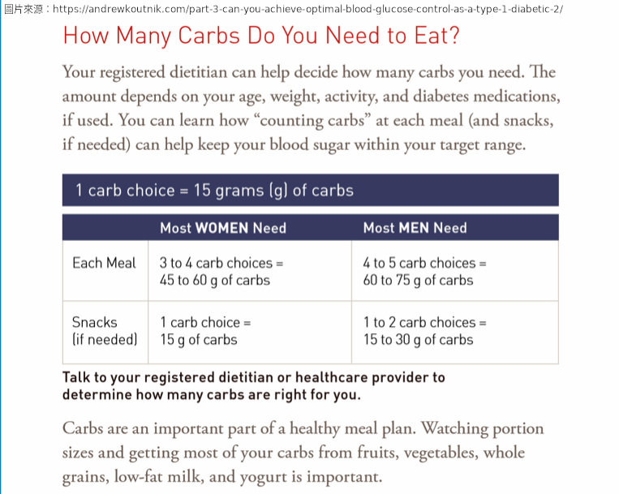

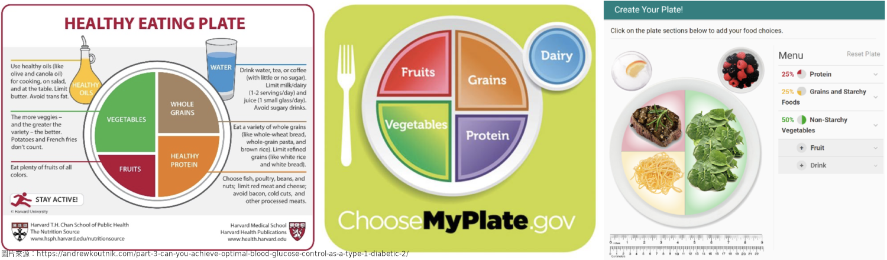

2. **社會汙名化**：醫護人員不願給病患兒童及家庭太多治療壓力，若要求家長採取不同的飲食、則可能會造成小孩承受同儕間的異樣眼光、以為自己和他人不一樣；院方會教導病患家屬吃多少就打多少胰島素、而非根據胰島素的藥物動力學特性來從根本上改變飲食内容的攝取（詳見後面章節）。  
3. **病人遵從性**：部分內分泌科醫師與營養師考量到患者對於新穎或限制性飲食的實際執行意願可能不高，因此往往會傾向建議採行醫病雙方均認為較可行、且患者本身較有意願遵循的飲食方案。  
（譯注：譯者並不同意這些觀點、認為作者乃採取委婉的分析立場以避免真實原因的闡述。）  

## 人體主要營養素
（Merriam-Webster, 2018）對此的定義為「生物體為生長與健康所『必需』的相對大量化學元素或物質」，而醫界一般將能提供大量熱量的三項營養素，即碳水化合物、脂肪與蛋白質都歸為此類（下面章節我們仍以此慣例進行討論）。但在科學上真正對生存所「必需」的，就只有人體無法自行合成的特定胺基酸與脂肪酸，這些「必需胺基酸」及「必需脂肪酸」才是我們必需要由飲食來獲得的養份，而碳水化合物卻不是（譯注：人體可透過糖質新生來自主生成葡萄糖供身體所需）。從上面的餐盤圖例與飲食建議的圖表可知其熱量來源主要為穀物、澱粉與水果形式的碳水化合物，而蛋白質與脂質的比例較小。  

### 養份代謝機制
**碳水化合物**：扣除掉纖維的碳水通過酶及胃腸道蠕動的攪拌研磨等機械作用，被逐步分解為較小的多醣與單醣，隨後被輸送至肝臟轉化為游離的葡萄糖分子、接著進入全身血液循環使血糖快速上升（見單元1）；只要攝取的澱粉或糖分愈多、血糖上升的幅度就愈大。  

**蛋白質**：在腸道中會先被分解為肽（胺基酸鏈）、進入腸細胞後進一步分解為胺基酸；這些胺基酸會促進升糖素的分泌（Paterson et al., 2015）而使肝臟分解肝糖並升高血糖值。部份的胺基酸具有糖質新生或生酮特性，因此視需求可用於生成葡萄糖及酮體，因此前者在經肝臓合成葡萄糖後亦會使血糖上升。但和碳水不同，蛋白質的血糖上升速度緩慢、具有間接、幅度小且持續較久的特點（Collier & O’Dea, 1983; Paterson et al., 2015），約在餐後0.5~2小時才開始生成葡萄糖、作用時間可能超過5小時（Pal & Ellis, 2010; Paterson et al., 2015）。  

**脂肪/脂質**：通常以三酸甘油酯的形式存在，其結構包含一個甘油主鏈與三條脂肪酸鏈，脂肪酸無法轉化成葡萄糖、但甘油可以（Berg JM, 2002）。然而其生成效果對血糖濃度的實際影響極其微小，造成食用脂肪幾乎觀察不到有血糖上升的現象。  

(Collier & O’Dea, 1983)讓受試者吃下50克碳水化合物（熟馬鈴薯）與50克蛋白質（牛小肉）、並再分別加入50克脂肪（奶油）共4個組別來比較胰島素的分泌情形（見圖3；本論文未直接測量血糖變化，但我們可從各組別的胰島素變化來間接推論）：單獨攝取碳水化合物會迅速刺激胰島素分泌、且於30分鐘達到峰值，並在攝取後的180至240分鐘恢復到基準線；而單獨攝取蛋白質則引起中度的胰島素分泌且峰值出現於60分鐘、並在攝取後的240分鐘仍略高於基線。這裡值得注意的是，當脂肪與碳水化合物或蛋白質共同攝入時，不僅改變了胰島素反應的峰值時間、也同時延長了胰島素的作用，顯示出脂肪的添加會影響整體胰島素動力學的表現。  

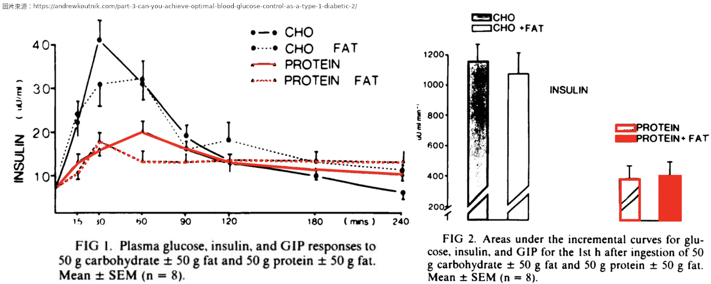

圖3亦指出無論是碳水或蛋白質，若同時攝入脂肪並不會顯著改變胰島素的分泌量；也就是說脂肪本身不會促發胰島素分泌、亦不會明顯影響其他二者主要營養素的胰島素總需求。  

總而言之，碳水化合物與蛋白質是唯二能造成可測量之血糖上升與顯著胰島素反應的主要營養素，且與蛋白質相比，碳水所引起的胰島素分泌會更加快速且明顯；相比而言蛋白質造成的胰島素反應比碳水低約60%、血糖上升幅度小且延遲。此外數據亦顯示脂肪對胰島素分泌無明顯影響、且不會造成餐後可測量的血糖變動。**由此可知第一型病患無論是攝取碳水化合物或是蛋白質，皆要使用外源性的胰島素才能保持血糖正常平穩。**  

**上面的數據基本描繪了進食時及餐後的胰島素反應，但其它一整天的時間又是如何呢？**（Thompson R, 2006）預測模擬了一般人在24小時（包含碳水化合物、蛋白質和脂肪組成的3餐）的胰島素濃度變化（圖4）：人體原則上全天候都需要胰島素、且需求量會隨時間及飲食内容不同而變化；**第一型患者若和一般人吃同樣的東西，就必須使用等量的胰島素來控制碳水及蛋白質引發的血糖上升，且同時要滿足餐間及夜晚基礎胰島素的需求才行。**  

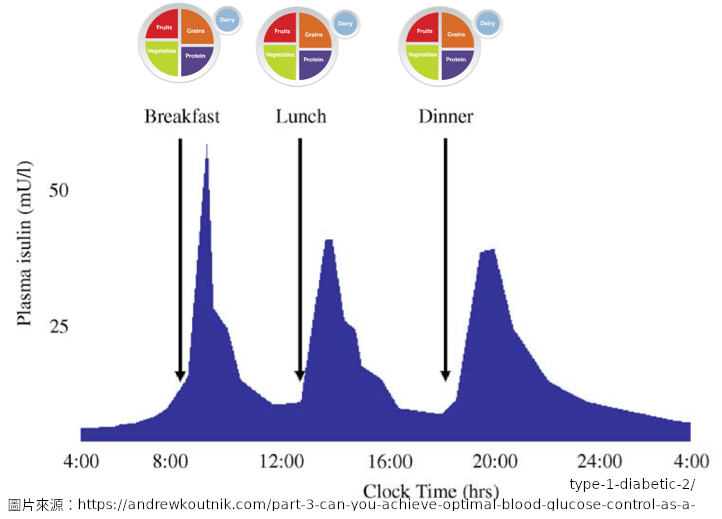

## 胰島素藥物動力學
人在下列三種生理代謝下都需要胰島素才能運作：  
1)將血糖送進各器官組織（少數情形例外；見單元1）。  
2)食用碳水化合物或蛋白質時。  
3)禁食時的少數葡萄糖合成。  
因此第一型病患在這些情況下都需要使用外源性胰島素才能維持血糖平衡。但我們由圖3可知並非所有的營養素都需要相同的胰島素量值和作用速率（即動力學），所以治療就會變得極端地複雜，如病人不應該在吃碳水時只注射長效胰島素，否則的話就會造成高血糖，原因是長效胰島素的動力學特性可能需一整天的時間才能將血糖降回正常值；且病人也不宜用速效胰島素來對治斷食時的血糖變動，因為這會大大增加低血糖的風險（見圖5）。另外相同的胰島素在不同個體間及單一個體内（見單元1）都有一定程度的變異性，因此不同的論文所呈現的胰島素動力學特性也會不盡相同（Bernstein, 2011; Chamberlain et al., 2017; Freeman, 2009; Mooradian, Bernbaum, & Albert, 2006）。表1盡可能地涵蓋各項差異並依各個胰島素的藥效起始、峰值與持續時間作出較廣泛範圍的整理表格，**讀者須依個人生理狀況、飲食及各藥物動力學的差異性來安全地穩定血糖**，不可專斷數字的界定區分。  

（譯注：圖五呈現的是所謂「大劑量」（industrialized dosage）注射所產生的圖表，其劑量往往高達0.4\~0.7/kg之間；採極低碳水飲食其注射需求會大幅降低（如單次注射可降至5\~10單位甚至更少），其藥效尖峰、起始及持續時長都會跟著縮減，因此在參考時須特別注意。）  

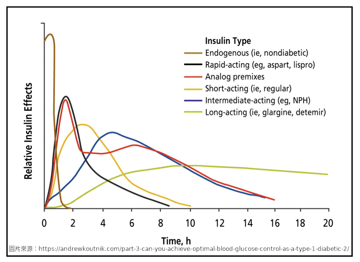

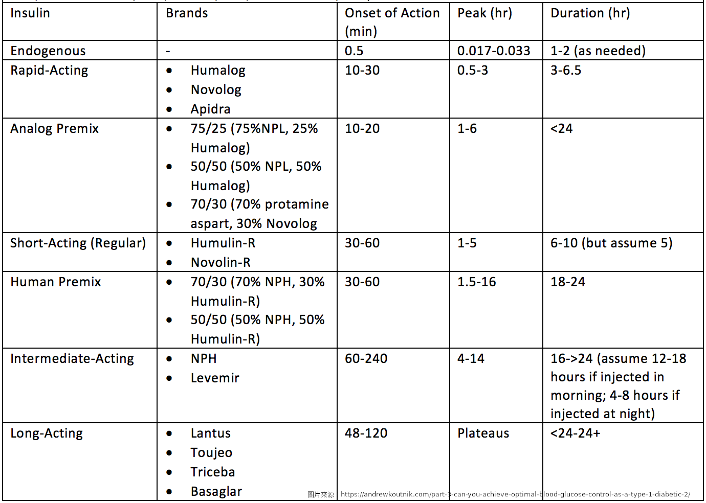

## 主要營養素與外源性胰島素的平衡
根據圖4的24小時胰島素分泌預測模型和圖3的混合飲食胰島素反應，用所謂的外源性「基礎／餐時胰島素」是最合乎生理所需的治療方法（圖6；醫療院所的實際治療也是如此進行。American Diabetes, 2018a）：它包含了兩種胰島素——基礎性及速/短效型，前者能緩慢釋出低濃度的胰島素以維持空腹時的血糖平穩、後者則因應進食（或餐間出現之高血糖）的生理所需，且其注射劑量仍常以單元2中的碳水計量法來決定。這裡我們要特別注意一點，即這種長、速/短效胰島素與碳水計量法結合的治療並沒有將蛋白質消化的血糖影響納入計算。理論上這樣的胰島素配製應能成功模擬正常人體的胰島素分泌並穩定血糖值，但在實際臨床操作上卻有著非常大的落差。  

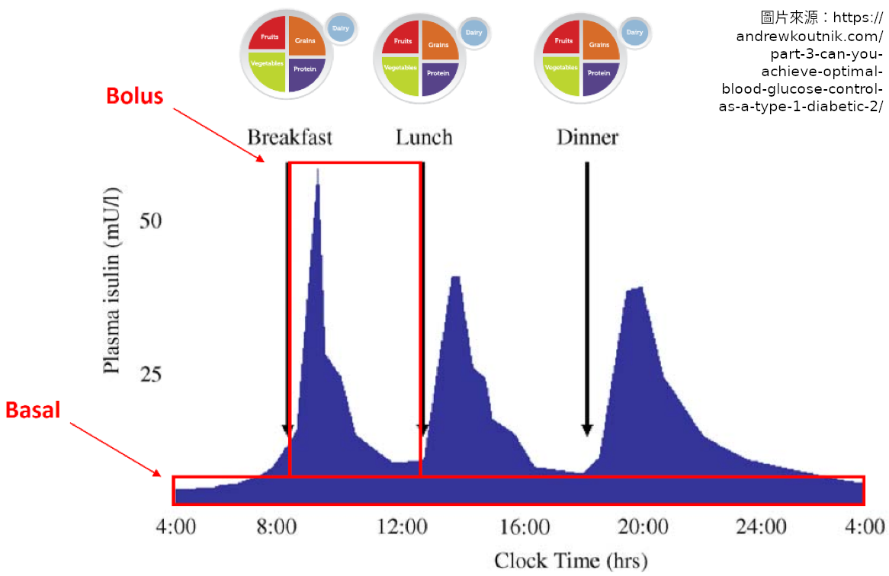

## 基礎／餐時胰島素治療與標準飲食指南下的血糖數據
(Alemzadeh et al., 2005)將患者的基礎胰島素由原本1天注射2次中長效改成1天1次的長效胰島素、並在餐時注射速效的方式進行各1年的血糖控制評估（表2），並發現到第一年（中長效+速效）患者的HbA1c為8.7\~9.0%、第二年（長效+速效）為8.3\~8.4%。這說明此法並無法將血糖正常化。  

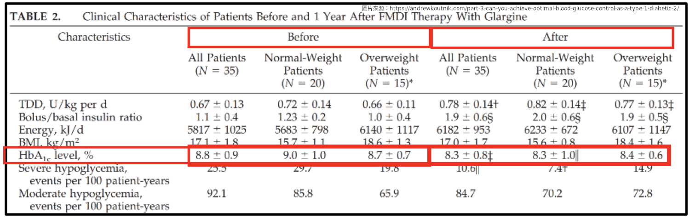

（Cherubini et al., 2006）對兩組皆使用基礎／餐時胰島素療法的兒童進行血糖分析，其中一組使用短效常規人體胰島素於餐前使用、另一組則使用速效胰島素類似物；研究人員發現到兩組人的血糖基本上沒有差別，**所有人的平均血糖（圖8A）及HbA1c（圖8B）均在135\~180mg/dL與7\~7.5%間，皆遠高於正常值的80~120mg/dL及小於5.7%。**  

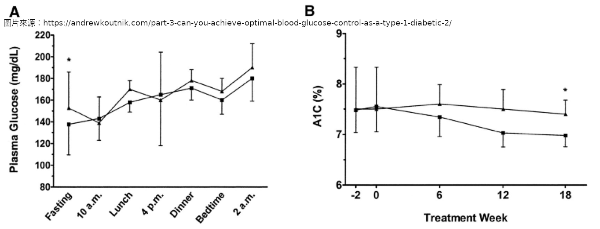

（Heller et al., 2012）研究了超過600位使用基礎／餐時胰島素、並分為使用不同種類基礎胰島素的兩組患者來進行實驗，但發現到所有人的HbA1c均為過高的7.3%（圖9A）、血糖值在1天中的9個不同時間點也都遠高於正常範圍（130~200mg/dL；圖9C）  

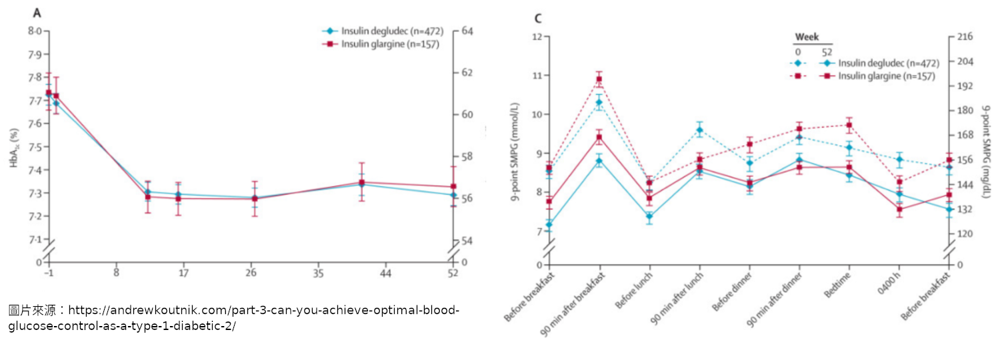

上述這三篇論文（以及更多相關的研究）都指出在使用基礎／餐時胰島素療法時，使用何種藥廠的胰島素並不是重點，而是當飲食内容為傳統的標準飲食時，血糖就無法獲得良好的控制（HbA1c大於5.7%且血糖遠高於80~120mg/dL）。  

**理論上外源性胰島素的作用速率應能和葡萄糖的血糖上升效果互相抵消平衡，但實際上卻完全不是這麼一回事；加上在單元1〈日常會影響血糖變化的要素〉提到的各種變因，血糖就會更加地不穩定。**  

## 影響胰島素需求的因素
我們下面將可能會影響到血糖的重要因素列表而出，並解釋為何「基礎／餐時胰島素」和「碳水計量法」兩者間要精確預測出血糖值是不可能的事，同時對胰島素造成的血糖變動做一分析。  

1. **碳水化合物**：這是血糖上升最主要的因素（見單元1），吃的愈多、血糖上升的速度及幅度就愈大、所需的胰島素也就愈多。  
・**計量難易度**：容易測量。  
・**血糖影響值**：不一定能完全掌握（原因見下述）。

2. **蛋白質**：血糖上升較緩慢、所需胰島素僅約碳水的60%（Collier & O’Dea, 1983），血糖變動值約碳水的0.4倍。  
・**計量難易度**：原則上可測量。  
・**血糖影響值**：原則上可預估。  

3. **身體自主的血糖變化**：有各種原因會使血糖在斷食時升高（肝糖分解與糖質新生等等；見單元1）、或在無胰島素作用下降低血糖（雖然效力較弱）。  
・**計量難易度**：難以計算。  
・**血糖影響值**：基本無法預測；對於生活作息固定且生活自律度高的第一型患者會有較好的準確性，但大多數病人都無此能力。

4. **胰島素的降糖效果**：血糖受人體胰島素敏感度及劑量而變動，不只藥效難以掌握、血糖升降幅度也難以預測。  
・**計量難易度**：變數太多無法計算。  
・**血糖影響值**：除非生活作息固定否則無法精確估算。

5. **胰島素敏感性**：無固定的值、胰島素的藥效也因此會忽強忽弱。  
・**計量難易度**：太多變動因素無法計算。  
・**血糖影響值**：就算是固定作息的患者也難以準確評估。

6. **胰島素劑量**：血糖降幅和劑量成正比，但除了各類胰島素有不同的藥效外、身體胰島素敏感性的變動也會造成同劑量的相同胰島素有相異的血糖降幅。  
・**計量難易度**：容易計算。  
・**血糖影響值**：難以準確預測。

人體新陳代謝是一種持續變動的過程，其中的血糖平衡機制一旦受到破壞而需靠外源性胰島素來自主調節時，各試各樣的變因就會讓血糖結果無法準確預測，倘若在飲食上又攝取大量的碳水化合物、又為此而施打高劑量的胰島素時，血糖值的不可預測性（即血糖變異數）就會愈高、疾病控制也就愈加困難。**在血糖升降上，碳水的升糖性與外源胰島素的降糖性幾乎不可能準確預期（也就是說碳水克數與單位胰島素藥效兩者間並無固定關係），若採取傳統的高碳水標準飲食並配合胰島素注射來試圖維持血糖平衡，就會讓每餐的血糖預測跟猜謎遊戲一樣，不只無法掌握確切結果、且會使短長期的疾病風險大為增加。**  

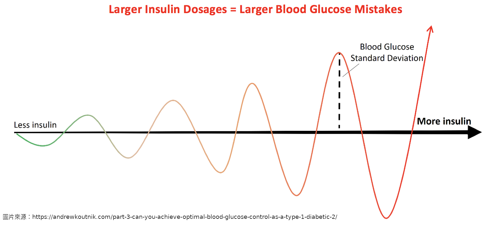

### 真實數據分析
圖10-2是我自己採高碳水飲食與基礎／餐時胰島素療法的數據圖表，我們可以看到其波動範圍極大、且不同天數與餐餐之間的血糖值都完全無法重合（各項因素可參看圖10-3）。而令人難過的是，跟大多數的第一型患者相比，我這樣可怕的血糖數據居然已經算是控制得還不錯了。  

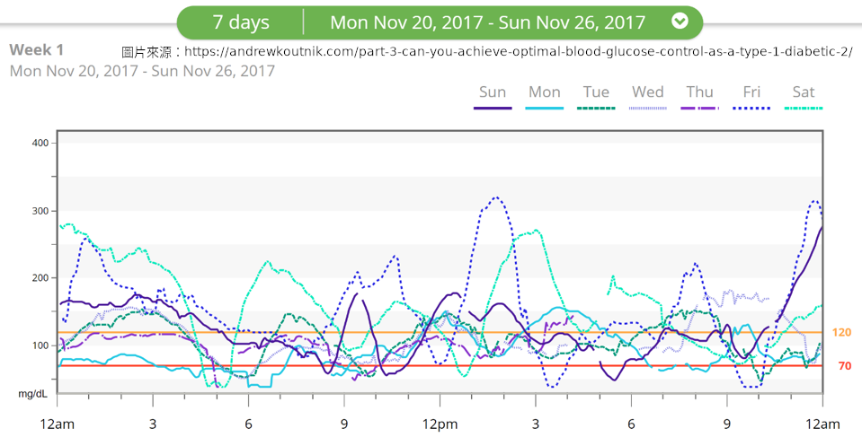

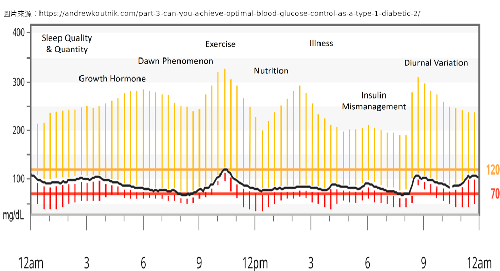

---

## 極低碳水化合物飲食療法
目前第一型糖尿病被視為自體免疫疾病且仍無法治癒，但現有的標準治療卻完全無法將血糖正常化、並使患者仍舊嚴重承擔各種急、長期疾病的風險，加上我們對人體新陳代謝中的碳水升糖性與胰島素降糖性的難以預測與無法準確調控，若使用外源性胰島素的劑量愈大、則往往會加劇其後果。**但身為第一型的患者，我們只能被動地接受嗎？答案當然是大大的「不」字；只要我們能深入地了解各項變因與最重要的飲食原則，我們就能有效地穩定血糖並大大降低各種短長期的疾病與併發症。**  

<u>**免責聲明**</u>：以下為個人概括性的血糖控制經驗分享、並望能為同路人提供一盞指引之光；血糖受各種變數影響，讀者應在醫師指導下自行判斷合適的治療方法。  

### 治療前後
* 1. **飲食内容**
  * **改變前**：
    * 一天三餐
    * <u>**高碳水**</u>（約200~400克/一天）
      * 馬鈴薯、米飯、燕麥、水果等
      * 搭配綠葉蔬菜
    * <u>**高蛋白質**</u>（約200~300克/一天）
      * 瘦肉：雞胸肉、鮪魚、蛋白、低脂優格、乳清蛋白
      * 含脂蛋白質（偶爾）：鮭魚或牛肉
    * **低脂（<100克/天）**：來自其他營養來源的殘餘脂肪，或是橄欖油、花生醬等作為佐醬。
  * **改變後**：
    * 一天2~3餐
    * 極低碳水（<50克/天、<10%總熱量）
      * 高纖低碳的綠色葉菜類
      * 不吃澱粉及含糖食物
    * <u>**高蛋白質**</u>（約200~300克/一天）
      * 瘦、肥蛋白質：魚、肉、蛋、低碳水豆類、乳酪、乳清蛋白等等
    * 多樣脂肪來源（約200克/天）
      * 蛋白質本有的油脂、橄欖油、堅果（整顆或抹醬）、中鏈三酸甘油酯MCT、椰子油等等
      * 偶爾吃杏仁粉、椰子粉或奶油

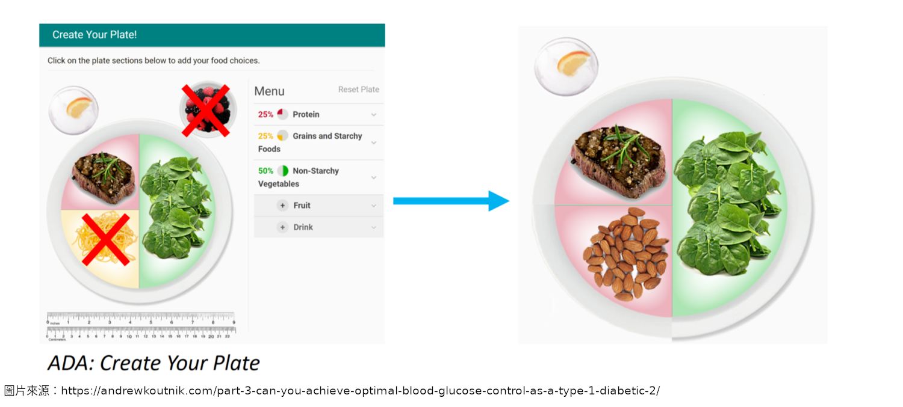

* 2. **胰島素注射**
  * **改變前：基礎／餐時胰島素**
    * 基礎胰島素：1天1次長效型（Lantus）或胰島素幫浦（速效Novolog）
    * 餐時胰島素：
      * 碳水化合物克數配合速效胰島素。
      * 蛋白質克數配合常規人體胰島素。
      * 血糖過高時（>120mg/dL）用速效胰島素校正。
  * **改變後：同樣為基礎／餐時胰島素**
    * 基礎胰島素：1天2次中長效型（早、晚Levemir）
    * 餐時胰島素：同改變前用法

### 治療結果
**胰島素總劑量變化**：改變飲食前我每餐的碳水量約50\~100克、1天約200~400克，每餐的胰島素總合加上基礎胰島素，我1天約需要打80\~100單位的劑量（範圍區間變化視長短週期的胰島素敏感性而有所不同）；飲食改變後，我目前1天的總劑量已降至20\~30單位間。我的藥物需求與費用不僅大幅降低、也因胰島素用量大減而少了約70%的血糖波動。  

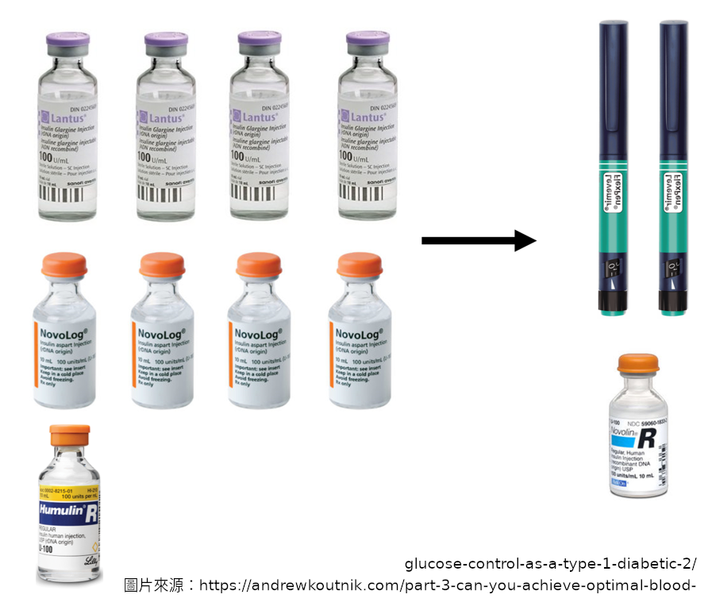

**血糖變異數**：圖15左為高碳水化合物飲食、右為極低碳水化合物飲食。左圖的平均血糖為122mg/dL、標準差為50mg/dL，即血糖值會在122mg/dL上下波動達50mg/dL、高低差可達100mg/dL，表示血糖高低起伏不定且每日波動程度根本無法預測；右圖平均血糖為93mg/dL、標準差僅19mg/dL，顯示血糖相對穩定非常多。  

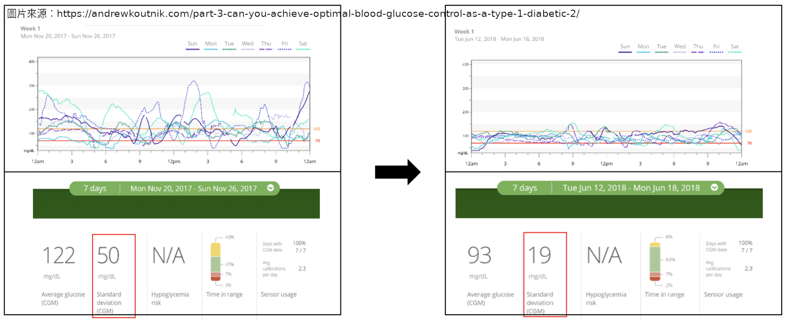

圖16為我在極低碳水化合物飲食並搭配基礎／餐時胰島素治療下的90天平均血糖圖表。  

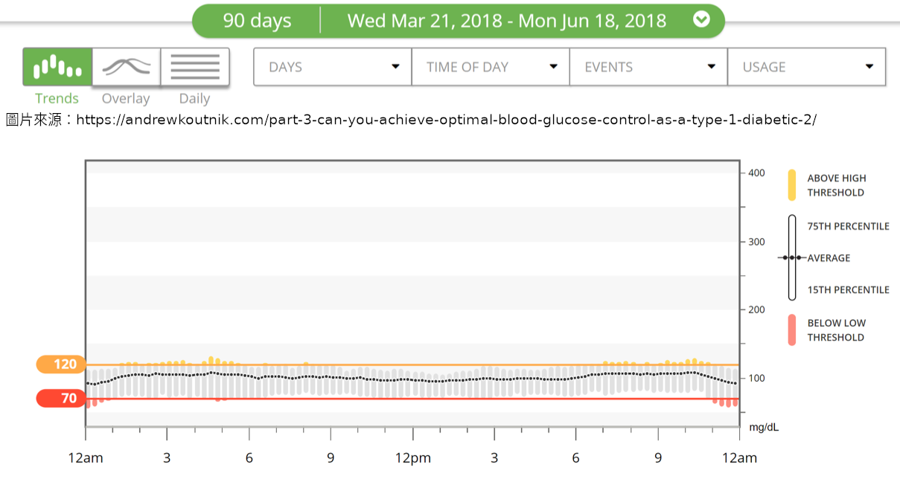

### 極低碳水化合物飲食與一般標準治療下第一型患者的血糖對比
若將我的血糖標準差19mg/dL和表3（Kuenen et al., 2011）做對比，我們可以發現在受試者中標準差小於30mg/dL的比例只有3.4%而已。  

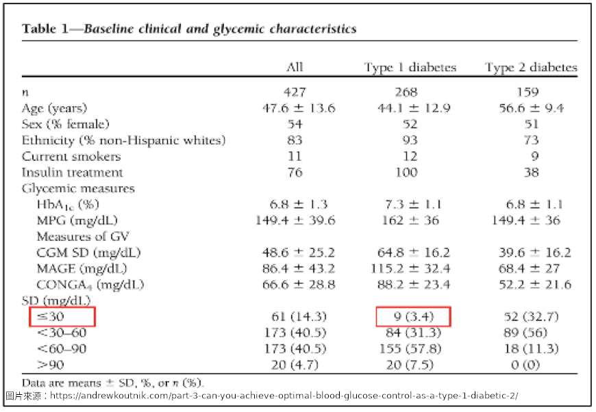

單就HbA1c而言，我最近一次的數值（極低碳水飲食）為4.9%、即2\~3個月的平均血糖值約為94mg/dL；拿T1D Exchange的數據做對比（見單元1），在超過25,000位第一型患者中只有0.1%的人其HbA1c低於5.0%（圖18）。（Saaddine et al., 2002）中5\~24歲正常健康個體的平均HbA1c為4.99%，我的4.9%正落在此範圍内。  

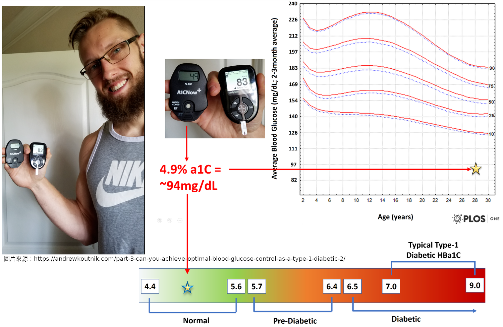

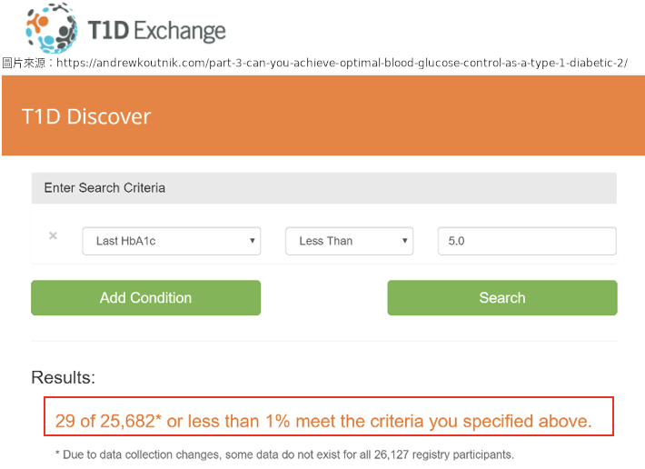

### 極低碳水飲食的胰島素治療
讓我們再看一次（Collier & O’Dea, 1983）的圖表（見圖19），我們可以了解到蛋白質與蛋白質+脂質的飲食對身體的胰島素分泌為緩慢、量小且作用時間較長（會超過4小時），這表示和碳水相比、其胰島素用量可減少2.5倍之多。就我自己與數百位病友交流的經驗，常規人體胰島素（Regular insulin，如HumulinR、NovolinR）就非常適合用在極低碳水飲食上：它和蛋白質及蛋白質+脂質的血糖上升速度可以互相匹配，因此不只能夠避免速效胰島素所造成血糖大幅波動的可能性，對病患的急性風險也能夠有所降低。在日常生活中有大大小小會影響血糖變化與胰島素敏感性的因素，而當我們把其中最重要的2項：碳水化合物及胰島素劑量給同時大幅減少，我們就可以有效地降低血糖變異程度、並在更加安全的情況下來進一步治療疾病。

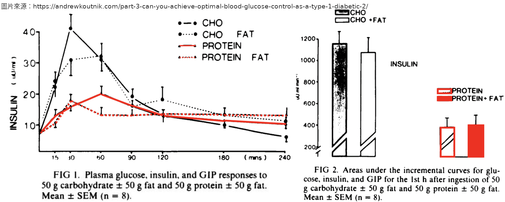

**這樣的飲食與藥物配合的好處包括**：  
1. 胰島素劑量大幅降低。  
2. 兩者對血糖升降的影響都相對緩慢（對比碳水與速效胰島素類似物）。  
3. 蛋白質+脂質與常規人體胰島素的血糖作用較能彼此匹配且安全。  

### 極低碳水飲食的血糖控制數據
若從我個人的治療成果（n=1）擴大來看看已發表的相關研究數據，我們會發現到極低碳水飲食並非什麼新的治療方法。  

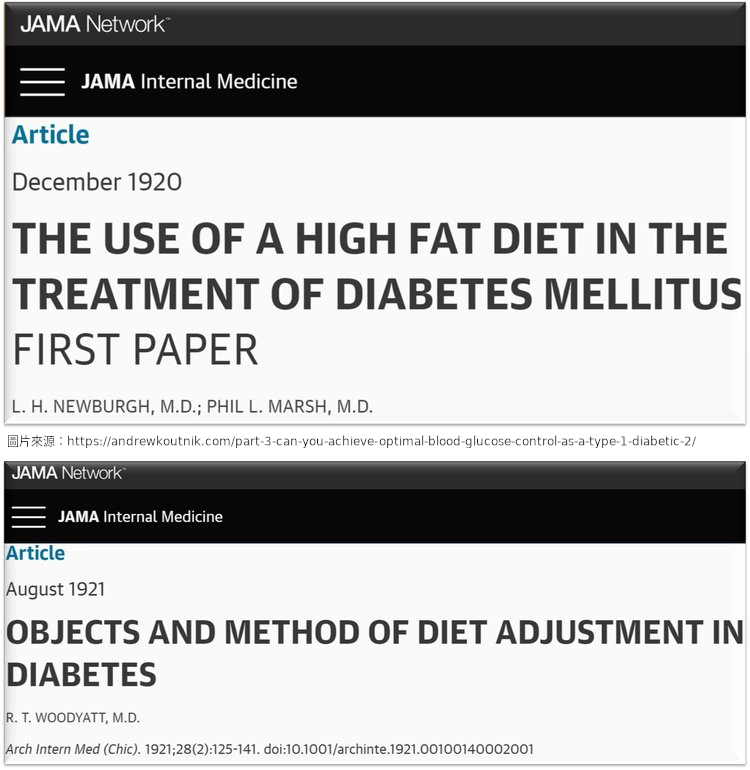

早在1920年（Newburgh & Marsh 1920）就提出了極低碳水化合物與高脂肪飲食的第一型糖尿病治療報告，且1年後的（Woodyatt 1921）比較了各種的飲食内容後，將重點放在極低碳水飲食上並以此作為血糖控制的有效方法。但在不久後隨著胰島素注射治療的普及，極低碳水飲食被認為對生活的限制太多，因此漸漸不被採用。  

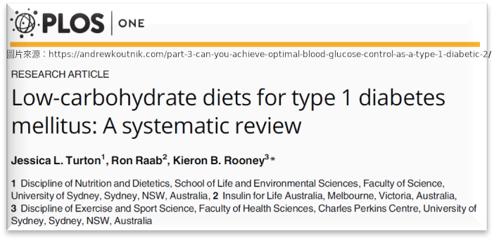

（Turton et al., 2018）針對所有碳水化合物攝取低於總熱量45%（一般人認為的低碳水飲食）、且觀察至少達2週以上的第一型糖尿病研究報告作了文獻回顧，並將低碳水飲食分成三大類群體加以分析：

1. 偽低碳水化合物飲食（FLCD）：碳水化合物佔總熱量為26~45%。
2. 真低碳水化合物飲食（TLCD）：碳水化合物佔總熱量<26%。
3. 極低碳水化合物生酮飲食（VLCKD）：每日碳水化合物<50克。

要特別注意**極低碳水飲食（<50克）和低碳水飲食（26~45%）並不相同，前者才是我們治療、且近年為大眾所熟悉的飲食方法（Feinman et al., 2015）**。  

治療的長期**遵從性**相當重要，2週的時間並無法真正評估出治療的成果（3個月會較適合），但這至少給了我們一個治療上的起始點、並在有限的研究資料中做出最好的判斷；（Turton et al., 2018）以現有的數據分析了每日碳水化合物攝取量（CHO）、飲食類型（FLCD、TLCD或VLCKD）、介入持續時間（追蹤期），以及介入前後的HbA1c、低血糖發生率、總胰島素劑量等結果（表4）。  

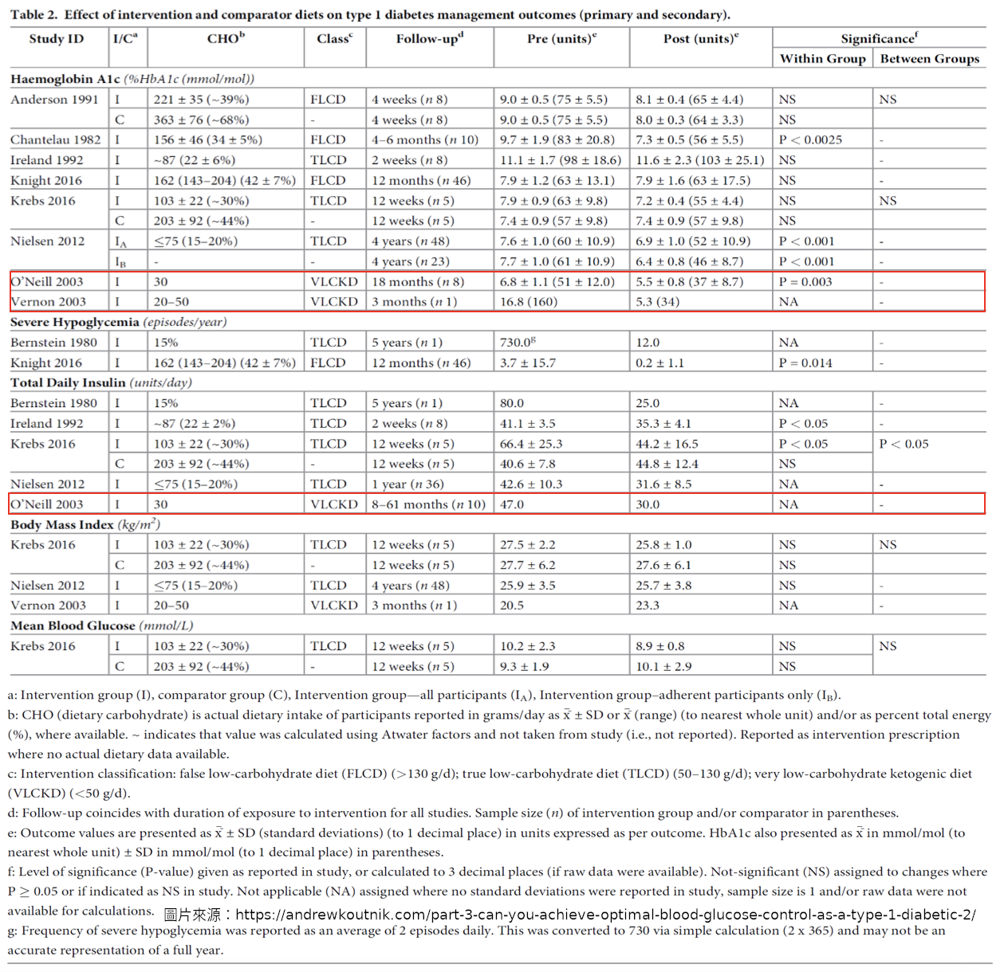

1. **HbA1c**  
・FLCD：無改善。  
・TLCD：無改善。  
・VLCKD：二份報告的數據顯示降低至正常健康人的範圍内（5.5%、5.3%）；**除了胰島細胞移植外、目前研究上沒有任何治療方法能夠將HbA1c降至此數值**。

2. **嚴重低血糖事件**  
・FLCD：從3.7降至0.2（僅單一研究）。  
・TLCD：從730降至12（僅單一研究）。  
・VLCKD：無相關報告。

3. **每日胰島素劑量**  
・FLCD：無相關報告。  
・TLCD：降低3/4。  
・VLCKD：使用量下降（僅單一研究）。

表5總結了至2018年第一型患者與極低碳水生酮飲食研究（Eiswirth, Clark, & Diamond, 2018; O’Neill, 2003; Vernon, Mavropoulos, Transue, Yancy, & Westman, 2003）的相關數據，雖然結果令人振奮，但仍待更多的研究數據出現。

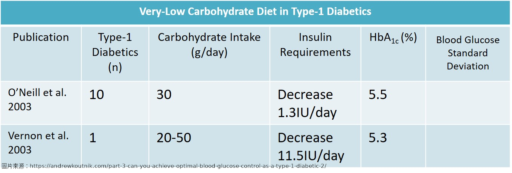

### （Lennerz et al., 2018）糖尿病與極低碳水飲食
此為目前規模最大且針對第一型患者與極低碳水飲食的研究報告，内容是以一個名為「TYPEONEGRIT」社群中的受試者所做出的數據分析；該團體除了採用極低碳水飲食外，還依照《伯恩斯坦醫師的糖尿病治療方法》（***《Dr. Bernstein’s Diabetes Solution: A Complete Guide to Achieving Normal Blood Sugars》***, Bernstein, 2011）一書中的藥物使用與疾病治療等方法來控制血糖。此社團的座右銘是：「第一型糖尿病患者不只能夠、且應該要和非糖尿病的健康同儕有著相同的血糖值。」

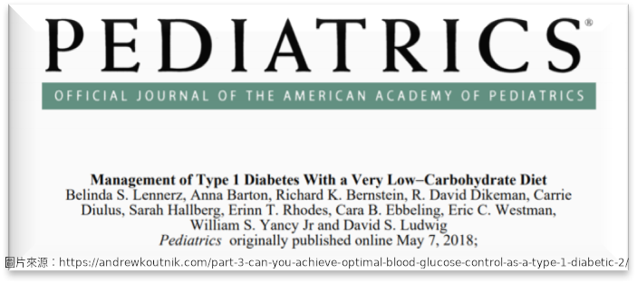
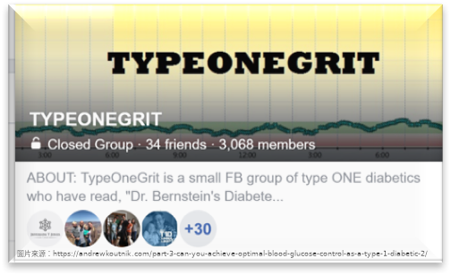

這本書不只討論了第一型與第二型的飲食治療（每日碳水少於30克）、也包含了各式的醫療器材使用、運動、口服與胰島素注射、各種會影響（含突發狀況）血糖變化的原因等等重要的治療細節；我在這裡可以保證，這本書是目前在血糖控制上最全面、最有價值的治療指南之一。

#### （Lennerz et al., 2018）血糖數據治療結果
1. **血糖控制**：300位受試者的平均HbA1c為5.67%（即平均血糖約116mg/dL，見圖20）、約為第一型患者中的前1.28%（Exchange），CGM則顯示多數人的平均血糖值是104mg/dL、標準差為28mg/dL，約是第一型患者的前4%（Kuenen et al., 2011）。

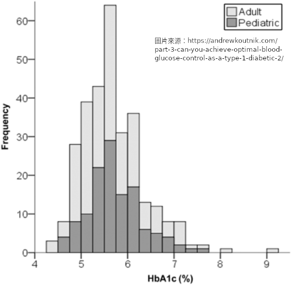

2. **不良反應**：嚴重事件如酮酸中毒、低血糖、癲癇發作、昏迷等等的發生率**極低**、僅約2%左右（表6）。

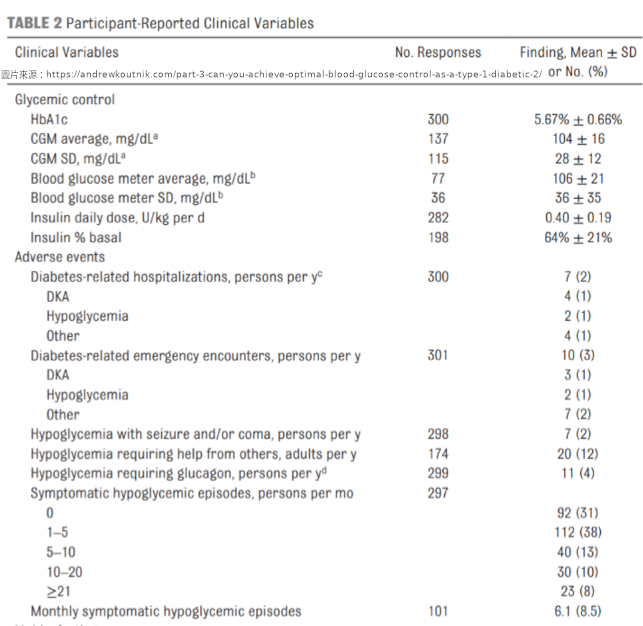

3. **健康與醫療滿意度**：此研究也針對醫病**雙方**對病人採取該治療方法的感受做了分析，内容包括：

* 受試者自評在極低碳水飲食下的整體健康狀況：
  * 97%的患者報告整體健康狀況為「良好」至「極佳」。
* 此飲食達成的疾病控制滿意度：
  * 87%感到「滿意」或「非常滿意」。
* 受試者對其醫師的滿意度：
  * 50%感到「滿意」或「非常滿意」。
  * 27%感到「不滿意」或「非常不滿意」。
* 極低碳水飲食的治療效果：
  * 97%反應為「良好」至「極佳」。
* 未與醫師討論極低碳水飲食治療的受試者比例：
  * 27%未跟醫師討論其飲食内容。
* 醫師對患者極低碳水化合物飲食的支持度：
  * 49%「同意」或「強烈同意」。
  * 20%「不同意」或「強烈不同意」。

幾乎所有的受試者都認為極低碳水飲食不只改善了整體健康且血糖控制成果更好，但有一點令人感到稍微的不安，即：受試者中有1/4的人完全沒有和他們的醫師告知極低碳水的治療方法，而這多少會造成醫病之間的溝通不良。但為什麼患者不願意跟理應是最應該幫助他們的人討論呢？原因是有的醫生不喜歡這種飲食方法、進而造成病人乾脆避免告知以免受到對方的批評；還有少數因為父母用極低碳水飲食來治療自己的小孩、結果遭醫生通報兒童保護中心進行阻止的案例。我自己跟許多父母交流過，多數的家長都相當不樂見有醫療衝突發生。

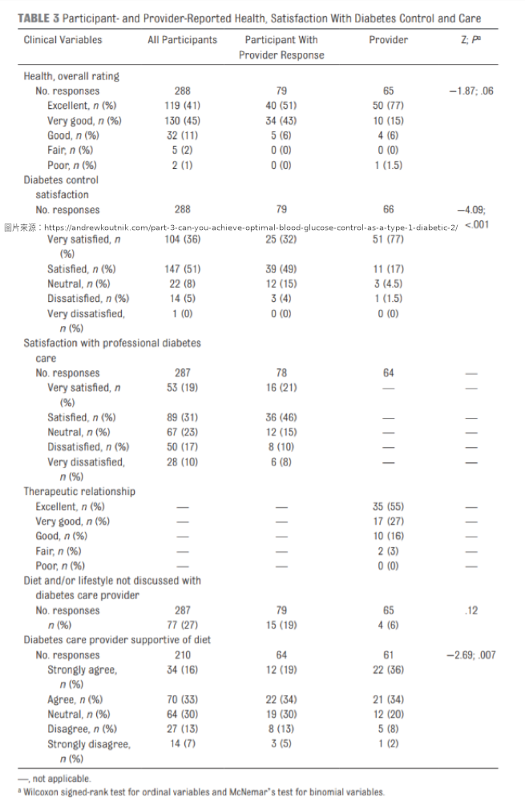

**2019年9月11日更新**：在（Turton et al. 2018）之後又有4篇相關研究，而在所有受試時間大於3個月以上的報告中，所有的第一型受試者均能將HbA1c維持在一般健康正常人的數值（Eiswirth et al. 2018；Leow et al. 2018；Lennerz et al. 2018；O’Neill, 2003；Vernon, Mavropoulos, Transue, Yancy, & Westman, 2003）。  

（Ranjan et al. 2017）針對10位第一型患者進行7天、並分別採用標準飲食（每天227克碳水）或極低碳水飲食（每天47克碳水）進行觀察，結果為後者的胰島素劑量下降44%、血糖標準差減少27%、低血糖發生率降低且正常血糖（此實驗定義為70\~180mg/dL）的時間增加；但因實驗時長只有7天，因此無法對HbA1c進行分析（需2\~3個月為宜）。  

（Eiswirth et al. 2018）為一女性第一型患者的個案報告，受試者實驗前3年的HbA1c為7.5%，在採用極低碳水飲食（每日30~50克碳水）後降至5.3%、平均血糖從187.2mg/dL降至110mg/dL、無顯著低血糖情形與不良的血脂變化、且主觀生活品質獲得改善。  

（Leow et al. 2018）為觀察性分析研究，針對11位平均每日攝取碳水量為28.9克的第一型受試者進行了平均2.6年的追蹤記錄，結果顯示平均CGM血糖值為106mg/dL、HbA1c為5.3%、血糖標準差為27mg/dL、正常血糖（定義為70~144mg/dL）時間為74%；但研究指出受試者一天中有3.6%時間出現低血糖情形（定義為54mg/dL）且LDL膽固醇升高（和過去個人的數據相比）。研究指出極低碳水和良好血糖控制有高度相關，但可能會有低血糖增加與血脂異常的風險。但低血糖應為血糖控制範圍太過緊繃導致，若將其適度提高則應可有效減少發生。  

所有這些研究均指出極低碳水飲食在血糖控制上有極大的幫助，但仍有部份醫界人士對其是否有潛在副作用有所疑慮。

**為什麼會有醫師對極低碳水飲食抱持負面態度**？患者為什麼不願意告訴醫師自己正在採行的飲食内容？下面我會提出並解釋極低碳水飲食正、反面的各種論點及批評。

## 極低碳水飲食的限制與批評
1. **高脂飲食**  

多數的醫療院所不喜歡聽到患者攝取高比例的膳食脂肪，其中一部分的起因來自針對碳水已偏高（>10%）又吃高脂肪飲食（約40\~60%）會有不良健康結果的相關研究。這種所謂的「高脂肪飲食」和西方飲食相差無幾，其中碳水的比例約20\~40%、脂肪約45\~60%，而肥胖又與熱量過多有正相關（Envigo; Schrauwen & Westerterp, 2000）。因此「高脂肪飲食」的真正涵義是吃高碳水化合物的同時又兼攝取高脂肪，而只要碳水攝取過多就會削弱人體從葡萄糖代謝轉向脂質與酮體代謝的能力（碳水攝取量需小於1天20~50克）。

而極低碳水飲食的糖分僅佔5~10%，並不會如「高脂肪飲食」會造成肥胖（Envigo; Feinman et al., 2015; Paoli, Rubini, Volek, & Grimaldi, 2013; Schrauwen & Westerterp, 2000），因此不應與攝取碳水超過10~15%的飲食互相混淆（Feinman et al., 2015）；（Paoli et al., 2013）亦指出極低碳水飲食和許多有益健康的結果為正相關。

2. **低密度膽固醇**

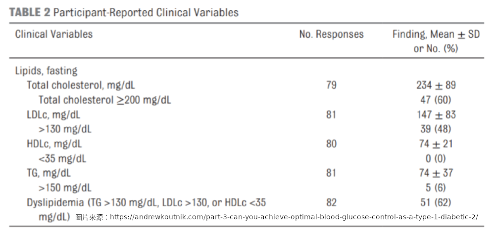

有部分採用極低碳水飲食的第一型患者其LDL會超過130mg/dL（表9，Lennerz et al., 2018)、而有研究顯示若升高則與心血管疾病可能有所關連（Ference et al., 2017），造成許多的内分泌科醫師為此感到擔憂（尤其是本已有相關疾病的群體；Conway, Lopes-Virella, & Blot, 2018; Livingstone et al., 2015; Livingstone et al., 2012; Soedamah-Muthu et al., 2006）。  

其實上LDL在心血管疾病的關連性已爭論多年（DuBroff, 2017）。極低碳水飲食通常會對3項血脂數據造成影響（Bhanpuri et al., 2018; Dashti et al., 2004; Feinman et al., 2015; Lennerz et al., 2018; Nordmann et al., 2006）：  

* 降低三酸甘油酯  
* 升高HDL膽固醇  
* LDL膽固醇無變化或升高

即使第3項的LDL可能會變高（但並非統一；Hu & Bazzano, 2014），這3項數據的變化和心血管疾病並無關連性；此外證據顯示LDL的顆粒大小、尤其是小而緻密的B型LDL顆粒（非一般抽血檢測的LDL膽固醇），可能才是心血管疾病更好的預測數據（Austin et al., 1988; Williams et al., 2003），而極低碳水飲食已被證實會減少B型的LDL顆粒（Bhanpuri et al., 2018）。就第一型患者心血管疾病的風險數據而言，HbA1c與三酸甘油酯才是最好的指標，而此兩項數據在極低碳水飲食下均有顯著改善（Diabetes, Complications Trial/Epidemiology of Diabetes, & Complications Research, 2016）。

3. **飲食遵從度**

病人或受試者在進行限制性的飲食時會有是否確實執行的問題（Dansinger, Gleason, Griffith, Selker, & Schaefer, 2005; Gardner et al., 2018），但只要給予鼓勵就會有極好的遵從性（Hallberg et al., 2018）。基本上我們仍要將極低碳水視為有一定遵從難度的飲食（如病人需放棄超市60%的食品；圖21）且觀念養成需要時間，因此要找方法讓適應的過程更加平穩些。  

只要改變原本的飲食就會有遵從性的問題（Dansinger et al., 2005），但對於極低碳水飲食我們可以用低升糖的食材（如椰子粉、杏仁粉、無糖黑巧克力、甜菊糖、赤藻糖醇、阿洛酮糖、洋車前子殼等等）來重現取代原本的高碳水料理。我極度推薦一個第一型患者的食譜網站Caroline’s Keto Kitchen（<http://www.carolinesketokitchen.com>），站主凱洛林提供了大量不會造成高血糖的「高碳水」複刻料理如披薩、甜甜圈、餅乾、蛋糕等等的作法，使它們不只跟原版的食物一樣好吃、且又不會使第一型病人的血糖飆升，這對一些一開始難以執行極低碳水飲食的人來說是個極佳的變通方法（還有其它各種免費或要錢的資源）。若病人的生活品質因血糖改善而提升，就可減緩飲食改變的適應困難、並進而達成良性的循環。  

4. **兒童發育**  

有人對此飲食提出質疑，因為有研究指出在治療癲癇患者而使用總熱量90%來自脂肪的限制性生酮飲食中，患者可能會有生長遲緩的情形（Vining et al., 2002）。

但相關的兒科論文並未提及蛋白質的攝取上限、且亦未顯示極低碳水飲食會阻礙或抑制兒童生長的現象（Lennerz et al., 2018），多項研究反而呈現相反的結果：不良的血糖控制會阻礙或抑制兒童生長期的發育（Bonfig et al., 2012; Frohlich-Reiterer et al., 2011; Hannon & Rogol, 2012; Khadilkar et al., 2013; Parthasarathy, Khadilkar, Chiplonkar, & Khadilkar, 2016）。

5. **極低碳水飲食的長期研究數據**  

目前仍欠缺相關的流行病學數據，亦有人主張該飲食會造成不良的後果。

上述說法基本上是來自高脂肪攝取與高LDL膽固醇之負面影響的錯誤推測（見上2. **低密度膽固醇**小節）。極低碳水飲食最重要的治療重點在改善第一型患者的不良血糖控制（往往是採行標準飲食所造成；見單元2），在血糖正常穩定的前提下，即可有效避免各種短長期的併發症，因此是否有相關流行病學的數據並無關緊要。目前已有4篇研究指出極低碳水飲食在老化囓齒動物上皆有良好的效果（Douris et al., 2015; Newman et al., 2017; Parry HA, 2018; Roberts et al., 2018），也期待後續有更多相關的研究出現。

6. **酮酸中毒的可能**  

當β細胞遭破壞使胰島素分泌減少，第一型患者就有可能發生酮酸中毒，因此有人質疑極低碳水飲食因會增加酮體濃度而提高發生風險；但這種酮體上升的情形不可與極低碳水飲食的生理狀態互相混淆（表10）。  

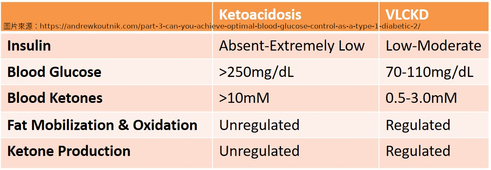

酮酸中毒同時有下列幾個徵象：胰島素分泌全無或過低、高血糖（大於250mg/dL）與高酮體濃度（大於10mM）。其發生機制為胰島素不足時（如β細胞功能衰退且未投入外源性胰島素）葡萄糖無法進入組織細胞（如骨骼肌與脂肪組織；見單元1）被轉換成能量，因此身體被迫使用脂肪做為能量來源、並產生副產品酮體；但長期性的極低碳水飲食不同，除了胰島素需求相當低之外，身體會開始從葡萄糖代謝轉變成脂質與酮體代謝為主的能量來源（即脂質/酮體適應；Volek et al., 2016）且血糖處在正常範圍内（70\~110mg/dL）、酮體濃度則在0.5\~3mM中低水平的穏定狀態中。事實上，到目前為止仍沒有任何極低碳水飲食會增加第一型患者酮酸中毒風險的數據。  

除了作為第一型糖尿病患者的治療方法外，極低碳水飲食也廣泛應用於其他眾多健康、疾病與運動表現領域（Feinman et al., 2015; Paoli, Rubini, Volek, & Grimaldi, 2013; Phinney, Bistrian, Evans, Gervino, & Blackburn, 1983; Phinney et al., 1980; Poff et al., 2017; Stafstrom & Rho, 2012; Volek et al., 2016），且有研究顯示酮體在降低身體氧化壓力與發炎、基因表現調節及代謝上扮演重要角色（Koutnik, D’Agostino, & Egan, 2019; Newman & Verdin, 2014）。就採用極低碳水飲食之第一型患者的數據來看，酮酸中毒幾乎不存在（僅1%；Lennerz et al., 2018）；事實上，酮酸中毒之發生風險與HbA1c升高有密切相關（Butalia, Johnson, Ghali, & Rabi, 2013; Butalia, Patel, Johnson, Ghali, & Rabi, 2014; Cengiz et al., 2013; Lebenthal, Shalitin, Yackobovitch-Gavan, Phillip, & Lazar, 2012; Weinstock et al., 2013），但以極低碳水飲食為治療方法的患者其HbA1c卻有明顯的降低（Lennerz et al., 2018）。  

7. **蛋白質攝取與腎功能**  

因腎臟對尿素（蛋白質分解之副產品）有再吸收與排出之生理作用，因此有人認為若蛋白質攝取過高則可能會造成腎臟受損（Brenner, Meyer, & Hostetter, 1982）；一份較早期的研究則推測高蛋白攝取可能會加重慢性腎臟病患者的負擔（Addis, 1948）。  

這篇NEJM的論文（Brenner et al., 1982）推測蛋白質攝取可能和年齡增長導致的疾病惡化有關、並形成人們對蛋白質與腎功能受損的恐懼；但到目前為止都沒有任何可信的證據，且研究發現高蛋白質攝取（≥1.5克蛋白質/公斤、≥20%熱量來自蛋白質或≥100克蛋白質/天）的受試者其腎小球濾過率（腎功能指標）並無任何影響（Devries et al., 2018）。另一方面（Fouque & Laville, 2009）顯示低蛋白飲食可延長慢性腎臟病患者的存活期，但較近期的（KDIGO, 2013）指出低蛋白攝取對不論健康或疾病的群體都可能沒有助益乃至有害。除了腎功能之外，高蛋白質飲食亦被證實可促進肌肉增長、保留肌肉量、於熱量限制飲食下加強脂肪消耗、增加飽足感且增進人體的產熱反應（Devries et al., 2018）。  

綜合來看，高蛋白攝取對人體組織成長有諸多益處、且對腎功能並無可證實的負面影響；就慢性腎臟病患者而言目前仍沒有具結論性的研究數據。

8. **相關研究本身的侷限性**

以研究Type-1 Grit的（Lennerz et al., 2018）為例，它雖是目前針對第一型糖尿病患者採用極低碳水飲食最大規模的分析報告，但其研究人員認為該療法仍存有一定之侷限性、不一定能夠順利推廣到所有的第一型患者身上，原因在於該Type-1 Grit群體本身為利用極低碳水飲食來積極控制血糖的患者，因此研究結果最多只能代表願意投入心力來嚴格控制病情的特殊子群，其極低碳水療法與正面成果不一定能對其它同為第一型的患者有同等的功效。

## 極低碳水飲食的正反論點
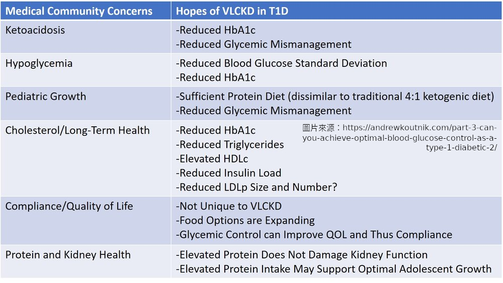

|  醫療院所反對理由 |  第一型患者期望與改善 |
|---|---|
|  ▪酮酸中毒 |  ▪降低HbA1c ▪減少血糖異常情形 |
|  ▫低血糖 |  ▫降低血糖標準差 ▫降低HbA1c |
|  ▪阻礙兒童發育 |  ▪蛋白質充分攝取（不同於傳統的4:1生酮飲食） ▪減少血糖異常情形 |
|  ▫膽固醇及長期健康 |  ▫降低HbA1c ▫降低三酸甘油酯 ▫提高HDL高密度脂蛋白 ▫減少胰島素使用量 ▫減少LDL低密度脂蛋白顆粒大小及數量（但仍需更多研究數據） |
|  ▪病人遵從性與生活品質 |  ▪沒有特別難處 ▪食材可選擇性愈來愈多 ▪生活品質與飲食遵從度達成良性循環 |
|  ▫蛋白質與腎功能 |  ▫提高蛋白質攝取並無任何負面影響 ▫有助青少年成長發育 |

醫病雙方對於極低碳水飲食都有各自的觀點（表11、圖22）：就醫療專業人員常見的疑慮，其中只有LDL膽固醇與病人遵從性有支持的數據，其它則多為受試者正面的評價，如三酸甘油酯降低、HbA1c下降、胰島素需求降低、血糖穩定與生活品質提高等等。無論如何，在採用極低碳水飲食前，各方面因素都需慎重考量。

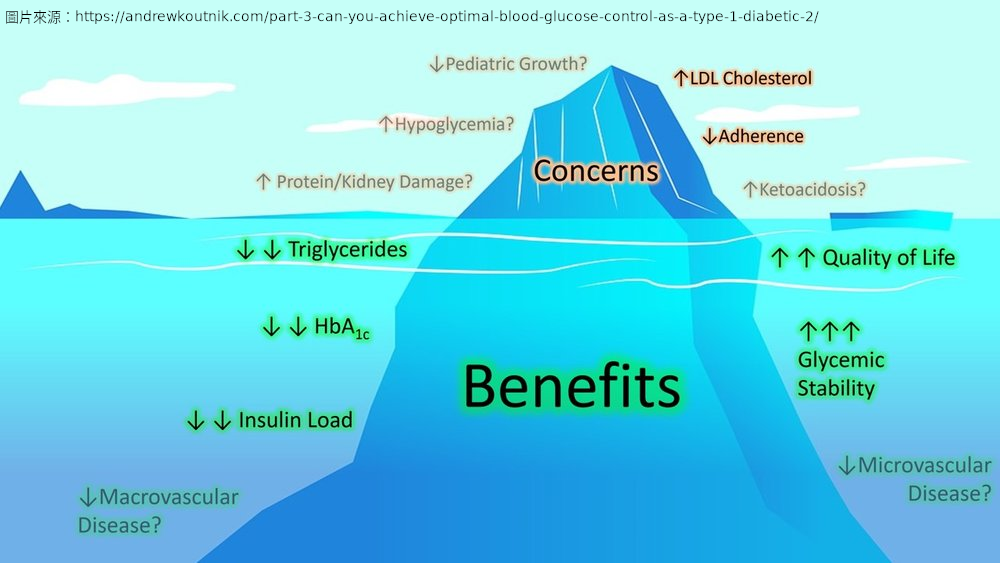

|  好處 |  疑慮 |
|---|---|
|  三酸甘油酯↓↓ |  LDL膽固醇↑ |
|  生活品質↑↑ |  病人遵從性↓ |
|  HbA1c↓↓ |  兒童發育↓(？) |
|  血糖穩定度↑↑↑ |  低血糖↑(？) |
|  胰島素需求↓↓ |  蛋白質與腎功能受損↑(？) |
|  微血管病變↓(？) |  酮酸中毒↑(？) |
|  大血管疾病↓(？) |   |

**第一型糖尿病治療的最終目標當然是希望能夠完全治癒，但現實是我們對疾病背後的自體免疫機制仍了解不足、可能還需數十年以上的時間才有克服的可能；但這不代表第一型患者只能無助地原地等死，因為我們可以透過改善飲食的方法來穩定且正常化我們的血糖。並非所有的第一型患者都能夠順利地使用極低碳水飲食來做為血糖控制的治療方法，但透過許多的研究報告及病人們的親身經歷（包括我自己），都清楚呈現了我們可以藉由飲食、藥物等等的方法來互相配合以達到血糖的正常化，而這就是當下第一型糖尿病患者們最大的著力點所在。極低碳水飲食仍需更多的研究以釐清醫界的質疑與操作上的限制、並進一步加強執行的穩健性，但它卻是當前第一型患者可以採行以穩定控制血糖的最好治療方法。就看我們能不能跟Type-1 Grit的受試者一樣，勇敢地（grit）往「第一型糖尿病患者不只能夠、且應該要和非糖尿病的健康同儕有著相同的血糖值」之目標邁進。**  

## 重要資料來源：
**《伯恩斯坦醫師的糖尿病治療方法：血糖正常完整指南》(《*Dr. Bernstein's Diabetes Solution: A Complete Guide to Achieving Normal Blood Sugars*》)** 為最重要、也是最全面的糖尿病治療指南，作者伯恩斯坦醫師本身即為第一型糖尿病患者兼内分泌科醫師，他在書中利用極低碳水化合物飲食指導第1及2型的患者、配合各種方法來達成血糖的穩定正常化。此書為我所知最詳盡的糖尿病書籍之一。另外他在youtube有開設頻道（RD Dikeman博士協助設立）<https://www.youtube.com/@DrRichardKBernstein/>，其中的「糖尿病大學」播放清單（The Complete Sessions，<https://www.youtube.com/playlist?list=PLs_TA02I6IvV-0SdUwE82Iw7iCCgbkJje>）推薦給剛接觸此治療方法的朋友參考。

|         |         |
|---|---|
|   |   |

臉書社團Type-1 Grit（<https://www.facebook.com/Type1Grit/>）是第一型患者採用極低碳水飲食最好的資訊來源與交流平台，我自己也持續地從這裡得到各種在醫療院所或書本中都難以知悉的無價知識  

《***The Ketogenic Diet for Type-1 Diabetes***》（***《第一型糖尿病的生酮飲食》*） 作者為Ellen Davis與Keith Runyan醫師** ，内容聚焦在運用生酮飲食來有效治療與管理疾病；Keith Runyan自己同時為第一型糖尿病患者，其個人部落格為<https://ketogenicdiabeticathlete.wordpress.com/author/krunyanmd/>。

**Caroline's Keto Kitchen**為一提供各種低碳水料理的食譜部落格（<http://www.carolinesketokitchen.com/>），能夠幫助患者在享受美食的同時又可避免血糖的大幅波動（我自己試過上面的許多食譜，美味與健康度著實令人驚豔）。站主凱洛林自己是位第一型患者，她的無私分享讓許多無法忘記高碳水飲食的人，可以在餐後平穩的血糖下享受各式的甜點美食。

Jeff Volek與Stephen Phinney是二位研究資歷超過20年之生理學及醫學博士，他們合著的***《The Art and Science of Low Carbohydrate Living》***（***《低醣飲食的藝術與科學：不只是瘦身，更是幫你維持健康、提升體能的終極指南》***，台灣晨星出版社，2021年）與***《The Art and Science of Low Carbohydrate Performance》***是透過極低碳水飲食以促進一般健康或運動表現的最佳入門書籍，不僅可供糖尿病患者參考、也適合任何想要更加深入相關歷史背景與生理機制運作的人閱讀。

## 單元摘要：
* 第一型糖尿病患者並無法從醫療院所得到能夠控制好血糖的相關營養學知識。
* 目前絕大多數的第一型患者仍被要求以「標準飲食」——即高碳水化合物、中等蛋白質、低脂肪——的方法來進行治療，但從來沒有任何的臨床研究可以證明這樣的飲食對血糖控制有良好的結果。
  * 其原因在於所謂的「標準飲食」是給一般非糖尿病患者的建議，而對罹病兒童院方不希望造成其因飲食不同而自覺與同儕有所區隔，且新的飲食會有遵從性的問題、對於患者本人及照顧者可能都難以持久實行。
* 營養素對人體而言可分為「必需」或「非必需」，前者如「必需蛋白質」或「必需脂肪酸」，意指人體無法自行合成、而需藉由飲食才能滿足需求；然而並不存在「必需碳水化合物」這種東西，因為我們人體可以自行合成葡萄糖來滿足生理所需。
* 這三種主要營養素（碳水化合物、蛋白質、脂質）對血糖的影響程度不同、其所需的胰島素量值也各不相同：
  * 碳水化合物（扣除纖維後）會被轉化為單一的葡萄糖分子、隨後進入血液循環並升高血糖，也就是說攝取的碳水化合物越多、血糖上升幅度越大。
  * 蛋白質會分解成單一的胺基酸，其中一部分可經過糖質新生轉換成葡萄糖而使血糖上升；相較於碳水化合物，蛋白質對血糖的影響小得多、延遲較長且途徑較間接。
  * 脂肪對血糖的影響極小，只有三酸甘油酯（3個脂肪酸+1個甘油）中的甘油骨架能被轉化為葡萄糖，脂肪酸本身無此作用。
* 第一型糖尿病患者需要外源性胰島素（通常為注射）來平衡碳水化合物、蛋白質與斷食期間（如睡眠或兩餐之間）的血糖上升現象。
* 基礎／餐時胰島素治療為第一型患者最常使用的用藥方法，基礎（長效）胰島素可穩定釋出藥物以維持患者斷食期間的血糖值、餐時胰島素（吃碳水時需用速效）則於餐前施打，其劑量以碳水計量法（見單元2）進行計算。
* 若以標準飲食配合基礎／餐時胰島素進行治療、再加上生活中各種會影響血糖的種種因素，數據顯示患者並無法有正常的血糖值。
* 人體的新陳代謝極其複雜，我們並無法找出一個可以精準計算出餐點及外源性胰島素彼此完全抵消並使血糖正常穩定的公式。
* 對第一型患者而言，每天的每一餐都像是一個胰島素的猜謎遊戲，其結果往往不可控且無法精確預測，尤其是碳水計量法的配合用藥更是如此。
* 胰島素用量愈多、則血糖的波動與變化幅度也就愈大。
* 作者（以及上千位Type-1 Grit社團的患者）透過極低碳水飲食成功地將血糖穩定控制在一般正常健康非糖尿病人的數值範圍内。
* 作者目前飲食為：每日3餐，内容為極低碳水化合物（每天<50克、約小於總熱量的10%）、高蛋白質（每日約200~300克）、脂質（不固定、約每日小於200克）。
* 作者使用的胰島素療法仍為基礎／餐時胰島素，但餐前使用短效（常規人體）胰島素、且每日總劑量僅約20~30單位（較標準飲食時減少約70%）。
* 作者全天的平均血糖值為一般非糖尿病患的正常血糖區間、且波動幅度相當有限。
* 作者的平均HbA1c為4.9%、約在第一型患者的前0.1%，屬於正常且健康的數值範圍。
* 因避免攝取碳水化合物可讓患者大幅降低胰島素用量、血糖波動情形可因此獲得改善，且使用藥效較緩和的短效常規人體胰島素來平衡蛋白質及脂肪所引起血糖上升，兩者間的效力彼此較能搭配，因此除了血糖會更趨穩定外、使用上也更安全些。
* Type-1 Grit為一採用極低碳水飲食的第一型糖尿病患者社群，其治療方法基於Richard Bernstein醫師所著***《Dr. Bernstein’s Diabetes Solution》***（***《伯恩斯坦醫師的糖尿病治療方法》***）一書（推薦必看）。
* 研究數據顯示，針對300位Type-1 Grit的受試者在實行極低碳水飲食至少3個月後，其平均血糖為104mg/dL、HbA1c值對比第一型患者約位居前1.28%。
* 極低碳水飲食受到批評質疑之處：
  * *高脂肪攝取*：高脂肪飲食通常和所謂「西方飲食」劃上等號、因此會被認為是肥胖元凶而遭致批評；但後者為高脂肪且高碳水的飲食，與限制碳水化合物的極低碳水飲食完全不同。
  * *LDL膽固醇*：極低碳水飲食可能會升高LDL、並讓一部分認為會增加心血管疾病風險的內分泌科醫生感到擔憂，但這兩者間是否有關連或為唯一因素則仍待釐清且備受質疑。
  * *病人遵從性*：有人認為極低碳水飲食過於嚴格且病人難以長期維持，但隨著血糖獲得良好控制的人愈來愈多、相關如食譜、實際治療方法等等的資源也愈來愈普及，使得這個飲食方法可以既愉快又長期性地融入生活當中。
  * *兒童發育*：因為癲癇兒童（採低碳水、低蛋白質飲食）相關的研究發現有發育遲緩的現象，因此有人擔憂採用極低碳水飲食是否也會有相同的問題。事實上第一型病人的極低碳水飲食，並不需如早期治療癲癇的飲食這般限制蛋白質攝取，而是可以攝取足夠的量以滿足成長發育所需，因此不會有阻礙生長的問題出現；加上研究亦證實血糖控制不良和兒童生長遲緩有關，而極低碳水飲食在血糖控制上有巨大幫助，罹病兒童更可避免發育遲緩的情形。
  * *長期健康*：目前尚無極低碳水飲食的長期流行病學數據，但血糖控制不良卻會造成各種長期的併發症。另外在動物模型的研究數據顯示長期的極低碳水飲食對健康有良好正面的作用。
  * *研究本身的侷限性*：以Type-1 Grit為例，由於該群體在治療上相當積極、但又只佔整體糖尿病患的極小比例，因此就算研究數據指出治療結果非常良好（HbA1c為正常健康的數值），但是否能推廣套用到其它第一型病人身上仍有疑慮。但作者認為這些數據其實是許多血糖控制不良患者的希望之光，只要可以勇敢地（grit）了解清楚並實際操作，對疾病管控就能夠有所幫助。

---
### 相關文獻：
* Addis, T. (1948). Glomerular nephritis: diagnosis and treatment. New York: Macmillan.
* Alemzadeh, R., Berhe, T., & Wyatt, D. T. (2005). Flexible insulin therapy with glargine insulin improved glycemic control and reduced severe hypoglycemia among preschool-aged children with type 1 diabetes mellitus. Pediatrics, 115(5), 1320-1324. doi:10.1542/peds.2004-1439
* American Diabetes, A. eAG/A1C Conversion Calculator. Retrieved from https://professional.diabetes.org/diapro/glucose_calc
* American Diabetes, A. (2016). Diagnosing Diabetes and Learning About Prediabetes. Retrieved from http://www.diabetes.org/diabetes-basics/diagnosis/
* American Diabetes, A. (2017). Grains and Starchy Vegetables. Retrieved from http:// www.diabetes.org/food-and-fitness/food/what-can-i-eat/making-healthy- food-choices/grains-and-starchy-vegetables.html?loc=cyp
* American Diabetes, A. (2018a). 8. Pharmacologic Approaches to Glycemic Treatment: Standards of Medical Care in Diabetes-2018. Diabetes Care, 41(Suppl 1), S73-S85. doi:10.2337/dc18-S008
* American Diabetes, A. (2018b). Create Your Plate. Retrieved from http://www.diabetes.org/food-and-fitness/food/planning-meals/create-your-plate/
* American Diabetes, A. (2018c). Fruits. Retrieved from http://www.diabetes.org/food-and-fitness/food/what-can-i-eat/making-healthy-food-choices/fruits.html?loc=cyp
* Austin, M. A., Breslow, J. L., Hennekens, C. H., Buring, J. E., Willett, W. C., & Krauss, R. M. (1988). Low-density lipoprotein subclass patterns and risk of myocardial infarction. JAMA, 260(13), 1917-1921.
* Berg JM, T. J., Stryer L. (2002). Biochemistry (5th ed.). New York: W H Freeman.
* Bernstein, R. K. (2011). Dr. Bernstein’s Diabetes Solution: The Complete Guide to Achieving Normal Blood Sugars (4th Ed.): Little, Brown Spark.
* Bhanpuri, N. H., Hallberg, S. J., Williams, P. T., McKenzie, A. L., Ballard, K. D., Campbell, W. W., . . . Volek, J. S. (2018). Cardiovascular disease risk factor responses to a type 2 diabetes care model including nutritional ketosis induced by sustained carbohydrate restriction at 1 year: an open label, non-randomized, controlled study. Cardiovasc Diabetol, 17(1), 56. doi:10.1186/s12933-018-0698-8
* Bonfig, W., Kapellen, T., Dost, A., Fritsch, M., Rohrer, T., Wolf, J., . . . the German Bundesministerium fur Bildung und Forschung Competence Net for Diabetes, M. (2012). Growth in children and adolescents with type 1 diabetes. J Pediatr, 160(6), 900-903 e902. doi:10.1016/j.jpeds.2011.12.007
* Butalia, S., Johnson, J. A., Ghali, W. A., & Rabi, D. M. (2013). Clinical and socio-demographic factors associated with diabetic ketoacidosis hospitalization in adults with Type 1 diabetes. Diabet Med, 30(5), 567-573. doi:10.1111/dme.12127
* Butalia, S., Patel, A. B., Johnson, J. A., Ghali, W. A., & Rabi, D. M. (2014). Association between diabetic ketoacidosis hospitalizations and driving distance to outpatient diabetes centres in adults with type 1 diabetes mellitus. Can J Diabetes, 38(6), 451-455. doi:10.1016/j.jcjd.2013.12.009
* Cengiz, E., Xing, D., Wong, J. C., Wolfsdorf, J. I., Haymond, M. W., Rewers, A., . . . Network, T. D. E. C. (2013). Severe hypoglycemia and diabetic ketoacidosis among youth with type 1 diabetes in the T1D Exchange clinic registry. Pediatr Diabetes, 14(6), 447-454. doi:10.1111/pedi.12030
* Chamberlain, J. J., Kalyani, R. R., Leal, S., Rhinehart, A. S., Shubrook, J. H., Skolnik, N., & Herman, W. H. (2017). Treatment of Type 1 Diabetes: Synopsis of the 2017 American Diabetes Association Standards of Medical Care in Diabetes. Ann Intern Med, 167(7), 493-498. doi:10.7326/M17-1259
* Cherubini, V., Iannilli, A., Iafusco, D., Cardella, F., Giamprini, M. S., Fanelli, C., & Coppa, G. V. (2006). Premeal insulin treatment during basal-bolus regimen in young children with type 1 diabetes. Diabetes Care, 29(10), 2311-2312. doi:10.2337/dc06-0754
* Collier, G., & O’Dea, K. (1983). The effect of coingestion of fat on the glucose, insulin, and gastric inhibitory polypeptide responses to carbohydrate and protein. Am J Clin Nutr, 37(6), 941-944. doi:10.1093/ajcn/37.6.941
* Constance A, H. C., Hayes C, Pereira R, Ross T, Swift C. (2011). My Carbohydrate Guide. In. Retrieved from http://www.lillydiabetes.com/_assets/pdf/ld90766_carbguide.pdf
* Conway, B. N., Lopes-Virella, M. F., & Blot, W. J. (2018). Late adulthood mortality among African-American and white American people with Type 1 diabetes according to age at diabetes diagnosis. Diabet Med, 35(6), 729-736. doi:10.1111/dme.13617
* Dansinger, M. L., Gleason, J. A., Griffith, J. L., Selker, H. P., & Schaefer, E. J. (2005). Comparison of the Atkins, Ornish, Weight Watchers, and Zone diets for weight loss and heart disease risk reduction: a randomized trial. JAMA, 293(1), 43-53. doi:10.1001/jama.293.1.43
* Dashti, H. M., Mathew, T. C., Hussein, T., Asfar, S. K., Behbahani, A., Khoursheed, M. A., . . . Al-Zaid, N. S. (2004). Long-term effects of a ketogenic diet in obese patients. Exp Clin Cardiol, 9(3), 200-205.
* Devries, M. C., Sithamparapillai, A., Brimble, K. S., Banfield, L., Morton, R. W., & Phillips, S. M. (2018). Changes in Kidney Function Do Not Differ between Healthy Adults Consuming Higher- Compared with Lower- or Normal-Protein Diets: A Systematic Review and Meta-Analysis. J Nutr, 148(11), 1760-1775. doi:10.1093/jn/nxy197
* Diabetes, C., Complications Trial/Epidemiology of Diabetes, I., & Complications Research, G. (2016). Risk Factors for Cardiovascular Disease in Type 1 Diabetes. Diabetes, 65(5), 1370-1379. doi:10.2337/db15-1517
* Douris, N., Melman, T., Pecherer, J. M., Pissios, P., Flier, J. S., Cantley, L. C., . . . Maratos-Flier, E. (2015). Adaptive changes in amino acid metabolism permit normal longevity in mice consuming a low-carbohydrate ketogenic diet. Biochim Biophys Acta, 1852(10 Pt A), 2056-2065. doi:10.1016/j.bbadis.2015.07.009
* DuBroff, R. (2017). Cholesterol paradox: a correlate does not a surrogate make. Evid Based Med, 22(1), 15-19. doi:10.1136/ebmed-2016-110602
* Eiswirth, M., Clark, E., & Diamond, M. (2018). Low carbohydrate diet and improved glycaemic control in a patient with type one diabetes. Endocrinol Diabetes Metab Case Rep, 2018. doi:10.1530/EDM-18-0002
* Envigo. Diet induced obesity. Retrieved from https://www.envigo.com/products-services/teklad/laboratory-animal-diets/custom-research/diet-induced-obesity/
* Exchange, T. D. T1D Discovery Tool. Retrieved from https://t1dexchange.org/pages/resources/our-data/
* Feinman, R. D., Pogozelski, W. K., Astrup, A., Bernstein, R. K., Fine, E. J., Westman, E. C., . . . Worm, N. (2015). Dietary carbohydrate restriction as the first approach in diabetes management: critical review and evidence base. Nutrition, 31(1), 1-13. doi:10.1016/j.nut.2014.06.011
* Ference, B. A., Ginsberg, H. N., Graham, I., Ray, K. K., Packard, C. J., Bruckert, E., . . . Catapano, A. L. (2017). Low-density lipoproteins cause atherosclerotic cardiovascular disease. 1. Evidence from genetic, epidemiologic, and clinical studies. A consensus statement from the European Atherosclerosis Society Consensus Panel. Eur Heart J, 38(32), 2459-2472. doi:10.1093/eurheartj/ehx144
* Fouque, D., & Laville, M. (2009). Low protein diets for chronic kidney disease in non diabetic adults. Cochrane Database Syst Rev(3), CD001892. doi:10.1002/14651858.CD001892.pub3
* Franz, M. J., Boucher, J. L., & Evert, A. B. (2014). Evidence-based diabetes nutrition therapy recommendations are effective: the key is individualization. Diabetes Metab Syndr Obes, 7, 65-72. doi:10.2147/DMSO.S45140
* Franz, M. J., Powers, M. A., Leontos, C., Holzmeister, L. A., Kulkarni, K., Monk, A., . . . Gradwell, E. (2010). The evidence for medical nutrition therapy for type 1 and type 2 diabetes in adults. J Am Diet Assoc, 110(12), 1852-1889. doi:10.1016/j.jada.2010.09.014
* Freeman, J. S. (2009). Insulin analog therapy: improving the match with physiologic insulin secretion. J Am Osteopath Assoc, 109(1), 26-36.
* Frohlich-Reiterer, E. E., Kaspers, S., Hofer, S., Schober, E., Kordonouri, O., Pozza, S. B., . . . Diabetes Patienten Verlaufsdokumentationssystem-Wiss Study, G. (2011). Anthropometry, metabolic control, and follow-up in children and adolescents with type 1 diabetes mellitus and biopsy-proven celiac disease. J Pediatr, 158(4), 589-593 e582. doi:10.1016/j.jpeds.2010.09.050
* Gardner, C. D., Trepanowski, J. F., Del Gobbo, L. C., Hauser, M. E., Rigdon, J., Ioannidis, J. P. A., . . . King, A. C. (2018). Effect of Low-Fat vs Low-Carbohydrate Diet on 12-Month Weight Loss in Overweight Adults and the Association With Genotype Pattern or Insulin Secretion: The DIETFITS Randomized Clinical Trial. JAMA, 319(7), 667-679. doi:10.1001/jama.2018.0245
* Hallberg, S. J., McKenzie, A. L., Williams, P. T., Bhanpuri, N. H., Peters, A. L., Campbell, W. W., . . . Volek, J. S. (2018). Effectiveness and Safety of a Novel Care Model for the Management of Type 2 Diabetes at 1 Year: An Open-Label, Non-Randomized, Controlled Study. Diabetes Ther, 9(2), 583-612. doi:10.1007/s13300-018-0373-9
* Hannon, T. S., & Rogol, A. D. (2012). Diabetes mellitus and growth in children and adolescents. J Pediatr, 160(6), 893-894. doi:10.1016/j.jpeds.2012.01.037
* Health, H. T. H. C. S. o. P. (2011). Healthy Eating Plate & Healthy Eating Pyramid. Retrieved from https://www.hsph.harvard.edu/nutritionsource/healthy-eating-plate/
* Health, H. T. H. C. S. o. P. (2018a). Vegetables and Fruits. Retrieved from https://www.hsph.harvard.edu/nutritionsource/what-should-you-eat/vegetables-and-fruits/
* Health, H. T. H. C. S. o. P. (2018b). Whole Grains. Retrieved from https://www.hsph.harvard.edu/nutritionsource/what-should-you-eat/whole-grains/
* Heller, S., Buse, J., Fisher, M., Garg, S., Marre, M., Merker, L., . . . Investigators, B. B.-B. T. T. (2012). Insulin degludec, an ultra-longacting basal insulin, versus insulin glargine in basal-bolus treatment with mealtime insulin aspart in type 1 diabetes (BEGIN Basal-Bolus Type 1): a phase 3, randomised, open-label, treat-to-target non-inferiority trial. Lancet, 379(9825), 1489-1497. doi:10.1016/S0140-6736(12)60204-9
* Hu, T., & Bazzano, L. A. (2014). The low-carbohydrate diet and cardiovascular risk factors: evidence from epidemiologic studies. Nutr Metab Cardiovasc Dis, 24(4), 337-343. doi:10.1016/j.numecd.2013.12.008
* KDIGO. (2013). Kidney Disease: Improving Global Outcomes (KDIGO) CKD Work Group KDIGO 2012 clinical practice guideline for the evaluation and management of chronic kidney disease. Kidney Int Suppl, 3, 1-150.
* Khadilkar, V. V., Parthasarathy, L. S., Mallade, B. B., Khadilkar, A. V., Chiplonkar, S. A., & Borade, A. B. (2013). Growth status of children and adolescents with type 1 diabetes mellitus. Indian J Endocrinol Metab, 17(6), 1057-1060. doi:10.4103/2230-8210.122623
* Koutnik, A. P., D’Agostino, D. P., & Egan, B. (2019). Anticatabolic Effects of Ketone Bodies in Skeletal Muscle. Trends Endocrinol Metab. doi:10.1016/j.tem.2019.01.006
* Kuenen, J. C., Borg, R., Kuik, D. J., Zheng, H., Schoenfeld, D., Diamant, M., . . . Group, A. S. (2011). Does glucose variability influence the relationship between mean plasma glucose and HbA1c levels in type 1 and type 2 diabetic patients? Diabetes Care, 34(8), 1843-1847. doi:10.2337/dc10-2217
* Leow, Z. Z. X., Guelfi, K. J., Davis, E. A., Jones, T. W., & Fournier, P. A. (2018). The glycaemic benefits of a very-low-carbohydrate ketogenic diet in adults with Type 1 diabetes mellitus may be opposed by increased hypoglycaemia risk and dyslipidaemia. Diabet Med. doi:10.1111/dme.13663
* Lennerz, B. S., Barton, A., Bernstein, R. K., Dikeman, R. D., Diulus, C., Hallberg, S., . . . Ludwig, D. S. (2018). Management of Type 1 Diabetes With a Very Low-Carbohydrate Diet. Pediatrics, 141(6). doi:10.1542/peds.2017-3349
* Lebenthal, Y., Shalitin, S., Yackobovitch-Gavan, M., Phillip, M., & Lazar, L. (2012). Retrospective comparative analysis of metabolic control and early complications in familial and sporadic type 1 diabetes patients. J Diabetes Complications, 26(3), 219-224. doi:10.1016/j.jdiacomp.2012.03.016
* Livingstone, S. J., Levin, D., Looker, H. C., Lindsay, R. S., Wild, S. H., Joss, N., . . . Scottish Renal, R. (2015). Estimated life expectancy in a Scottish cohort with type 1 diabetes, 2008-2010. JAMA, 313(1), 37-44. doi:10.1001/jama.2014.16425
* Livingstone, S. J., Looker, H. C., Hothersall, E. J., Wild, S. H., Lindsay, R. S., Chalmers, J., . . . Colhoun, H. M. (2012). Risk of cardiovascular disease and total mortality in adults with type 1 diabetes: Scottish registry linkage study. PLoS Med, 9(10), e1001321. doi:10.1371/journal.pmed.1001321
* Merriam-Webster. (2018). Definition of Macronutrient. Retrieved from https://www.merriam-webster.com/dictionary/macronutrient
* Mooradian, A. D., Bernbaum, M., & Albert, S. G. (2006). Narrative review: a rational approach to starting insulin therapy. Ann Intern Med, 145(2), 125-134.
* Newburgh, L. H. M., P. L. (1920). THE USE OF A HIGH FAT DIET IN THE TREATMENT OF DIABETES MELLITUS. JAMA Internal Medicine, 26(6), 647-662. doi:10.1001/archinte.1920.00100060002001
* Newman, J. C., & Verdin, E. (2014). Ketone bodies as signaling metabolites. Trends Endocrinol Metab, 25(1), 42-52. doi:10.1016/j.tem.2013.09.002
* Newman, J. C., Covarrubias, A. J., Zhao, M., Yu, X., Gut, P., Ng, C. P., . . . Verdin, E. (2017). Ketogenic Diet Reduces Midlife Mortality and Improves Memory in Aging Mice. Cell Metab, 26(3), 547-557 e548. doi:10.1016/j.cmet.2017.08.004
* Nordmann, A. J., Nordmann, A., Briel, M., Keller, U., Yancy, W. S., Jr., Brehm, B. J., & Bucher, H. C. (2006). Effects of low-carbohydrate vs low-fat diets on weight loss and cardiovascular risk factors: a meta-analysis of randomized controlled trials. Arch Intern Med, 166(3), 285-293. doi:10.1001/archinte.166.3.285
* O’Neill, D. F. W., E. C.; Bernstein, R. K. (2003). The effects of a low-carbohydrate regimen on glycemic control and serum lipids in diabetes mellitus. Metab Syndr Relat Disord, 1(4), 291-298. doi:10.1089/1540419031361345
* Oza-Frank, R., Cheng, Y. J., Narayan, K. M., & Gregg, E. W. (2009). Trends in nutrient intake among adults with diabetes in the United States: 1988-2004. J Am Diet Assoc, 109(7), 1173-1178. doi:10.1016/j.jada.2009.04.007
* Pal, S., & Ellis, V. (2010). The acute effects of four protein meals on insulin, glucose, appetite and energy intake in lean men. Br J Nutr, 104(8), 1241-1248. doi:10.1017/S0007114510001911
* Paoli, A., Rubini, A., Volek, J. S., & Grimaldi, K. A. (2013). Beyond weight loss: a review of the therapeutic uses of very-low-carbohydrate (ketogenic) diets. Eur J Clin Nutr, 67(8), 789-796. doi:10.1038/ejcn.2013.116
* Parry HA, K. W., Mumford P, Romero M, Hann C, Mobley B, Zhang Y, Roberts MD, Kavazis AN. (2018). Lifelong Ketogenic Diet Feeding Increases Longevity, But Does Not Alter Oxidative Stress Markers in Rats. Paper presented at the Medicine & Science in Sports & Exercise.
* Parthasarathy, L., Khadilkar, V., Chiplonkar, S., & Khadilkar, A. (2016). Longitudinal Growth in Children and Adolescents with Type 1 Diabetes. Indian Pediatr, 53(11), 990-992.
* Paterson, M., Bell, K. J., O’Connell, S. M., Smart, C. E., Shafat, A., & King, B. (2015). The Role of Dietary Protein and Fat in Glycaemic Control in Type 1 Diabetes: Implications for Intensive Diabetes Management. Curr Diab Rep, 15(9), 61. doi:10.1007/s11892-015-0630-5
* Phinney, S. D., Bistrian, B. R., Evans, W. J., Gervino, E., & Blackburn, G. L. (1983). The human metabolic response to chronic ketosis without caloric restriction: preservation of submaximal exercise capability with reduced carbohydrate oxidation. Metabolism, 32(8), 769-776.
* Phinney, S. D., Horton, E. S., Sims, E. A., Hanson, J. S., Danforth, E., Jr., & LaGrange, B. M. (1980). Capacity for moderate exercise in obese subjects after adaptation to a hypocaloric, ketogenic diet. J Clin Invest, 66(5), 1152-1161. doi:10.1172/JCI109945
* Pinhas-Hamiel, O., Hamiel, U., Boyko, V., Graph-Barel, C., Reichman, B., & Lerner-Geva, L. (2014). Trajectories of HbA1c levels in children and youth with type 1 diabetes. PLoS One, 9(10), e109109. doi:10.1371/journal.pone.0109109
* Poff, A., Koutnik, A. P., Egan, K. M., Sahebjam, S., D’Agostino, D., & Kumar, N. B. (2017). Targeting the Warburg effect for cancer treatment: Ketogenic diets for management of glioma. Semin Cancer Biol. doi:10.1016/j.semcancer.2017.12.011
* Ranjan, A., Schmidt, S., Damm-Frydenberg, C., Holst, J. J., Madsbad, S., & Norgaard, K. (2017). Short-term effects of a low carbohydrate diet on glycaemic variables and cardiovascular risk markers in patients with type 1 diabetes: A randomized open-label crossover trial. Diabetes Obes Metab, 19(10), 1479-1484. doi:10.1111/dom.12953
* Roberts, M. N., Wallace, M. A., Tomilov, A. A., Zhou, Z., Marcotte, G. R., Tran, D., . . . Lopez-Dominguez, J. A. (2018). A Ketogenic Diet Extends Longevity and Healthspan in Adult Mice. Cell Metab, 27(5), 1156. doi:10.1016/j.cmet.2018.04.005
* Saaddine, J. B., Fagot-Campagna, A., Rolka, D., Narayan, K. M., Geiss, L., Eberhardt, M., & Flegal, K. M. (2002). Distribution of HbA(1c) levels for children and young adults in the U.S.: Third National Health and Nutrition Examination Survey. Diabetes Care, 25(8), 1326-1330.
* Schrauwen, P., & Westerterp, K. R. (2000). The role of high-fat diets and physical activity in the regulation of body weight. Br J Nutr, 84(4), 417-427.
* Soedamah-Muthu, S. S., Fuller, J. H., Mulnier, H. E., Raleigh, V. S., Lawrenson, R. A., & Colhoun, H. M. (2006). High risk of cardiovascular disease in patients with type 1 diabetes in the U.K.: a cohort study using the general practice research database. Diabetes Care, 29(4), 798-804.
* Stafstrom, C. E., & Rho, J. M. (2012). The ketogenic diet as a treatment paradigm for diverse neurological disorders. Front Pharmacol, 3, 59. doi:10.3389/fphar.2012.00059
* Thompson R, C. D., Hindmarsh PC. (2006). The role for insulin analogs in diabetes care. Current Paediatrics, 16, 117-122.
* Turton, J. L., Raab, R., & Rooney, K. B. (2018). Low-carbohydrate diets for type 1 diabetes mellitus: A systematic review. PLoS One, 13(3), e0194987. doi:10.1371/journal.pone.0194987
* USDA. (2017). Grains. Retrieved from https://www.choosemyplate.gov/grains
* USDA. (2018a). Choose My Plate. Retrieved from https://www.choosemyplate.gov
* USDA. (2018b). Fruit. Retrieved from https://www.choosemyplate.gov/fruit
* Vernon, M. C., Mavropoulos, J., Transue, M., Yancy, W. S., & Westman, E. C. (2003). Clinical experience of a carbohydrate-restricted diet: effect on diabetes mellitus. Metab Syndr Relat Disord, 1(3), 233-237. doi:10.1089/154041903322716714
* Vining, E. P., Pyzik, P., McGrogan, J., Hladky, H., Anand, A., Kriegler, S., & Freeman, J. M. (2002). Growth of children on the ketogenic diet. Dev Med Child Neurol, 44(12), 796-802.
* Volek, J. S., Freidenreich, D. J., Saenz, C., Kunces, L. J., Creighton, B. C., Bartley, J. M., . . . Phinney, S. D. (2016). Metabolic characteristics of keto-adapted ultra-endurance runners. Metabolism, 65(3), 100-110. doi:10.1016/j.metabol.2015.10.028.
* Weinstock, R. S., Xing, D., Maahs, D. M., Michels, A., Rickels, M. R., Peters, A. L., . . . Network, T. D. E. C. (2013). Severe hypoglycemia and diabetic ketoacidosis in adults with type 1 diabetes: results from the T1D Exchange clinic registry. J Clin Endocrinol Metab, 98(8), 3411-3419. doi:10.1210/jc.2013-1589.
* Williams, P. T., Superko, H. R., Haskell, W. L., Alderman, E. L., Blanche, P. J., Holl, L. G., & Krauss, R. M. (2003). Smallest LDL particles are most strongly related to coronary disease progression in men. Arterioscler Thromb Vasc Biol, 23(2), 314-321.
* Woodyatt, R. T. (1921). OBJECTS AND METHOD OF DIET ADJUSTMENT IN DIABETES. JAMA Internal Medicine, 28(2), 125-141. doi:10.1001/archinte.1921.00100140002001Addis, T. (1948). Glomerular nephritis: diagnosis and treatment. New York: Macmillan.
* Alemzadeh, R., Berhe, T., & Wyatt, D. T. (2005). Flexible insulin therapy with glargine insulin improved glycemic control and reduced severe hypoglycemia among preschool-aged children with type 1 diabetes mellitus. Pediatrics, 115(5), 1320-1324. doi:10.1542/peds.2004-1439
* American Diabetes, A. eAG/A1C Conversion Calculator. Retrieved from https://professional.diabetes.org/diapro/glucose_calc
* American Diabetes, A. (2016). Diagnosing Diabetes and Learning About Prediabetes. Retrieved from http://www.diabetes.org/diabetes-basics/diagnosis/
* American Diabetes, A. (2017). Grains and Starchy Vegetables. Retrieved from http:// www.diabetes.org/food-and-fitness/food/what-can-i-eat/making-healthy- food-choices/grains-and-starchy-vegetables.html?loc=cyp
* American Diabetes, A. (2018a). 8. Pharmacologic Approaches to Glycemic Treatment: Standards of Medical Care in Diabetes-2018. Diabetes Care, 41(Suppl 1), S73-S85. doi:10.2337/dc18-S008
* American Diabetes, A. (2018b). Create Your Plate. Retrieved from http://www.diabetes.org/food-and-fitness/food/planning-meals/create-your-plate/
* American Diabetes, A. (2018c). Fruits. Retrieved from http://www.diabetes.org/food-and-fitness/food/what-can-i-eat/making-healthy-food-choices/fruits.html?loc=cyp
* Austin, M. A., Breslow, J. L., Hennekens, C. H., Buring, J. E., Willett, W. C., & Krauss, R. M. (1988). Low-density lipoprotein subclass patterns and risk of myocardial infarction. JAMA, 260(13), 1917-1921.
* Berg JM, T. J., Stryer L. (2002). Biochemistry (5th ed.). New York: W H Freeman.
* Bernstein, R. K. (2011). Dr. Bernstein’s Diabetes Solution: The Complete Guide to Achieving Normal Blood Sugars (4th Ed.): Little, Brown Spark.
* Bhanpuri, N. H., Hallberg, S. J., Williams, P. T., McKenzie, A. L., Ballard, K. D., Campbell, W. W., . . . Volek, J. S. (2018). Cardiovascular disease risk factor responses to a type 2 diabetes care model including nutritional ketosis induced by sustained carbohydrate restriction at 1 year: an open label, non-randomized, controlled study. Cardiovasc Diabetol, 17(1), 56. doi:10.1186/s12933-018-0698-8
* Bonfig, W., Kapellen, T., Dost, A., Fritsch, M., Rohrer, T., Wolf, J., . . . the German Bundesministerium fur Bildung und Forschung Competence Net for Diabetes, M. (2012). Growth in children and adolescents with type 1 diabetes. J Pediatr, 160(6), 900-903 e902. doi:10.1016/j.jpeds.2011.12.007
* Butalia, S., Johnson, J. A., Ghali, W. A., & Rabi, D. M. (2013). Clinical and socio-demographic factors associated with diabetic ketoacidosis hospitalization in adults with Type 1 diabetes. Diabet Med, 30(5), 567-573. doi:10.1111/dme.12127
* Butalia, S., Patel, A. B., Johnson, J. A., Ghali, W. A., & Rabi, D. M. (2014). Association between diabetic ketoacidosis hospitalizations and driving distance to outpatient diabetes centres in adults with type 1 diabetes mellitus. Can J Diabetes, 38(6), 451-455. doi:10.1016/j.jcjd.2013.12.009
* Cengiz, E., Xing, D., Wong, J. C., Wolfsdorf, J. I., Haymond, M. W., Rewers, A., . . . Network, T. D. E. C. (2013). Severe hypoglycemia and diabetic ketoacidosis among youth with type 1 diabetes in the T1D Exchange clinic registry. Pediatr Diabetes, 14(6), 447-454. doi:10.1111/pedi.12030
* Chamberlain, J. J., Kalyani, R. R., Leal, S., Rhinehart, A. S., Shubrook, J. H., Skolnik, N., & Herman, W. H. (2017). Treatment of Type 1 Diabetes: Synopsis of the 2017 American Diabetes Association Standards of Medical Care in Diabetes. Ann Intern Med, 167(7), 493-498. doi:10.7326/M17-1259
* Cherubini, V., Iannilli, A., Iafusco, D., Cardella, F., Giamprini, M. S., Fanelli, C., & Coppa, G. V. (2006). Premeal insulin treatment during basal-bolus regimen in young children with type 1 diabetes. Diabetes Care, 29(10), 2311-2312. doi:10.2337/dc06-0754
* Collier, G., & O’Dea, K. (1983). The effect of coingestion of fat on the glucose, insulin, and gastric inhibitory polypeptide responses to carbohydrate and protein. Am J Clin Nutr, 37(6), 941-944. doi:10.1093/ajcn/37.6.941
* Constance A, H. C., Hayes C, Pereira R, Ross T, Swift C. (2011). My Carbohydrate Guide. In. Retrieved from http://www.lillydiabetes.com/_assets/pdf/ld90766_carbguide.pdf
* Conway, B. N., Lopes-Virella, M. F., & Blot, W. J. (2018). Late adulthood mortality among African-American and white American people with Type 1 diabetes according to age at diabetes diagnosis. Diabet Med, 35(6), 729-736. doi:10.1111/dme.13617
* Dansinger, M. L., Gleason, J. A., Griffith, J. L., Selker, H. P., & Schaefer, E. J. (2005). Comparison of the Atkins, Ornish, Weight Watchers, and Zone diets for weight loss and heart disease risk reduction: a randomized trial. JAMA, 293(1), 43-53. doi:10.1001/jama.293.1.43
* Dashti, H. M., Mathew, T. C., Hussein, T., Asfar, S. K., Behbahani, A., Khoursheed, M. A., . . . Al-Zaid, N. S. (2004). Long-term effects of a ketogenic diet in obese patients. Exp Clin Cardiol, 9(3), 200-205.
* Devries, M. C., Sithamparapillai, A., Brimble, K. S., Banfield, L., Morton, R. W., & Phillips, S. M. (2018). Changes in Kidney Function Do Not Differ between Healthy Adults Consuming Higher- Compared with Lower- or Normal-Protein Diets: A Systematic Review and Meta-Analysis. J Nutr, 148(11), 1760-1775. doi:10.1093/jn/nxy197
* Diabetes, C., Complications Trial/Epidemiology of Diabetes, I., & Complications Research, G. (2016). Risk Factors for Cardiovascular Disease in Type 1 Diabetes. Diabetes, 65(5), 1370-1379. doi:10.2337/db15-1517
* Douris, N., Melman, T., Pecherer, J. M., Pissios, P., Flier, J. S., Cantley, L. C., . . . Maratos-Flier, E. (2015). Adaptive changes in amino acid metabolism permit normal longevity in mice consuming a low-carbohydrate ketogenic diet. Biochim Biophys Acta, 1852(10 Pt A), 2056-2065. doi:10.1016/j.bbadis.2015.07.009
* DuBroff, R. (2017). Cholesterol paradox: a correlate does not a surrogate make. Evid Based Med, 22(1), 15-19. doi:10.1136/ebmed-2016-110602
* Eiswirth, M., Clark, E., & Diamond, M. (2018). Low carbohydrate diet and improved glycaemic control in a patient with type one diabetes. Endocrinol Diabetes Metab Case Rep, 2018. doi:10.1530/EDM-18-0002
* Envigo. Diet induced obesity. Retrieved from https://www.envigo.com/products-services/teklad/laboratory-animal-diets/custom-research/diet-induced-obesity/
* Exchange, T. D. T1D Discovery Tool. Retrieved from https://t1dexchange.org/pages/resources/our-data/
* Feinman, R. D., Pogozelski, W. K., Astrup, A., Bernstein, R. K., Fine, E. J., Westman, E. C., . . . Worm, N. (2015). Dietary carbohydrate restriction as the first approach in diabetes management: critical review and evidence base. Nutrition, 31(1), 1-13. doi:10.1016/j.nut.2014.06.011
* Ference, B. A., Ginsberg, H. N., Graham, I., Ray, K. K., Packard, C. J., Bruckert, E., . . . Catapano, A. L. (2017). Low-density lipoproteins cause atherosclerotic cardiovascular disease. 1. Evidence from genetic, epidemiologic, and clinical studies. A consensus statement from the European Atherosclerosis Society Consensus Panel. Eur Heart J, 38(32), 2459-2472. doi:10.1093/eurheartj/ehx144
* Fouque, D., & Laville, M. (2009). Low protein diets for chronic kidney disease in non diabetic adults. Cochrane Database Syst Rev(3), CD001892. doi:10.1002/14651858.CD001892.pub3
* Franz, M. J., Boucher, J. L., & Evert, A. B. (2014). Evidence-based diabetes nutrition therapy recommendations are effective: the key is individualization. Diabetes Metab Syndr Obes, 7, 65-72. doi:10.2147/DMSO.S45140
* Franz, M. J., Powers, M. A., Leontos, C., Holzmeister, L. A., Kulkarni, K., Monk, A., . . . Gradwell, E. (2010). The evidence for medical nutrition therapy for type 1 and type 2 diabetes in adults. J Am Diet Assoc, 110(12), 1852-1889. doi:10.1016/j.jada.2010.09.014
* Freeman, J. S. (2009). Insulin analog therapy: improving the match with physiologic insulin secretion. J Am Osteopath Assoc, 109(1), 26-36.
* Frohlich-Reiterer, E. E., Kaspers, S., Hofer, S., Schober, E., Kordonouri, O., Pozza, S. B., . . . Diabetes Patienten Verlaufsdokumentationssystem-Wiss Study, G. (2011). Anthropometry, metabolic control, and follow-up in children and adolescents with type 1 diabetes mellitus and biopsy-proven celiac disease. J Pediatr, 158(4), 589-593 e582. doi:10.1016/j.jpeds.2010.09.050
* Gardner, C. D., Trepanowski, J. F., Del Gobbo, L. C., Hauser, M. E., Rigdon, J., Ioannidis, J. P. A., . . . King, A. C. (2018). Effect of Low-Fat vs Low-Carbohydrate Diet on 12-Month Weight Loss in Overweight Adults and the Association With Genotype Pattern or Insulin Secretion: The DIETFITS Randomized Clinical Trial. JAMA, 319(7), 667-679. doi:10.1001/jama.2018.0245
* Hallberg, S. J., McKenzie, A. L., Williams, P. T., Bhanpuri, N. H., Peters, A. L., Campbell, W. W., . . . Volek, J. S. (2018). Effectiveness and Safety of a Novel Care Model for the Management of Type 2 Diabetes at 1 Year: An Open-Label, Non-Randomized, Controlled Study. Diabetes Ther, 9(2), 583-612. doi:10.1007/s13300-018-0373-9
* Hannon, T. S., & Rogol, A. D. (2012). Diabetes mellitus and growth in children and adolescents. J Pediatr, 160(6), 893-894. doi:10.1016/j.jpeds.2012.01.037
* Health, H. T. H. C. S. o. P. (2011). Healthy Eating Plate & Healthy Eating Pyramid. Retrieved from https://www.hsph.harvard.edu/nutritionsource/healthy-eating-plate/
* Health, H. T. H. C. S. o. P. (2018a). Vegetables and Fruits. Retrieved from https://www.hsph.harvard.edu/nutritionsource/what-should-you-eat/vegetables-and-fruits/
* Health, H. T. H. C. S. o. P. (2018b). Whole Grains. Retrieved from https://www.hsph.harvard.edu/nutritionsource/what-should-you-eat/whole-grains/
* Heller, S., Buse, J., Fisher, M., Garg, S., Marre, M., Merker, L., . . . Investigators, B. B.-B. T. T. (2012). Insulin degludec, an ultra-longacting basal insulin, versus insulin glargine in basal-bolus treatment with mealtime insulin aspart in type 1 diabetes (BEGIN Basal-Bolus Type 1): a phase 3, randomised, open-label, treat-to-target non-inferiority trial. Lancet, 379(9825), 1489-1497. doi:10.1016/S0140-6736(12)60204-9
* Hu, T., & Bazzano, L. A. (2014). The low-carbohydrate diet and cardiovascular risk factors: evidence from epidemiologic studies. Nutr Metab Cardiovasc Dis, 24(4), 337-343. doi:10.1016/j.numecd.2013.12.008
* KDIGO. (2013). Kidney Disease: Improving Global Outcomes (KDIGO) CKD Work Group KDIGO 2012 clinical practice guideline for the evaluation and management of chronic kidney disease. Kidney Int Suppl, 3, 1-150.
* Khadilkar, V. V., Parthasarathy, L. S., Mallade, B. B., Khadilkar, A. V., Chiplonkar, S. A., & Borade, A. B. (2013). Growth status of children and adolescents with type 1 diabetes mellitus. Indian J Endocrinol Metab, 17(6), 1057-1060. doi:10.4103/2230-8210.122623
* Koutnik, A. P., D’Agostino, D. P., & Egan, B. (2019). Anticatabolic Effects of Ketone Bodies in Skeletal Muscle. Trends Endocrinol Metab. doi:10.1016/j.tem.2019.01.006
* Kuenen, J. C., Borg, R., Kuik, D. J., Zheng, H., Schoenfeld, D., Diamant, M., . . . Group, A. S. (2011). Does glucose variability influence the relationship between mean plasma glucose and HbA1c levels in type 1 and type 2 diabetic patients? Diabetes Care, 34(8), 1843-1847. doi:10.2337/dc10-2217
* Leow, Z. Z. X., Guelfi, K. J., Davis, E. A., Jones, T. W., & Fournier, P. A. (2018). The glycaemic benefits of a very-low-carbohydrate ketogenic diet in adults with Type 1 diabetes mellitus may be opposed by increased hypoglycaemia risk and dyslipidaemia. Diabet Med. doi:10.1111/dme.13663
* Lennerz, B. S., Barton, A., Bernstein, R. K., Dikeman, R. D., Diulus, C., Hallberg, S., . . . Ludwig, D. S. (2018). Management of Type 1 Diabetes With a Very Low-Carbohydrate Diet. Pediatrics, 141(6). doi:10.1542/peds.2017-3349
* Lebenthal, Y., Shalitin, S., Yackobovitch-Gavan, M., Phillip, M., & Lazar, L. (2012). Retrospective comparative analysis of metabolic control and early complications in familial and sporadic type 1 diabetes patients. J Diabetes Complications, 26(3), 219-224. doi:10.1016/j.jdiacomp.2012.03.016
* Livingstone, S. J., Levin, D., Looker, H. C., Lindsay, R. S., Wild, S. H., Joss, N., . . . Scottish Renal, R. (2015). Estimated life expectancy in a Scottish cohort with type 1 diabetes, 2008-2010. JAMA, 313(1), 37-44. doi:10.1001/jama.2014.16425
* Livingstone, S. J., Looker, H. C., Hothersall, E. J., Wild, S. H., Lindsay, R. S., Chalmers, J., . . . Colhoun, H. M. (2012). Risk of cardiovascular disease and total mortality in adults with type 1 diabetes: Scottish registry linkage study. PLoS Med, 9(10), e1001321. doi:10.1371/journal.pmed.1001321
* Merriam-Webster. (2018). Definition of Macronutrient. Retrieved from https://www.merriam-webster.com/dictionary/macronutrient
* Mooradian, A. D., Bernbaum, M., & Albert, S. G. (2006). Narrative review: a rational approach to starting insulin therapy. Ann Intern Med, 145(2), 125-134.
* Newburgh, L. H. M., P. L. (1920). THE USE OF A HIGH FAT DIET IN THE TREATMENT OF DIABETES MELLITUS. JAMA Internal Medicine, 26(6), 647-662. doi:10.1001/archinte.1920.00100060002001
* Newman, J. C., & Verdin, E. (2014). Ketone bodies as signaling metabolites. Trends Endocrinol Metab, 25(1), 42-52. doi:10.1016/j.tem.2013.09.002
* Newman, J. C., Covarrubias, A. J., Zhao, M., Yu, X., Gut, P., Ng, C. P., . . . Verdin, E. (2017). Ketogenic Diet Reduces Midlife Mortality and Improves Memory in Aging Mice. Cell Metab, 26(3), 547-557 e548. doi:10.1016/j.cmet.2017.08.004
* Nordmann, A. J., Nordmann, A., Briel, M., Keller, U., Yancy, W. S., Jr., Brehm, B. J., & Bucher, H. C. (2006). Effects of low-carbohydrate vs low-fat diets on weight loss and cardiovascular risk factors: a meta-analysis of randomized controlled trials. Arch Intern Med, 166(3), 285-293. doi:10.1001/archinte.166.3.285
* O’Neill, D. F. W., E. C.; Bernstein, R. K. (2003). The effects of a low-carbohydrate regimen on glycemic control and serum lipids in diabetes mellitus. Metab Syndr Relat Disord, 1(4), 291-298. doi:10.1089/1540419031361345
* Oza-Frank, R., Cheng, Y. J., Narayan, K. M., & Gregg, E. W. (2009). Trends in nutrient intake among adults with diabetes in the United States: 1988-2004. J Am Diet Assoc, 109(7), 1173-1178. doi:10.1016/j.jada.2009.04.007
* Pal, S., & Ellis, V. (2010). The acute effects of four protein meals on insulin, glucose, appetite and energy intake in lean men. Br J Nutr, 104(8), 1241-1248. doi:10.1017/S0007114510001911
* Paoli, A., Rubini, A., Volek, J. S., & Grimaldi, K. A. (2013). Beyond weight loss: a review of the therapeutic uses of very-low-carbohydrate (ketogenic) diets. Eur J Clin Nutr, 67(8), 789-796. doi:10.1038/ejcn.2013.116
* Parry HA, K. W., Mumford P, Romero M, Hann C, Mobley B, Zhang Y, Roberts MD, Kavazis AN. (2018). Lifelong Ketogenic Diet Feeding Increases Longevity, But Does Not Alter Oxidative Stress Markers in Rats. Paper presented at the Medicine & Science in Sports & Exercise.
* Parthasarathy, L., Khadilkar, V., Chiplonkar, S., & Khadilkar, A. (2016). Longitudinal Growth in Children and Adolescents with Type 1 Diabetes. Indian Pediatr, 53(11), 990-992.
* Paterson, M., Bell, K. J., O’Connell, S. M., Smart, C. E., Shafat, A., & King, B. (2015). The Role of Dietary Protein and Fat in Glycaemic Control in Type 1 Diabetes: Implications for Intensive Diabetes Management. Curr Diab Rep, 15(9), 61. doi:10.1007/s11892-015-0630-5
* Phinney, S. D., Bistrian, B. R., Evans, W. J., Gervino, E., & Blackburn, G. L. (1983). The human metabolic response to chronic ketosis without caloric restriction: preservation of submaximal exercise capability with reduced carbohydrate oxidation. Metabolism, 32(8), 769-776.
* Phinney, S. D., Horton, E. S., Sims, E. A., Hanson, J. S., Danforth, E., Jr., & LaGrange, B. M. (1980). Capacity for moderate exercise in obese subjects after adaptation to a hypocaloric, ketogenic diet. J Clin Invest, 66(5), 1152-1161. doi:10.1172/JCI109945
* Pinhas-Hamiel, O., Hamiel, U., Boyko, V., Graph-Barel, C., Reichman, B., & Lerner-Geva, L. (2014). Trajectories of HbA1c levels in children and youth with type 1 diabetes. PLoS One, 9(10), e109109. doi:10.1371/journal.pone.0109109
* Poff, A., Koutnik, A. P., Egan, K. M., Sahebjam, S., D’Agostino, D., & Kumar, N. B. (2017). Targeting the Warburg effect for cancer treatment: Ketogenic diets for management of glioma. Semin Cancer Biol. doi:10.1016/j.semcancer.2017.12.011
* Ranjan, A., Schmidt, S., Damm-Frydenberg, C., Holst, J. J., Madsbad, S., & Norgaard, K. (2017). Short-term effects of a low carbohydrate diet on glycaemic variables and cardiovascular risk markers in patients with type 1 diabetes: A randomized open-label crossover trial. Diabetes Obes Metab, 19(10), 1479-1484. doi:10.1111/dom.12953
* Roberts, M. N., Wallace, M. A., Tomilov, A. A., Zhou, Z., Marcotte, G. R., Tran, D., . . . Lopez-Dominguez, J. A. (2018). A Ketogenic Diet Extends Longevity and Healthspan in Adult Mice. Cell Metab, 27(5), 1156. doi:10.1016/j.cmet.2018.04.005
* Saaddine, J. B., Fagot-Campagna, A., Rolka, D., Narayan, K. M., Geiss, L., Eberhardt, M., & Flegal, K. M. (2002). Distribution of HbA(1c) levels for children and young adults in the U.S.: Third National Health and Nutrition Examination Survey. Diabetes Care, 25(8), 1326-1330.
* Schrauwen, P., & Westerterp, K. R. (2000). The role of high-fat diets and physical activity in the regulation of body weight. Br J Nutr, 84(4), 417-427.
* Soedamah-Muthu, S. S., Fuller, J. H., Mulnier, H. E., Raleigh, V. S., Lawrenson, R. A., & Colhoun, H. M. (2006). High risk of cardiovascular disease in patients with type 1 diabetes in the U.K.: a cohort study using the general practice research database. Diabetes Care, 29(4), 798-804.
* Stafstrom, C. E., & Rho, J. M. (2012). The ketogenic diet as a treatment paradigm for diverse neurological disorders. Front Pharmacol, 3, 59. doi:10.3389/fphar.2012.00059
* Thompson R, C. D., Hindmarsh PC. (2006). The role for insulin analogs in diabetes care. Current Paediatrics, 16, 117-122.
* Turton, J. L., Raab, R., & Rooney, K. B. (2018). Low-carbohydrate diets for type 1 diabetes mellitus: A systematic review. PLoS One, 13(3), e0194987. doi:10.1371/journal.pone.0194987
* USDA. (2017). Grains. Retrieved from https://www.choosemyplate.gov/grains
* USDA. (2018a). Choose My Plate. Retrieved from https://www.choosemyplate.gov
* USDA. (2018b). Fruit. Retrieved from https://www.choosemyplate.gov/fruit
* Vernon, M. C., Mavropoulos, J., Transue, M., Yancy, W. S., & Westman, E. C. (2003). Clinical experience of a carbohydrate-restricted diet: effect on diabetes mellitus. Metab Syndr Relat Disord, 1(3), 233-237. doi:10.1089/154041903322716714
* Vining, E. P., Pyzik, P., McGrogan, J., Hladky, H., Anand, A., Kriegler, S., & Freeman, J. M. (2002). Growth of children on the ketogenic diet. Dev Med Child Neurol, 44(12), 796-802.
* Volek, J. S., Freidenreich, D. J., Saenz, C., Kunces, L. J., Creighton, B. C., Bartley, J. M., . . . Phinney, S. D. (2016). Metabolic characteristics of keto-adapted ultra-endurance runners. Metabolism, 65(3), 100-110. doi:10.1016/j.metabol.2015.10.028.
* Weinstock, R. S., Xing, D., Maahs, D. M., Michels, A., Rickels, M. R., Peters, A. L., . . . Network, T. D. E. C. (2013). Severe hypoglycemia and diabetic ketoacidosis in adults with type 1 diabetes: results from the T1D Exchange clinic registry. J Clin Endocrinol Metab, 98(8), 3411-3419. doi:10.1210/jc.2013-1589.
* Williams, P. T., Superko, H. R., Haskell, W. L., Alderman, E. L., Blanche, P. J., Holl, L. G., & Krauss, R. M. (2003). Smallest LDL particles are most strongly related to coronary disease progression in men. Arterioscler Thromb Vasc Biol, 23(2), 314-321.
* Woodyatt, R. T. (1921). OBJECTS AND METHOD OF DIET ADJUSTMENT IN DIABETES. JAMA Internal Medicine, 28(2), 125-141. doi:10.1001/archinte.1921.00100140002001
