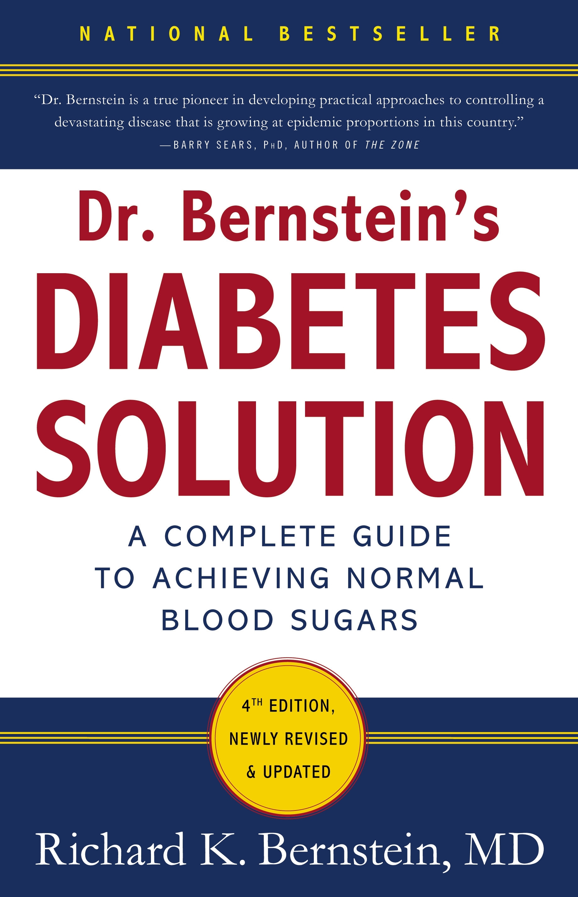
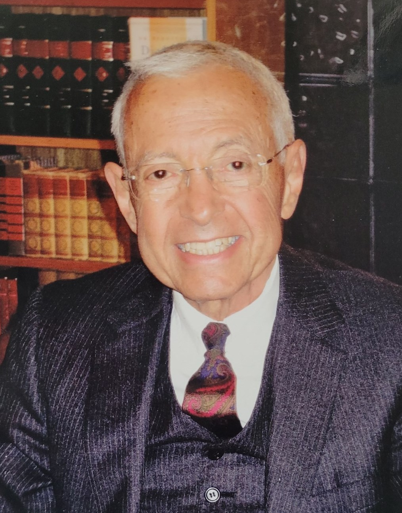

# 《伯恩斯坦醫師的糖尿病治療方法》第四版選譯

|   |   |
|---|---|
|||

* 以下是從《伯恩斯坦醫師的糖尿病治療方法》第四版（《Dr. Bernstein's Diabetes Solution》,4th edition, Little, Brown & Company, 2011）選擇性地翻譯我自己覺得有趣的段落或部分編章；這本書目前沒有中文版，如果有興趣且可以進行英文閱讀的讀者請務必取得參閱，相信會對疾病治療有極大的幫助（電子書版本目前仍可購買取得）。  
Richard Bernstein醫師已於2025年4月15日離世，享壽90歲。

* This post is selected Chinese translation from 《Dr. Bernstein's Diabetes Solution》, 4th edition, Little, Brown & Company, 2011. I just choose paragraphs and partial chapters, which attract me, as materials for personal translation exercises. If there is anyone who's interesting about this endocrine disorder, please go get this book and read it thoroughly. The knowledge and treatments in it should have great curative effect on this disease and its complications.  
Dr. Bernstein died on April 15, 2025, at 90 years of age.

\- 林詠盛(Louis), louisophie@gmail.com  
\- https://github.com/louisophie/withinretreat  
\- https://x.com/louisophie_/  
\- https://louisophie.wordpress.com/  
\- https://withinretreat.blogspot.com/  
\- #糖尿病治療 #飲食科學 #糖尿病 #中文翻譯 #diabetes #dietary #translation #RichardKBernstein

---

## 治療前後

**正文前言：來自14個病人的經驗分享**

你自己是世界上唯一一個有責任和能力來把自己的血糖給控制好的人，而非你的醫生；或許醫生可以多少幫助你一點，但根本的責任和最終的結果仍是自己要承擔，更不用說整個治療過程往往會造成生活形態上的重大改變、有時甚至會需要有一定程度上的犧牲。這時最常出現的問題往往會是：「這一切的辛苦真的值得嗎？」我想這一單元的內容和病人們所分享的治療故事是足以完滿回答這個問題的，而且說不定可以給讀者一些改變的動力和誘因、最後也可以和分享故事的人一樣得到努力的成果。如果下面所分享的許多真實故事仍不足以說服你治療的成效，讀者可以上亞馬遜（www.amazon.com或www.amazon.co.uk）本書頁面的讀者評論（Reader Reviews）區查找，裡頭有上百個網友分享的類似故事足以閱讀及參考。

### 《治療前後01》

J.L.F.是個有3個孫子女的71歲二戰軍艦飛行員，且目前仍在從事財務顧問相關的工作；他是以飲食、運動和胰島素增敏劑的口服藥物來控制他的血糖，且藉由本書的飲食規劃，他的總膽固醇和高密度脂蛋白的比值（心臟疾病風險的參考數據）從相當高的7.9降至低於平均的3.0，糖化血色素（四個月的平均血糖參考值）從非常高的10.1%降至5.6%（已經相當接近一般非糖尿病人的水準），R-R間期檢查（見單元02〖體檢報告：疾病及其風險的評估標準〗，測試控制心跳頻率的神經受損程度的檢查）也從極度不正常的9%進步到現在以其年齡標準堪為正常的33%。

「我想我整個成年之後的生活都是一直處在有輕微糖尿病的狀態；剛開始出現的症狀是精神總是有氣無力，再之後則是會頭昏、走路重心不穩、甚至會暈倒（但很少發生），而且我開始有了陽痿的情形。

「約80年代早期的時候我開始會感到眩暈，且有盜汗、手臂酸痛、昏厥不起的傾向，加上許多跟心臟問題相關的症狀。我的血管造影指出我的心血管動脈有很嚴重的問題，因此我動了心血管手術，在接下來的七年中我也活得算是健康。

「問題發生在1985年的年尾，我開始注意到我腳趾頭的觸覺開始消失了；我的內科醫生跟我說這是因為我的高血糖而產生的神經病變，同時也幫我做了血液檢測，我才知道我的血糖濃度是400mg/dl，因此醫生跟我說要注意自己的飲食，並且要小心儘可能避免吃甜的食物。我在一個月後回診追蹤，但我的血糖數值仍達350mg/dl。在接下來的數次回診期間，我神經病變的狀況變得愈來愈嚴重，且我的血糖一直處在350mg/dl的水平，我的腳也愈來愈麻木無感，直到這時候我才開始感覺到問題的嚴重性。

「那時我的體力尚可，每天總要走最少2英里（約3.2公里）的路、每星期最少也會去1到2次的健身房，而且對我行程滿檔的顧問工作也都處理的算是得心應手；同時間我開始透過非醫生的管道，跟我有神經病變和糖尿病經驗的朋友請教相關的個人體驗和知識作為參考。

「我的第一個心理衝擊來自我一個有糖尿病的朋友，他有腳部的神經病變（有嚴重的神經痛），腳趾頭也有無法癒合的嚴重潰瘍；他跟我說一旦神經病變愈形惡化，截肢是無法避免的，同時也跟我生動地描述放任不管的糖尿病患會有的雙腿愈截愈短的情形（salami surgery，切香腸手術）。

「當我愈聽愈多朋友們的故事，我的情緒就愈加煩躁不安。變老和生病是每個人都會有的歷程，但如果是因此而身體有所殘缺、到哪裡都需要有人在旁協助的時候，那會是件多痛苦的事啊。突然間我雙腳的感覺麻木不再只是一件小事了，它變成了一記當頭棒喝。

「我在高爾夫俱樂部遇到了一位相當有錢的汽車經銷商，只是他的腿因為糖尿病而把膝蓋以下的部份都截掉了。他跟我說他一開始並沒很在意他的血糖，他的醫生能夠做的也很有限；而他現在除了短暫休息以及睡覺之外都只能靠這張輪椅行動，且要下輪椅都需要有人在旁協助才行。他跟我開玩笑的說（他是一位勇敢樂觀的人），要是他還能撐過下次的截肢手術，截掉的就不只是膝蓋而是屁股了。他的這份堅毅勇氣，卻讓我感到異常地毛骨悚然，因為我的雙腳麻木現在已是愈來愈嚴重了，甚至連我的陰莖也都受到了波及；我愈是感到恐懼，我就愈感到茫然無助且無所適從。我需要有什麼人可以來幫助我指點一條明路，好讓我的雙腳不要再繼續惡化下去。

「我是在1986年的4月初和太太一起到Bernstein醫師那邊就診。那次的會面時間長達7個半小時，內容包括了各式檢查結果和治療方法的說明；糖尿病的各種併發症，不管有多輕微，他都對我作了詳盡的解說；身體各方面的平衡要如何兼顧以及出狀況時的個別療法，也都說明的非常清楚。以看似無足輕重的魚鱗狀腳皮為例，它其實是糖尿病非常嚴重的併發症，而Bernstein醫師叫我早晚使用貂油（mink oil）塗抹，照做之後我的雙腳就漸漸地不再有乾燥掉落的皮層和疼痛不已的傷口，取而代之的是逐漸柔軟及光滑的皮膚。就只是這樣一個看似小問題的改善，就足以澈底改變一個人的生活心態；相反的如果我沒有受到像這樣適當的糖尿病治療，接下來就不是只有需要穿特殊訂製的鞋子以及愈形艱難的走路姿態而已，截肢也只是遲早會發生的悲劇。

「以上種種的看診過程中，最重要的是Bernstein醫師對糖尿病的深度說明，包括了成因、各種併發症狀及其治療的方法，而且還會指出治療的原由和背後的原理，讓我可以對疾病本身和對應的治療方法有更深入及清楚的了解。

「藉由測量指尖的血糖我就有了對治糖尿病的重要參考依據；我們把飲食作為治療的第一步，而且Bernstein醫師不只是要我吃或避免特定種類的食物而已，他還會跟我詳細解釋背後的道理為何、不同食物的差別在哪、以及如何執行跟維持飲食規劃的方法，同時也跟我強調了經由知識的累積而建立起對疾病規律控制的重要性。要是沒有養成穩定長期的飲食規律，那麼糖尿病的惡化就只是必然的結果。他也指出糖尿病才是心臟疾病最大的病根，而非一般認為的膽固醇、膳食脂肪、生活壓力等等的要素；事實上糖尿病才是我們首要應該全力對治的罪魁禍首。

「隨著治療的進行我的雙腳已經沒有麻木的現象而是相當的敏捷、皮膚也非常地乾淨漂亮；我的陽萎問題也得到不錯的改善；飯後常有的嚴重打嗝、胃脹氣和胃灼熱現象也都完全消失了。除了心血管疾病是我目前最擔心的事情之外，其它的併發症都因病情的改善而沒有造成什麼困擾；但我現在了解到糖尿病才是心臟疾病最大的起因，因此只要我把糖尿病給控制好，我就可以把心臟病的風險給大幅降低了。

　「另外一個我血糖正常化之後的影響，是我開始可以用平穩的心態來看待這個疾病：我不會再有孤立無援的徬徨感了，無能為力的消極心態也消失無蹤，對他人求助、卻呼應無門的絕望感也消退殆盡了。我可以盡情地做運動、快樂地享受用雙腿走路、痛快地體會因身體健康所帶來快活愉悅的感動；我也不用再擔心眼睛會失明了；我也重拾了我對房事的自信心。

「原來逐步遠去的身體健康，現在則是我可以伸手觸及且控制良好的事情了，而其中最重要的原因在於我有了完善治療的新知識和可以穩定持續執行的好方法。」

### 《治療前後02》

Thomas G. Watkins（湯馬士．華特金斯）是一位40歲的新聞記者，他在23年前被發現有糖尿病。過去九年來他依照本書提出的胰島素療程來治療自己的疾病。

「這幾十年來我接受過好幾位糖尿病醫師的治療，並且把我的病維持在「控制得宜」（至少以醫師們的角度）的狀況下；那時我一天要打2次的胰島素，並用尿糖試紙（之後改成血糖試紙）來調整注射的劑量，而且依照醫院的建議每天吃60%總熱量的碳水化合物作為營養的來源。

「但是我總是感到有什麼地方不對勁，也就是說，我的日「常」生活其實一點都不正常：為了怕有低血糖我不敢作大量的運動；我每天的用餐時間都必須毫無彈性地固定不變，即使是在我完全不餓的情況下也一定要吃每日三餐的食物；我知道高血糖會造成各式的併發症，但當我試著讓血糖儘可能正常時，換來的卻是極高或極低如蹺蹺板般上上下下的血糖數值。到了1986年時我的體重像是吹氣球般增加到189磅（約86公斤），但我對減肥完全沒有任何頭緒，而所謂「控制得宜」的病情實際上應該是完全失控才對。我認識到一定有什麼地方需要去改變才行。

「同一年（1986）我去參加了一場醫學專家的座談會，其中的一名講者就是Bernstein醫師。他的資歷相當令人印象深刻，因為他自己就是個超過40年的糖尿病患者，而且幾乎沒有相關的併發症問題；他用自我實驗的方式來找出合適的治療方法（他對醫學文獻的了解則近乎是百科全書式的透徹），但其中一部份卻不合於主流的意見：他對現時的飲食建議是大力抨擊的，且對於許多的治療原則如胰島素的使用方式也都持尚待改善的意見。但無論如何他終究是對的；整場演講下來他完全不用上廁所，我卻上了兩次的洗手間（原注：高血糖會造成頻尿）。

「由於我需要收集相關的資料好在《Medical Tribune》（醫學論壇）上發表文章，於是我和Bernstein醫師接洽想要過去他的辦公室待上一天好了解更多的東西。他的想法非常地直截了當，他認為所謂「控制尚可」的糖尿病（亦即長期的血糖劇烈變動）是完全錯誤的說法，因為其成因並不是源自身體天生的缺陷，而完全是病人沒有得到應有的治療以及訓練不足所致；如果病人有足夠的知識和正確的治療技巧，維持正常的血糖值根本就沒有什麼困難而是普遍應有的水準罷了。除了目標的確立外，他也教病患許多簡單明確的治療方法，其中一個重要的原則就是：需要的劑量愈小則誤差就愈小，而對誤差的校正也就愈容易。

「那次採訪之後我便想把新得到的知識給用在自己的病情上。1987年初，多少仍抱著小心謹慎的心態，我決定到Bernstein醫師那邊放手一試。這次的就診和過往的經驗有著極大的差異，首先是絕大多數我看過的醫生其看診時間大概是15分鐘左右，但他卻花了8個小時；其它醫生說我沒有併發症，他卻發現了好幾個；他們說我的血糖控制尚可，Bernstein醫師則要我把起伏的血糖給平穩下來、並且要求我減肥；他也花了大量的看診時間在講解血糖控制的各種眉眉角角。最重要的是，他對待病人的方式和我的第一位糖尿病醫生所抱持的心態完全相反：後者要我不必了解太多，有什麼問題或想要的資訊再掛號問醫生就可以了；但Bernstein醫師卻不是這樣，他認為糖尿病要控制得好，病患就要真正了解背後的原理和治療方法，且至少要跟他的醫生知道的一樣多才行。

「主流治療中有2個反對血糖正常化的理由，第一是這樣會增加低血糖的發生，第二是會讓患者的體重增加。但我發現到這些都不是真的而是剛好相反：初次看診後的4個月內我就少了9磅（約4公斤），而且接下來的數年間體重仍不斷地在下降；我的血糖則是因維持穩定而更好估算劑量，加上我的藥量變得相當小，已經不用再靠猜測來調整劑量，故能有效地避免低血糖的發生。

「這是自從我被發現有糖尿病以來，第一次我感到擁有身體健康的主控權。我不會再因上下起伏的血糖而有巨烈起伏的情緒變化了；就算我仍須使用胰島素和忍受其種種的不便，跟過去的痛苦相比，現在則不知要快活多少倍了；我可以毫無顧慮地出國、玩自由潛水、在野地騎腳踏車，卻不用擔心被糖尿病所擾；如果我想跳過一餐不吃（不管是早中晚），我也不用擔心會有什麼問題。

「因為胃輕癱的關係，我的血糖原本在飯後會變得非常低、數小時後卻會大幅地上升，現在也沒有這個問題了；會讓我提早死亡的心血管神經病變也跟著改善了；雖然我現在吃的油脂和蛋白質比起以前要多得多，我的各項血脂數據卻改善變成在正常的範圍內；保險公司用來判定糖尿病標準的糖化血色素，現在也下降到不符合投保資格了；最重要的是，我覺得現在實在是健康愉悅太多了。

「絕大多數的醫生都不會用Bernstein醫師的方法來治療病人，原因是這不僅太花病人的時間金錢和學習的心力，且對醫生來說也是如此；而糖尿病是醫生們的金母雞，長期下來他們願意做的就只有抽血、就診看報告和簡單談話、開一個月的藥物處方、握手再見、最後則是給人帳單收錢。但現在情況已經有在變轉了（譯注：指當時的美國）：這幾年有愈來愈多的證據支持Bernstein醫師的治療方法；長期以來的高碳水飲食已經受到了許多的質疑；同時也有愈來愈多的醫生支持一天數次胰島素注射並由病人完全掌控的治療原則。Bernstein醫師著重的就是要妥善嚴格地控制好血糖，如此不僅可以避免併發症的發生，體內的器官也才能保全不受損害。Bernstein醫師的治療方法不僅讓我可以控制好血糖，我也因此能夠重新找回因生病而失去的人生自主權。

### 《治療前後03》

Frank Purcel（法蘭克・波賽爾）是位76歲的已婚退休人士，和我許多的結婚病患一樣，他的太太Ike（愛克）也和他一起走過治療的過程。

Ike：「Frank有糖尿病已經很久了，不過因為是第二型的關係，因此一直都只有吃藥治療而已。他最早被發現到血糖過高是1953年仍在軍中服役的時候，因為抽血檢查才被發現到的，他們稱此為化學性的糖尿病，但因為不是測試尿糖，所以Frank並沒有被告知要進行治療；那個時候尿液檢測才是判定是否有糖尿病的標準。但即使如此，他還是開始不吃甜食並且開始減重。那段時間他瘦了約30磅（13.6公斤）。

「1983年Frank發生了輕微的心臟病，於是便開始看心臟科門診以接受詳細的治療、並吃了2、3年的β阻斷劑和其它藥物；他的病情控制得算是不錯，也不需開刀即可控制住病情。但醫師發現到Frank的血糖一直處在不好的狀態並認為這需要多加注意，於是就開了特泌胰（Diabinese，一種磺醯脲類藥物）給他。我想會開立這個藥可能是因為這是那時的慣用首選藥物吧。那時Frank大概是每4個月給這位心臟科醫師做一次血糖檢查。

「那時我對什麼是正常的血糖完全不瞭解、也沒有血糖數值範圍（像是1000或12）應為多少的概念，因為從來沒有人跟我們解釋過這個東西，我們唯一被告知的就只有血糖是不是過高而已。我們就這樣被治療了7、8年的時間，如果那時候就遇到Bernstein醫師的話，或許就不用像現在這麼辛苦了吧。幾年下來心臟科醫師最後跟Frank建議說去找內分泌科的醫師，因為他認為沒有辦法只靠藥物、而需要更多的專業才能有效治療。

「我們去了在家附近、紐約上城區的一間大型醫院看診，接待我們的是那裡糖尿病中心的主任；現在那間醫院已經是相當有名的醫學中心了。那位主任依舊開立特泌胰給Frank、並且每三個月測量一次血糖的數值，但他的血糖都一直處在254、240的狀態降不下來，於是醫師就會說：「讓我們換另一種藥試試。」接著他又開立了像是優降糖（Glyburide）及庫魯化（Glucophage）等的藥物。完全沒有人跟我們提過飲食的事情，我們總是一直在吃藥，但他的血糖就是無法降低，看診的時候很少有低於200的。直到我終於大致了解數值高低的標準，我便向醫生問道：「我們是不是要去看營養師呢？問題會不會是出在飲食上呢？」我們就跟其它人一樣吃著大同小異的食物，但我的一些糖尿病友會特別注意他們的飲食，因此我想營養攝取應該是有助於治療的。結果醫師回答說：「當然好，這是一個不錯的提議。

「後來醫師介紹了一個年輕的女性營養師，而我們總共去看了三次；『每天要吃11種不同的碳水化合物。』她說，並且給了我們食物金字塔的說明指南，可是我們完全不需要從她那邊取得這個東西。最後唯一有變化的只有Frank開始節制吃甜食而已，變成偶爾吃一次冰淇淋、蛋糕或是餅乾；我也會買一些新推出低脂、低糖的產品，特別是膳食脂肪是那個時候我最在意的事情。

「後來因為Frank的一次嚴重低血糖才讓我們正視到應該要更加積極地面對這個疾病。那時從來沒有人跟我們提過吃藥可能會造成低血糖的情形，因此當他出現低血糖昏迷時，我還以為是中風；而且讓我百思不得其解的是，Frank那時還自己突然清醒跑去浴室穿褲子。他失去意識無法回話，我當下立刻打911請急救人員過來，到現場後對方給Frank注射葡萄糖並放上擔架送到救護車。在路途中他清醒了過來，問道：「我現在在這裡做什麼？」到院後醫護人員幫他測血糖，結果數值只有26mg/dl；那時我還沒有像現在因為有Bernstein醫師的協助而對糖尿病有相當的了解，但多少知道這個數字真的是太低了，更不用說在注射葡萄糖之前的狀況了。

「我們猜測低血糖的原因可能是他不小心吃了兩次的口服藥造成的，但真相到底為何則沒有人知道。但無論如何，因為這個意外的發生，讓我們下定決心要去做一些改變。

「我有一個醫生朋友是Dick Bernstein醫師相當熟的同事，他的一位長輩有非常嚴重的糖尿病和併發症，但因為有Dick Bernstein的治療才得以改善症狀並以較舒服的狀態來延長生命的最後時期。我跟他談了Frank的問題，他說：『除非你們去看Dick Bernstein的門診，否則病情不會有改善的，血糖也沒有辦法有效地降下來。』那時是在低血糖狀況發生前，我當下就回絕了對方的建議，因為Frank已經有在看醫生了，而且還是醫學中心的糖尿病科主任，隨便一個私人醫師怎麼可能比得過呢？但在這次嚴重低血糖發生後，我們兩個一起去找我的這位醫生朋友，他則跟我們詳細說明了Bernstein醫師的治療方法和改善結果，並先給我們打了預防針：Bernstein醫師的治療是多少有爭議性的、且需要投入極大的努力才能得到回報。他希望我們和對方聯絡，我們也認為不如就試試看吧。」

Frank：「老實說第一次見面我對Bernstein醫師的印象是他有點兒古怪，但不久之後我就了解到他其實是一個鶴立雞羣的人物。我在軍中和許多的醫生共事過，也遇過各式各樣的人，但我從沒有遇過一個這麼專注在一件事情上面的類型；他對糖尿病的了解和治療是我接觸的其它醫生所不能比的，其程度甚至讓我覺得有點過頭了，但治療下來的結果卻非常令人印象深刻，我對他也相當的滿意佩服。他訂定了良好的治療計劃、有清楚的目標和方法、且除了糖尿病的治療外完全不受其它的事情分心打擾。我照著他替我訂下的計畫治療並監控我的血糖，使原本都是超過200的數值，現在已經降低到他設下的標準85到105的範圍了。目前除了飲食外我有注射胰島素加以治療，分別是早上、中午、晚餐及睡前注射，除此之外我也不再吃冰淇淋且戒除了其它對健康有害的許多惡習。當時我第一次就診時我的狀況是相當糟的、臉色蒼白又疲憊不堪，但現在我的狀況和氣色都大幅改善且紅潤不少。我到現在對扎手指量血糖仍是頗有不滿，但已經養成了習慣、變成會自動自發地自己去做的第二天性了。

「當我被告知要注射胰島素的時候我整個人都崩潰且難過的痛哭不已，認為我的人生已經完蛋了。但藉由Bernstein醫師的幫助和教導，我現在完全不會這麼想了；用他教的注射方法來注射胰島素一點都不會痛，且只需要幾秒鐘的時間就可完成，加上劑量小且針頭細短，注射時幾乎是一點感覺都沒有。當時開始使用胰島素的時候我是用腰間的贅肉進行皮下注射，到現在我已經瘦了一大圈、肚子周圍也沒有什麼肉了，但同樣在這些部位進行注射仍幾乎沒有什麼痛覺。當時Bernstein醫師是直接在診間親自示範進行注射給我看的，然後再要求我做一次給他看。自從那之後我就是自己注射，即使是在外頭也是一樣，如在餐廳或洗手間時就直接施打，完全不在意會不會引起他人的側目，雖然事實上好像根本沒有人會在意的樣子。」

Ike：「關於注射胰島素這件事，我一直有種這會是不可避免的直覺，而當Frank被告知這個要求時他當下整個人崩潰大哭，認為這表示他已經到無路可走的地步了，不只有各種的病痛纏身、最後還要遭受胰島素注射的折磨。但他終究是走過來了，且在堅持療程不過1個月到6週的時間，我們已經可以有效地控制住病情、且對未來生活都有清楚的規劃。Frank知道控制血糖平穩的方法，且不管血糖數值是偏低或是稍高，他都了解該怎麼處理應對，他的身體也因而得到了大幅度的改善，而這都是當時Bernstein醫師不吝教導的結果。」

### 《治療前後04》

Joah Delaney（喬亞・德蘭尼）是位53歲的母親及職業婦女，工作是會計師。她和許多的病患一樣有著不平凡的人生故事。

「我要先坦承當我開始進行這個治療方法的時候是感到非常無助的，因為我錯誤地下意識認定我這一輩子都要受盡針頭、各種檢測及諸多醫學困惑的苦難了；但幸運的是這並沒有發生，因為實際操作了幾週之後，這個療程已經變成了我日常生活的一部分，就跟化妝一樣地簡單自然。

「在我接受Bernstein醫師的治療之前，我已經接受了我的人生注定是要遭受糖尿病各種併發症的折磨了，且那時我已經開始注射胰島素，但卻沒有任何控制得宜的跡象；我的腿晚上睡覺時會疼痛、雙手和腳也有刺灼的感覺。前任醫師給我的飲食熱量交換表其背後原理我完全無法理解，且我的體重一直不斷地上升。我的日常生活開始變得憂鬱且總是處在饑餓的狀態。

「現在因為這個可以有效控制血糖的治療方法，我已經不再有無從掌握病情的無力感了，尤其是每次測血糖時數值總是在正常範圍。我的情緒和身體狀況也很好，不只是瘦了下來，也因為吃的是健康且有飽足感的飲食，我不再有饑腸轆轆的感覺了；我的腳和雙手的痛感也消失了。現在我終於有了可以控制好病情的自主能力，且在和朋友們相處時也不用再刻意隱瞞我的糖尿病了。」

### 《治療前後05》

約有65%的糖尿病男性有性功能障礙的問題，原因是高血糖使得陰莖充血勃起的生理機制受到了損害。這個現象在治療後不見得能完全治癒，但對長時期維持正常血糖的男性而言，部份人的性功能多少還是可以恢復至一定的水準。就我們治療過其性功能獲得改善的數個案例當中，其成因多半是由於自主神經受損造成、而非血液無法流入陰莖內血管使其勃起所導致。底下提到的這位病人是在威而剛未上市前來就診的，而我發現到他陰莖及雙腳的血壓雖正常，但骨盆的神經反射功能卻有嚴重受損。

「我目前是已婚的59歲男性並有3個小孩。4年前、也就是我被發現有第二型糖尿病滿十年的時候，我注意到我總是一直處在疲憊的狀態下，且常是坐立難安又易怒不已，並且無法長時間地集中注意力，但除了這些情緒的變化外，身體尚無其它太大的問題。不過我發現到我的性功能開始有了狀況、即無法維持勃起足夠長的時間；那時我並沒有意識到我的心理狀況和性功能兩者間可能彼此有所關連。

「直到後來我就診於Bernstein醫師並學會了血糖測量的方法，我才知道我的血糖數值高的嚇人，平均高達375mg/dl。藉由他的治療方法、飲食及少量的胰島素注射，現在我的血糖基本上都已經下降至正常的數值了。

「經這段時間的治療，不管是身體或精神上我都感覺好得多了，且性功能也有了大幅的改善。我目前仍保持每天測血糖，且因為病情的進步，讓我在全髖關節置換手術後，能夠快速地恢復健康且無任何後遺症。」

### 《治療前後06》

R.J.N.是位骨科外科醫師，在過去三年中一直遵循本書的方法進行治療。

「我今年五十四歲，自十二歲起便患有糖尿病，並在這三十九年中接受了傳統的飲食及胰島素療法，但卻得到了嚴重的視網膜病變、青光眼、高血壓、且因神經病變需要佩戴腳的輔具，而且直到接受腎臟移植手術之前（我的兩個腎臟都嚴重受損）做了好幾個月的血液透析；那時我每星期要做3次的透析、每次要在醫院待上約五個小時，讓我身心俱疲不已。

「我的血糖長年下來總是處在大幅震盪的狀態，這不僅嚴重影響到了我的身心穩定、同時也重創了我的家庭生活；最後我被迫放棄了外科手術的工作，也因此幾乎完全沒有收入。

「因為頻繁的低血糖讓我常有怪異的行為出現，使得許多不知道我有糖尿病的人誤以為我有吸毒或酗酒的問題；我變得有敵對他人的傾向，有焦慮、易怒及情緒不穩的問題，且還有嚴重的身體不適，包括疲憊、肢體抽搐、視力模糊、頭痛和思緒遲鈍的現象，我甚至還發生好幾次因血糖過低而全身痙攣被送到加護病房的情形。而相反地當血糖過高時，我就沒有任何精力、總是昏昏欲睡且視力模糊、且感到口渴卻頻繁地排尿。

「在過去三年的時間，我一直嚴格遵循Bernstein醫師教導我的方法，包括每天多次測量、且知道如何迅速調整偏離目標範圍的血糖；另一方面因為我以極低碳水化合物飲食為治療方法，而這讓血糖控制變得更加容易。

「透過對血糖的嚴格控制我的病情有了極大的改善：我的神經病變消失且不再需要佩戴輔具，我的視網膜病變不僅停止了惡化且開始漸漸復原，我也不再需要使用滴了超過十年青光眼的特製眼藥水；我的消化問題獲得了大大改善，我的意識不清、抑鬱和疲勞的現象也都消失了。我現在能夠完全投入全職工作當中，且血糖也控制得非常地穩定。

「不同於傳統的治療方式，現在我以實際可行且有條理原則的方法來治療我的糖尿病，也因此我感到更加地強壯、健康與快樂，且有了更加積極的心態來面對生活。」

### 《治療前後07》

LeVerne Watkins（麗薇恩・華特金斯）是位六十八歲有孫子女的女士，同時也是一家社服機構的副執行長。初次見面時她已經罹患第2型糖尿病13年且使用了2年的胰島素。在她的故事中呈現了傳統治療裡頭大量碳水化合物與大劑量胰島素注射的問題。

「一開始在不到兩年內我的體重從125磅增加至155磅（約57公斤、70公斤），且整天總是老想著點心或下一餐的到來；那時只要是一清醒，我就只想吃東西。我總是隨身帶著我的零食包，包括了無鹽餅乾、普通可口可樂和葡萄糖片，且我一定要準時進食，因為只要晚了半小時用餐，我的手就會開始出汗、且情緒會變得非常地緊張，甚至在社交場合、集會活動或工作中的會議時，我也不得不強迫自己集中注意力以便處理當下的事情。在一次我主持的會議上，我還記得我最後說的一句話是『哦，我很抱歉』，然後我就從椅子上摔下來，醒來時才知道自己已經在醫院急診室了。

「還有一次我在搭地鐵的時候，往常的通勤時間只需要25分鐘，但那天列車因故延誤了將近兩小時，但糟糕的是我忘了帶零食包出門，不久後我就感到頭暈、流著大量的汗且行為開始出現異常；這時坐在對面的一位男士發現到我戴的醫療辨識手環，於是趕緊過來抓住我的手臂大喊：『她有糖尿病！』

「食物、果汁、糖果、餅乾和水果開始從四面八方傳過來；那時的天氣非常寒冷，但大家仍不斷幫我扇風讓空氣流動且一邊餵我吃東西，而在醒來後我感到既感激又尷尬。在那之後我就不再搭乘地鐵、並將會議盡可能安排在午餐之後，以確保自己不會有過低的血糖、且不用擔心點心或下一餐的進食時間。

「我自覺幾乎是完全失去了掌控生活的能力：我總是吃個不停，衣服、鞋子和內衣都開始變得不合身。大學以來我一直都是個衣架子，可是那時我卻感到自己變得臃腫且笨拙不堪。我試圖跟我的糖尿病醫師討論體重增加和整天吃個不停的問題，但他卻說：『這是你缺乏意志力造成的。』並且說：『只要你有決心就不會吃那麼多了。』對此我非常非常的生氣，從此之後再也沒有找他看診。」

「我自己也試了相關的減肥課程，但這些飲食計劃和由糖尿病專家推薦的營養師兩者間的專業意見卻互相扞格。於是我只能默默接受了自己每天越來越胖、總是感到飢餓且缺乏意志力的現實，更不用說大部分時間我總是感到相當地不快樂。」

「我很感謝我的先生一直是我最好的靠山；他總是會說：『就算妳再胖一點也是很漂亮的，而且也可以順便替自己買些新衣服。』尤其是當他幫我拉上已經過緊衣服拉鍊的時候。他會特別幫我注意報紙和雜誌上有關糖尿病的文章並剪下來給我看、也會提醒我收看有關的電視節目，而且也非常鼓勵我參加糖尿病的活動、講座及各種的研討會。1988年4月3號星期日、也就是復活節當天，他從《紐約時報》上剪下了一篇標題為〈糖尿病的新療法〉的文章給我，沒想到就是這則剪報徹底改變了我的人生；我反覆念了這篇文章數十次，並決定去找Bernstein醫師接受治療。

「自從那次的看診，我就再也沒有發生過低血糖了。我用他的方法穩定維持我的血糖，包括了施打少量不同種類的胰島素、並配合飲食中碳水和蛋白質的攝取量來進行調整。沒多久我就感到生活開始有了活力且充滿希望與光明，我也更加有了掌控自己生活的信心。現在我已經不用再特別避開火車或地鐵了，且可以自己開上幾小時的車都沒有任何的問題、也都完全沒有低血糖的狀況發生；我也重新開始身體的訓練、體能也逐漸地改善，工作及家庭上的體力要求也都能完全應付得上。接受治療幾個月後我的體重降回了129磅（約58公斤）、衣服尺寸也從14碼降到10碼，十個月後又降到了8碼、體重也變成了120磅（約54公斤），我原本相當疼痛腫脹的右膝關節炎也跟著改善緩解。原先我的胰島素注射劑量是每天31個單位，現在只需要注射8單位就足夠了。我的精神狀態非常地好，活得也更有尊嚴、自我價值也得到了完備與提升。

「我也克服了我對糖尿病各種併發症的不安與恐懼，因為我曾經認為心臟病、腎衰竭、失明、截肢等等的悲慘狀況是我無法逃脫的命運，但現在我認為它們並不是糖尿病的最終結果。」

「目前為止我的生活仍有許多地方尚待改善：我有時仍會一時忍不住吃太多或是吃一些不適當的食品。一開始照著無麵包、無水果、無義大利麵和無牛奶的飲食計劃走看起來並不難，但現在有時我會感到有一定的難度；我的作法是盡可能地讓沙拉、肉類、魚和家禽的料理更富有變化、做起來更加有趣，來讓不當飲食的發生減到最少。」

「到目前為止我仍一直努力維持這樣的生活方式，但無論如何就疾病的治療上我已經有了重大的改善與結果；糖尿病對我而言已經不再是死路一條了，相反地它變成一個我可以操之在己且順利攻克的人生挑戰。」

### 《治療前後08》

A.D.是位55歲、並在14年前被發現罹患糖尿病的退休排版編輯師，而他就和我們大多數根據書中療程來治療的病患一樣，他的糖化血色素和心臟病風險的評估（膽固醇及高密度脂蛋白的比值）都在治療後雙雙降低至正常的數值。

「在我的家族中我母親及大哥都因為糖尿病而活得非常地辛苦：我母親受到各式併發症的侵擾，最後腳從膝蓋以下被手術截肢，且到死前都一直活在痛苦中；我大哥則是有心血管的問題，且雙腳都遭截肢，留下的只是手術後令人怵目驚心的殘肢，可以說他被糖尿病搞得不成人形。

「當我察覺到身體開始出現糖尿病併發症時，我立刻意識到大事不妙，於是當下立刻就向外尋求所謂的專業醫療協助；但兩年下來我不知看了多少的醫生、聽取了不知多少的醫療建議，我的健康狀況不只沒有改善、反倒是愈來愈差；我的醫師總是跟我說：『注意一下你的體重。』然後要我一天吃一顆降血糖的藥。這整個治療過程看似再容易不過，但卻一點用都沒有；我的血糖一直都在200mg/dl左右，且三不五時會一下子向上衝到400mg/dl，而常態性的感到身心俱疲則是我日常生活的寫照。

「我是在1985年開始接受Bernstein醫師的治療，也是那時起我的病情才獲得改善、身心狀態才能夠重拾病前的活力與精神。第一次就診時，他當下就將原先的藥物調整為每日三餐前的速效、及早上與睡前的緩效降血糖藥，並且嚴格檢查我的飲食內容是否有任何會增高血糖的成分，其中包括了把碳水化合物大幅度地減至最少的量，如將我從小最愛吃的通心麵及義大利餃給完全捨棄掉；另一方面Bernstein醫師強調蛋白質的攝取，為此我則是主動把魚類加到三餐的飲食中（我完全不在意可以多吃一點蛋白質）。

「治療初期我對這些飲食上的調整及限制是有相當反感的，總覺得就算我照著做也沒有辦法長久維持下去；另外Bernstein醫師要求我在每次看診前的一個星期內每天要量多次的血糖以備看診之用，也就是說我要每天自己扎手指採血好幾次才行。只要是可以改善我的病情，我是可以完全忍受短時間內的生活變動與要求的，但是長時期的飲食改變對我則是相當困難的事情，尤其是到了休假及親友聚會活動的時候，這種飲食的限制更是令人難以忍受，因為身旁的人總是在肆無忌憚地大吃大喝，而我只能想辦法咬緊牙關渡過這種苦難。無論如何我就這樣撐了兩個月，雖然中間不乏有幾次沒有確實遵守飲食限制，但我的整體健康狀況有了極大的改善、自律能力也跟著一起得到提升與加強；我的血糖值開始往下降至140、130mg/dl，最後得以長期穩定在100mg/dl及更低的數值內。

「Bernstein醫師也力勸我買一台計步器來計算每日步行的距離，我也開始了每天手提3磅（約1.34公斤）重物甩手步行的運動。一開始我並不喜歡這種運動方式，因為我覺得這相當浪費時間，但堅持了一段時間後，我卻發現它的效果非常好，主因是同時期我已經習慣每天量血糖了，而我的血糖值就隨著運動的積累變得愈來愈接近正常。我自己本來就是個早起的人，我就利用早晨的空檔時間在家附近的森林公園走路運動。我也買了啞鈴並嘗試在家中做像是手臂彎舉、頭頂上舉、手臂轉動、胸拉運動等等的重量訓練，也才知道原來在家裡就可以做許多有益健康的運動。

「我的血糖已經脫離了那種會讓我隨時進醫院的數值了，取而代之的是長期穩定維持在正常的血糖範圍內，且過往有的全身疲憊倦怠感也都消失了。因為在堅持Bernstein醫師的治療方法下，我不只是對自己的病情有了完全的掌控，我也知道我不會再遭受到令許多病患痛苦折磨不已的糖尿病併發症了。」

### 《治療前後09》
Harvey Kent（哈維・肯特）是位51歲、到目前為止已罹病6年的糖尿病患（但我們認為他的血糖問題很可能早在確診前的3～4年就已經出現了），且他的家族中也有得病的案例。他的治療過程堪稱當代醫療制度下的普遍遭遇。

「我一直是屬於糖尿病高危險的族群，因為不只是我的父母都有糖尿病，我49歲往生的哥哥即是死於糖尿病併發症，而我目前59歲的姊姊也因為糖尿病而被迫進行血液透析，也因此當我知道糖尿病找上我的時候，我當下第一時間的反應就是我很有可能會步上我家人的後塵。我有試著去減肥但成效不彰，而我的新陳代謝科醫師唯一會做的就是不斷地加重我的藥量，所以每次看完診我就要吃下更多的藥物，但我的血糖值卻同時和劑量成正比，藥吃的愈多、我的血糖數值就愈高。漸漸地我的直覺告訴我這樣下去一點用都沒有，我一定要想辦法找到其它不同的治療方法才行，畢竟我不想要變成我哥哥那樣最後令人難過的下場。

「由於我的住所就在馬馬羅內克（Mamaroneck，Bernstein醫師門診所在地）且離他的診所相當近，我太太就建議我過去就診、即使只是把看診過程當作次要的參考也好。我當時的想法是這真的會有差別嗎？但我仍舊是掛了號，也才開始了我一個完全不一樣的糖尿病治療方法。當下主流的糖尿病治療是要你減肥、做運動、然後再拿處方簽領藥回家吃，但以上我只有吃藥這一項有成功達標而已；而Bernstein醫師一樣要我服藥，但其它的方法卻完全違背主流的醫學治療。他最強調的就是改變飲食、視飲食規劃為最重要的治療主軸，而我也因此成功減下了許多體重。

「他在初診時就跟我詳細解說了治療及飲食上的要點與許多細節，讓我可以逐漸了解並體會其原因及運作機制。原本Bernstein醫師的計劃是要我先維持原先的飲食並同時測量與記錄血糖、以便和改變飲食後的結果相對照，但那時（大約是第3、4次的看診）我就已經把我的碳水攝取給盡可能地減少了，因此在我們討論飲食規劃的時候，他向我確認其實我已經開始實行1個多月了。

「我之前總共看了3位不同的醫師，而Bernstein醫師的上一個是位糖尿病的專科醫師，診所規模也大上許多，但他從來沒有跟我說過像是『只要你可以把血糖給控制好，絕大多數的併發症都是可以被逆轉恢復的』這種重要的觀念，就連ADA（美國糖尿病協會，我是他們的會員）裡面的人也都完全沒有這樣的想法，更不用說要從他們的嘴裡聽到這樣的話了。但Bernstein醫師就是這樣跟我說且詳細地解釋，讓我這樣一位需終身受糖尿病所苦的病患，能夠對未來有正面積極的希望。我自己算是屬於不幸中的大幸，因為在發現罹病時我的併發症並不算多且尚未嚴重化（不像我的哥哥及姊姊），但我非常清楚只要血糖沒有控制好，各種的併發症就會馬上襲捲而來。

「但我上一位醫師卻不是這樣替病患看診的，他只是叫我要記得量血糖、然後3個月後再過來一次，但說老實話，我完全不知道回診的意義何在；那時我每天早上都會測一次血糖（數值差不多是在140mg/dl上下），而回診時醫師會替我抽血、檢查腳底和眼睛（整個流程費時約半小時），然後就是3個月後的事了。這樣的治療對我來說是完全沒有意義的，因為病患只會變得愈來愈糟而已，結果就是像我的哥哥及姊姊一樣受到併發症的折磨、最後乃至悲慘地死去。當下所謂的正規第2型糖尿病治療，事實上就是強迫耗竭病患胰臟的胰島素分泌能力，到最後就變成只能靠注射胰島素才能夠維持生命了。

「Bernstein醫師對我做了非常詳盡的檢查，並幫我發現到許多之前的醫師都沒有注意到的症狀，像是他檢查出我有貧血的問題、並且尿液中有尿蛋白的存在；他除了告訴我各項問題的改善方法之外，Bernstein醫師認為有尿蛋白不一定就是表示有腎病變，有可能是由於腎結石或血糖控制不好所造成的，因此他建議我要先把血糖給穩定下來之後再做一次檢查，若是糖尿病引起的話，則數據就會跟著有所改善。

「Bernstein醫師治療的第一件事是把我正在服用的Micronase（譯注：硫醯基尿素類藥物的其中一個商品名）給換成Glucophage（即二甲雙胍，其中文商品名為庫魯化），原因是Micronase會刺激腎臟分泌胰島素、進而加速β細胞耗竭的速度。『你為什麼要吃這種藥呢？這樣只會提早讓你的胰臟失去功能而已。』他說，並且指出我的血糖有過高及過低的現象，因此需要適時處理或避免低血糖的發生、並需注射胰島素來把過高的血糖給降下來。我對注射胰島素有非常不好的印象，特別是看到我父親的使用結果更是讓我排斥不已；我之前的醫師要求我打胰島素時是這樣跟我說的：『任何的治療方法都沒有用，現在你只剩下注射胰島素一途了。』但Bernstein醫師卻不是如此，而是這樣跟我說：『我希望你可以適時地使用胰島素來降低血糖過高的情形，如此可以同時緩和胰臟的分泌需求、並避免β細胞耗竭的發生。』在我聽來，Bernstein醫師所提的才是真正合理且可行的解釋及觀點。

「我太太對我的整個治療過程相當感同身受，認為我需要的是一個可以真正幫助我的教練，而Bernstein醫師就是這樣一個角色。在後來了解到他的人生經歷後，我開始深深體會到他的工程師性格，因為他就是以工程的方式來治療，因此醫學的立場就較淡薄些；最主要是他會先審視你的整體狀況，然後再針對個別的因素去做調整以達到所要的結果，加上他自己就是位第1型的糖尿病患者，因此對整個疾病的大小細節都相當瞭若指掌、遠非一般的糖尿病專科醫師可比。現在我每天都要自己測5次的血糖，而當每次回診我把數據拿給Bernstein醫師時，他不會只是看看、然後跟我說3個月後再來，而是會針對血糖異常的部份做藥物上的調整，並同時詢問我其它身體及生活的狀況來做到最好的治療效果，也因此我現在的血糖才能夠控制得非常穩定。

「飲食的改變是需要時間去適應的，畢竟我所處的生活文化相當地重視食物，而糖尿病人又常常是喜歡大吃特吃的人（我自己的猜測）。常有朋友會問我：『你今天吃了什麼？』我會回答：『我吃了火雞肉、沙拉及健怡可樂。』但我以前最喜歡吃的東西其實是烤煎餅（全是碳水化合物），而且有好幾年的時間每週末都會親自烤給太太吃；而現在我一樣會烤給家人吃，但除了會偶爾偷吃一小口外，基本上是不再吃這些東西了。當然有時候我會有想吃碳水的欲望，但隨著身體狀況的改善，我在飲食上也更有自制的能力，整個人也就更有精神且活力充沛。我已經在我的家人身上看過太多的苦難了，因此只要是為了身體健康，飲食上的一點小小犧牲我是完全可以接受的。

「從我開始找Bernstein醫師看診到現在，我已經瘦了將近30磅（約13.5公斤），血糖也降了約35%的數值，但這些成果都不是用所謂的減肥飲食、而是靠Bernstein醫師的飲食規劃才達成的。在糖尿病治療上我仍有長遠的路要走，但這卻是我第一次感到我終於有了控制疾病的自主權與主導能力。」

### 《治療前後10》
J.A.K.目前67歲且為公司的管理階層，而他有第2型糖尿病長達24年，且注射了20年的胰島素。

「我是透過好朋友們的介紹才知道Bernstein醫師的，那時我的狀況已經很糟了，右眼視野中央的部份已經因為視網膜下出血而看不見了。

「Bernstein醫師花了好幾個小時幫我做了各種檢查，並回答了我許多問題、且跟我解釋了疾病真正的成因，包括了飲食、血糖控制及身體感受之間的關係；我熱切地希望這些建議能夠對我殘破不堪的身體有所幫助，也因此我非常認真地照著醫囑加以治療，健康狀況也因此得到了極大的改善：

* 我的小腿和腳趾已經不再會抽筋了。
* 腿部的神經病變已恢復正常。
* 各式的皮膚問題皆痊癒。
* 自主神經病變（即R-R間期檢查，見單元02）2年後即恢復正常。
* 消化方面的問題也得到了徹底的改善。
* 我的體重在6個月從188磅（約85公斤）減至172磅（約78公斤）。
* 原先我的膽固醇及高密度脂蛋白比值是偏高的5.3，但在低碳水飲食及血糖良好控制的治療下其數值降到了3.2，比起同年齡的非糖尿病一般人的心血管風險要更低。
* 我的每日胰島素劑量從52降到31單位，且不再有頻繁的嚴重低血糖現象。
* 總體的身體及精神狀況都有明顯的提升與改善。

「以上所有這些成果都是由於血糖的控制得宜。事實上，在治療後我的糖化血色素已經從7.1%降至一般非糖尿病正常人的4.6%了，而且因為我已經曉得如何控制自己糖尿病的技巧和方法，一旦血糖有所升降時，我就能夠隨時乃至事前就能夠做好調整和預防的準備。如當我必須跳過一餐不吃時，我就可以事先做好因應而不會有血糖的問題，也因此就跟接受治療前一樣，我在飲食上並不需受到時間上的限制。

「接受治療後不只是身體有所改善，我的精神狀況也比起10年前、甚至是15年前的自己要好太多了；這讓我不禁有所感慨，如果那時就可以知道治療自己糖尿病的方法，我的人生或許就可以不用活得那麼辛苦了吧。」

### 《治療前後11》
Lorraine Candido（洛琳・坎迪朵）現年60多歲，罹患第一型糖尿病已有20多年了，但在10年前開始成為我的病人並接受治療。她和先生Lou（盧）兩人總是一起合作進行治療、並共同享受治療後身體重獲健康的新生活。

Lorraine：「那個時候我全身上下都是各式各樣的併發症，像是膀胱發炎、腎臟感染、眼睛也出了問題；我的雙腳基本上是膝蓋以下都是麻木無感的，因此有一次我光著腳在外面走路散步，結果腳底不小心踩到一個圖釘卻完全沒有感覺；我有迷走神經的病變、身上也有因藥物副作用而有的潰瘍問題。我母親同樣有眼睛的疾病，於是我找了當時幫她看病的眼科醫師就診，但他卻跟我說：『妳和妳母親有相同的問題，但不用擔心，交給我們就好了；妳這一年內再回診一次，我們那時再處理即可。』但我心裡頭想：『真的是這樣嗎？』而之後我就診於Bernstein醫師時，他看過之後卻跟我說：『我馬上幫妳轉診給眼科醫師治療。』然後馬上就進行了眼睛的雷射手術。」

Lou：「如果不是我們找到了Bernstein醫師，我敢保證她的眼睛現在已經失明了；最近2次的眼科回診的病情狀況都相當好，原本一隻眼睛有積水的情形也消失了，連醫師也感到相當的不可思議。」

Lorraine：「醫師說我左眼的恢復狀況相當好，我自然是高興極了。

「第一次進入Bernstein醫師的診間時，我完全不知道接下來會發生什麼事，我唯一知道的就是我過得非常糟糕、而且覺得我的人生已經走投無路了；看診過程中我對即將要接受的療程感到膽顫心驚，即使方法相當簡單易懂，但我心底一直拿不定主意。像是我相當喜歡吃巧克力棒，但Bernstein醫師卻說不行，因此我們在治療初期的關係是有點緊張的，只是最後我才了解到僅為了口腹之欲卻要賠上自己的一條命，這是一件多麼不值得的事情。

「Bernstein醫師是位非常好的人、並且非常地照顧他的病人；只要我們有不懂的地方，他就會有問必答。他對待病人不是視如牛羊牲畜、而是真正以尊重與關心對待之；我們問了好多好多的問題，而要不是有他的幫助，我想我早已一命嗚呼了。

「我們剛開始和他接觸的過程，現在回想起來還是滿不好意思的。我們的一個兒子在經營報攤，Lou也常過去幫忙，回來時就會帶一些各家的報紙給大家看，裡頭有時也會有各種的八卦媒體小報。這些八卦小報在沒有新聞時常會報一些醫療奇蹟的相關八卦，而有一次它的標題就是『糖尿病自癒的驚人真相』。當然我是不相信這些東西的，但當時我的身體狀況相當差，於是我們就根據報導找到了Bernstein醫師的資訊。我們的交友圈完全沒有人知道有這號人物存在，但我們還是去電想要確認是否真有其事；當時接電話的正是Bernstein醫師本人，而且他還告訴我們許多治療的注意事項。我們從來沒有遇見過這麼親力親為的醫師，最後Lou則跟我說：『我們就直接過去就診吧。』」

Lou：「我們住的麻州春田市是有自己的醫生的，但她身體的各種併發症如雙腳下肢麻木或腎臟問題等等卻都一直無法獲得改善；那位醫師自己有家人在加斯林糖尿病中心（譯注：Joslin Diabetes Center，美國知名的糖尿病醫院）工作，於是我問他：『我太太的病有沒有什麼好的治療方法呢？如果把她轉診到Joslin會不會比較好？』但他說：『他們那邊可以做的，在我們這裡都有啊，何必那麼麻煩呢？』但我們就是覺得有什麼地方不對勁，因為他們是用所謂標準治療流程來替Lorraine治病的，過程當然相當安全，但這是對他們安全，對我太太則是一點用都沒有；而Bernstein醫師卻完全不是這樣在治療，因為光是初診，Lorraine就花了2次各5個小時、總共10小時的時間在療程教育及訓練上。」

Lorraine：「整個訓練課程參與的人就只有我、我丈夫及Bernstein醫師親自來幫我們上課，而不是讓我們在候診室無謂地等待數小時的時間；光是我們單趟的車程就要花2個小時了，所以我自己在治療的意願上是相當低的。但第一次看診結束後我們在車上一路討論心得，雖然我本能還是相當地抗拒治療，但心裡頭多少了解到這是我唯一的路了，因為我想要活下去、而且我希望我的雙腳和雙眼都可以完好地保留下來。我想要的就是這麼簡單。也幸虧接受了Bernstein醫師的治療，我雙腳的體感也都完全恢復了正常。」

Lou：「自從初診進行了飲食的調整，我們花了1個月才把她的血糖給降至正常值，否則本來都是在300、400mg/dl的。」

Lorraine：「一開始我還是相當心不甘情不願地接受治療，畢竟Bernstein醫師的療程一路走來還是挺辛苦的，要不是有Lou的全力支持，我們才有辦法和原本的生活方式徹底地一刀兩斷。我們從食物的採購清單做起，因為超級市場賣的東西我幾乎都不能吃，甚至是在開始治療後的好幾年我才敢重新踏進賣場。Lou在一開始就陪我一路走來，就算他沒必要和我吃一樣的東西，他卻仍一起跟著我三餐都儘可能吃相同的飲食。有時他會額外吃其它的食物，但我總是會忍住不吃。這整個過程對我其實是相當辛苦的，畢竟我很討厭別人告訴我該做什麼、該怎麼做。」

Lou：「這真的是非常地辛苦；重要的是我們病患及家屬一定要有相關的基礎知識，這樣治療才有可能成功。尤其是我太太在開始療程前都已經將近60歲了，我們長久以來的生活模式早就已經定型了。」

Lorraine：「像我們已經結婚45年了，生了6個小孩、到現在又有了7個孫子，每次他們來我都會準備巧克力餅乾和冰淇淋給大家吃。」

Lou：「但因為治療的要求，我們現在知道該怎麼去應對。」

Lorraine：「所以我現在才能夠健康地在這裡分享我的治療經驗。 」

Lou：「雖然過程是很辛苦的。」

Lorraine：「我們家沒有巧克力等的東西，就連所有的節日如感恩節、耶誕節、家人生日、結婚紀念日等等，我們都不會準備甜點。開始治療的第1週我就因飲食的改變而瘦了15磅（約6.8公斤）；我一方面配合飲食、同時也調整藥物的劑量。」

Lou：「許多東西要一起統合起來考慮才行。像是她原本的胰島素用量一天有時會高達80~90單位，但在改變了飲食後，她現在1天只需打13.5單位就夠了，又因為大量減少了會導致脂肪積累的胰島素、加上配合大幅度減少碳水的量，她才有辦法瘦這麼多。」

Lorraine：「我到現在還是不喜歡飲食上的許多限制，說我是個固執的人也沒關係；但因為我嚴格遵守飲食的規範，我到現在已經瘦下85磅（約38.6公斤）了，衣服尺寸也跟著換成小號了。」

Lou：「我們放棄一部份的飲食來成就更好的生活品質。」

Lorraine：「像是不再吃巧克力之類東西。」

Lou：「馬鈴薯也是我們不吃的食物。生活上的各種取捨抉擇一直都是我們每天要面對的東西，但我希望我們可以活得健康且幸福，而不是為了一時的口腹之欲或長久的錯誤飲食習慣，結果走向了悲慘的人生。」

Lorraine：「治療要有成效是需要決心的。說實話我並不喜歡Bernstein醫師的治療方法，因為像是我給孫子們的各種糖果餅乾我都不能再吃了；但這樣做卻對疾病治療有極大的幫助，我也才能夠健康地活下來。」

Lou：「像我自己喜歡競走，但她基本上是不運動的，可是自從她瘦下來穿上緊身褲時，別人看到都會問她：『妳是不是有在慢跑？』」

Lorraine：「我有時會和孫女一起逛街買衣服，我們可以一起買相同尺寸的服裝，這在治療前是不可能的事。」

Lou：「你們看她現在苗條的樣子就知道了。」

Lorraine現在的總膽固醇/HDL已從不好的高數值5.9降至如今的3.3。

### 《治療前後12》

有許多血糖長期控制不良的糖尿病患者在得到良好的治療後，在生活上的各個層面都發生了重大的改變，其中像是婚姻狀況、受孕情形、有能力重回職場工作等等，而Elaine L.（伊蓮）的情況正是最後這一種。她自己在高血糖時就會有全身虛弱無力的狀況，而對許多需要保持工作精力的糖尿病患者來說，有此問題時就常會濫用安非他命來提神工作。Elaine現為一位60歲的母親及藝術家，而她的糖尿病人生故事在現實上並不罕見。

「我是在21年前罹病的，這中間也試過各種的治療方法，除了對治我生理上的疾病外，也希望可以同時對我心理上的高度不穩定性能有所改善；但這些治療最後都沒辦法獲得什麼療效。

「治療上最大的難關是我日常生活的完全失控。我被告知我是屬於血糖會嚴重影響身心的糖尿病類型，而且除了忍受血糖高低起伏所造成的身心耗竭外別無其它辦法；又因為我自己是藝術家，我最害怕的事就是我會不會因此而失明。我的生活就這樣愈來愈糟，但我卻無能為力去改善它。

「為了我的病我們拜訪了一個又一個的醫生、並在全國各大的糖尿病中心接受治療，但我一直無法得到良好的控制；有的醫生告訴我說我的血糖控制得非常好，但其它的醫生卻跟我說不要太執著一定要將血糖控制在150mg/dl以下；又有醫生指示說如果今天中餐後的血糖過高，則可以等到隔日中餐前再校正血糖即可。總之我的狀況愈來愈差、身體愈感疲憊，最後也停止了作畫；我也愈來愈不敢看有關糖尿病的書籍文章，因為我知道我了解的愈深，就無異等於提早預知了我日後的悲慘狀況。

「在罹病5年後，我一位住在佛羅里達州的叔叔建議我讀一讀Bernstein醫師出的第一本書；書中講述的治療方法合理多了，但我的內心仍有極大的抗拒，認為糖尿病已經使我的人生走調定型了，為什麼我還要花時間去了解這麼多東西，甚至是成為一個糖尿病的專家呢？我始終對糖尿病感到排斥與憤怒，但我知道我只能一時忽略它，而它永遠都不會放過我。

「但無論如何善的種子畢竟是種下去了，畢竟我還是希望自己能夠竭盡所能地治療自身的疾病，而不是未來後悔過去做得太少。

「第一次到Bernstein醫師的門診時我心裡仍是相當地警戒，因為一想到還要改變我的飲食，我就感到非常地痛苦，而且還不只是飲食而已，我必須想辦法調整心態以便每天進行多次的胰島素注射、多次測量血糖、以及記錄各種藥物與血糖的數值。我討厭所有這一切的治療過程，直到我的血糖記錄開始愈來愈正常，我的心態才逐漸有所改變。雖然我不喜歡飲食上的限制，但整體來說並不比ADA的限制多。總而言之我的身體狀態愈來愈好、虛弱無力的情形也愈來愈少出現，我也因此能夠開始畫畫了，後來甚至可以租下工作室進行全職的工作，直到現在可以開始販售我的作品了。

「Bernstein醫師的治療方法我在一開始是相當不喜歡的，但最後我卻因此而重獲了新生的自由與幸福。」

Elaine的總膽固醇/HDL從4.74降到了3.4，血糖也長期處在接近正常的數值，體重也從143磅（約65公斤）降至134磅（約60.8公斤），糖化血色素則從10.7%降至6%。

### 《治療前後13》

Carmine DeLuca（卡米恩・德盧卡）在45歲時罹患了第2型糖尿病，現在年紀為60歲初頭，且就跟我的許多病人一樣，一開始接受的是所謂的「正規」療法，結果發現到自己的身體狀況愈來愈差。

「當初我是以吃藥和調整飲食為主，但這樣持續了十年左右，我的病情卻愈來愈嚴重；這段時間我有看過一些關於Bernstein醫師的報導，也知道他有接受過地方報紙的專訪。我的一個同事跟我提到他，並叫我看要不要過去就診治療；除了我同事外，我的一些相關領域的朋友也跟我說Bernstein醫師相當的不錯。

「在過去就診前，這十幾年下來我的雙眼、雙腳及雙手都漸漸出現了問題。我雖然多少有在注意我的飲食，但身為一個義大利後裔，我的三餐總是離不開義大利麵、麵包等等這類的東西，更不用說醫生開給我的藥只是讓我愈服用愈糟而已。我原本看的是一般內科的醫師，但事實證明他完全不知道糖尿病該怎麼治療；我的血糖本來還可以勉強維持在140~160mg/dl間，但很快地就衝到了200mg/dl大關，然後不斷地往上攀升，最後一下子就超過了300mg/dl。我雙腳末端的神經已經失去感覺了，然後是我的雙手、接著在我50歲過後雙眼的視網膜也出現了問題。我想這些併發症就是糖尿病最可怕的地方，而就在這走投無路之際，我想一定要試著做些什麼才行。

「當時我是這樣想的：『要看醫生就要找最好的』，而身邊有許多人都一致認可Bernstein醫師的治療，於是我就決定向他的診所預約了門診。那時我的血糖已經高到375mg/dl了。在下定決心給他就診後，Bernstein醫師完全沒有讓我失望，因為我從他的看診過程中學到太多東西了，而且許多都是我從來沒聽說過的新觀念。Bernstein醫師相當的專業且知識淵博，只要你有問題向他請教，他就會儘可能給你最好的解決方法；他還跟我說只要有問題就可以跟他聯絡，24小時有狀況隨時可以打給他。在這樣的治療下，我感到非常的安全與踏實。

「就診後我開始瘦了下來，雖然減的重量還很少，但身邊的人都跟我說：『你看起來好極了。』由此可見在給Bernstein醫師治療之前，我的狀況有多不好了。

「治療的第一步是最艱難的，而追根究底碳水化合物才是根本的起因，Bernstein醫師也是以此原則來規範飲食的內容。我本來是完全不在意什麼膽固醇的，但身邊總是有人在討論這些東西，最後我也被吸引了過去，且完全不在意我到底吃了多少的碳水化合物了；只是令我感到奇怪的是，從來沒有人討論過膽固醇和碳水化合物兩者之間的關係，直到Bernstein醫師跟我解釋飲食治療時，我才發現最根本的原因就是碳水化合物。於是我開始接受治療，然後就像變魔術般，我的體重開始往下降。

「整個治療的最關鍵處就是要避免碳水化合物，但對我來說這並不太困難，因為我喜歡吃肉、沙拉、蔬菜和起士，因此就能夠有效地避開碳水的誘惑；我的血糖也因此而能維持在100mg/dl的數值，且精神及身體狀況都相當的良好。

「我積極控制胰島素劑量及用藥，而當血糖趨於穩定時，胰島素用量也隨之減少，且未來還有再減量的空間。目前我大概是2個月回診1次，而在回診前的1週我會把1天4次的血糖數值給忠實地在表格上記錄下來，以便就診時給Bernstein醫師檢查我的血糖狀況，而他就會依此提醒我該注意與改善的地方。他的糖尿病治療方法相當地有效，只要在開始治療時的種種不便能順利渡過，當病情逐步改善時，接下去的療程就會愈走愈順了。Bernstein醫師認為我是個相當好的病人，我也願在這裡跟大家分享，沒有什麼難關是過不了的，只要方向正確且努力改變，就一定看得到成果。」

### 《治療前後14》

Mark Wade（馬克・韋德）是位通過兒科醫學委員會認證的醫師，同時也是一位罹患糖尿病多年的患者。目前他與妻子有了第三個小孩。他的罹病故事令我同感共鳴，因為我們的生命經歷有著許多相似之處。

「Bernstein醫師的治療方法真的是徹底改變了我原本悲慘的生活。在我34歲遇見Bernstein醫師之前，我已經是位注射胰島素長達22年的糖尿病患者；當時我一直認為我的病情控制相當得宜，因為多年來我從未因酮酸中毒（由高血糖及脫水所引發的嚴重病症）或嚴重低血糖而住院，且我的血液循環和神經功能也都還不錯，每天的身體鍛鍊也未曾間斷過，只是飲食則相對隨性些。

「然而我常常發現我的傷口和皮膚割傷往往需要數月甚至數年的時間才會癒合，而且總會留下難看的疤痕。另外我每年都會有1到2次的肺炎，每次持續時間長達4個月左右，因此常常讓我不得不休學或暫停工作兩個半月的時間。我的情緒波動更是劇烈，常常從溫和體貼到急躁易怒、最後乃至冷漠無情，且每天要這樣反覆4到5次。我這種情況是和血糖的上下波動有著密切關係的：我的餐後血糖會一路飆升至300~500mg/dl，而在下一餐前則往往又會驟降至50mg/dl以下。這種極端性格的轉變令我的情緒變得難以預測，甚至差點讓我失去妻子與親友們的信任與依靠。為了防止這種致命的低血糖情形，我必須嚴格遵守用餐的時間，但即使是如此，我的生活仍難以擺脫低血糖的風險而過得相當地艱辛；因為只要用餐時間配合不上，不僅是我的生命岌岌可危，就連我身邊所愛的人也會因此而被迫承擔風險。

「在住院醫師培訓期間，我的每週平均工作長達110小時，現在回想那段日子真可謂噩夢連連；我需要在查房、門診、急診室以及重症加護病房之間來回奔波，還要抽空檢查患者及閱讀大量的醫學文獻，身心極限也不斷地受到挑戰。我的目標是成為一名優秀的醫師，於是我表面上總是保持冷靜從容，但內心卻是一團亂麻，人際關係也因病情與壓力而逐漸地與人產生疏離。儘管我熱愛籃球、慢跑和舉重，每天堅持1至1.5小時的高強度運動，但我的血糖卻常常左右我的運動表現，造成我永遠無法知道自己到底是能堅持10分鐘還是2小時，因此當然也就無法真正達到我理想中的體能狀態與肌肉線條。

「我對檢測血糖、鍛鍊、飲食和就醫的關注近乎偏執，朋友們甚至戲稱我為神經病。根據傳統的糖尿病管理指南，我自認為是位模範患者，但卻從來沒有人告訴過我，我的生活其實可以過得更好：只要多測幾次血糖、多打幾次的胰島素、且更加嚴格地管理飲食，如此就能真正掌控糖尿病，而不是反過來被它所左右。

「在九年前我遇見了Bernstein醫師，他為我提供了迄今為止最全面、邏輯清晰且信息量極大的糖尿病教育；透過細緻入微的體檢與檢測，他精準揭示了我以往的糖尿病管理方式對健康的隱性損害。隨後他為我量身打造了一套個性化、嚴格而又合理的飲食、運動及血糖的監測計劃，而這也使我第一次真正掌控了自己的病情。當然，每天5到8次的無痛胰島素注射、固定的飲食計劃和頻繁的指尖採血都需要極強的自律，但這一點犧牲與收穫相比就顯得微不足道了。如今，我可以自由選擇用餐或是斷食，且能夠按所需來安排活動、而非僅僅圍繞著用餐時間來過生活，並且能夠靈活調整用藥來應對突發的狀況，而這些日常活動都是一般的非糖尿病患者視為理所當然的生活自由。最重要的是，我的情緒波動大大地減少，疾病的發作頻率和嚴重程度也都獲得了顯著的改善。」

\* \* \*

以上所有這些分享治療經驗的人都是我的病患，且他們的健康都在治療後得到了顯著的改善。如果有讀者想瞭解本書前三版各方真實的讀後心得，我強烈建議讀者訪問本書的官方網站`www.diabetes-book.com/testimonials/testimonials.shtml`或是查看在亞馬遜（www.amazon.com）上的讀者評論；讀者會發現許多從未直接接受過我治療的人，在嘗試本書的治療方法後也都表達了同樣的積極反響。其中有趣的是，來自英國的讀者其評論往往更加詳盡且充滿熱情；許多相關的評論可在英國亞馬遜（www.amazon.co.uk）上找到，我認為它們非常值得一讀。要知道，這些讀者是在其國家醫療服務體系（NHS, National Health Service）的重重限制下取得醫療上的成功的。

若各位讀者想參加我每月在網路上所舉辦的病患問題對談（Teleseminars），請至www.askdrbernstein.net了解詳情。（譯注：Bernstein醫師的油管`https://www.youtube.com/@DrRichardKBernstein`有許多珍貴的資源及問題對談視頻（20230823後已不再更新），其中包括了相當重要的糖尿病基礎觀念及治療影片（Dr. Berstein's Diabetes University Playlist，伯恩斯坦醫師的糖尿病大學），有需求者可在其油管頻道搜尋觀看。）

（譯注：本系列譯文為2023/07/29首發，本章節則為2024/06/18發布，而當下重新整理日期為2026/08/08。Bernstein醫師已於2025年4月15日離世，享壽90歲）