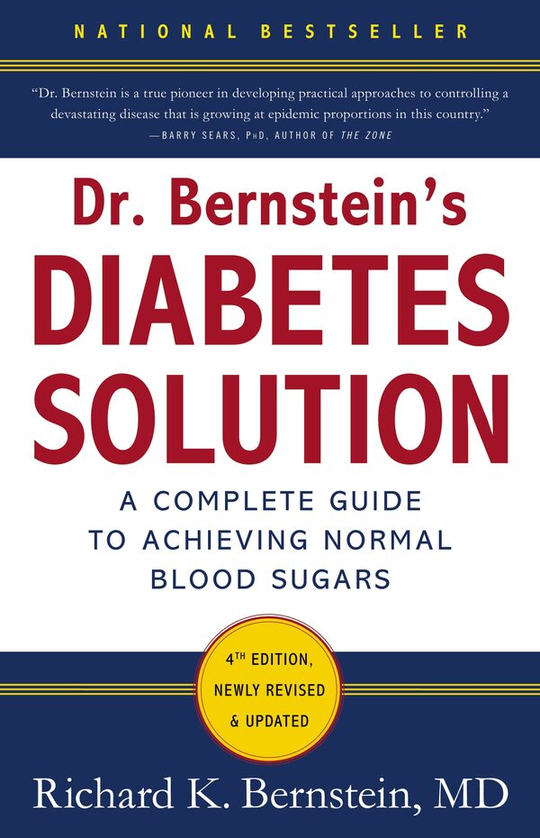
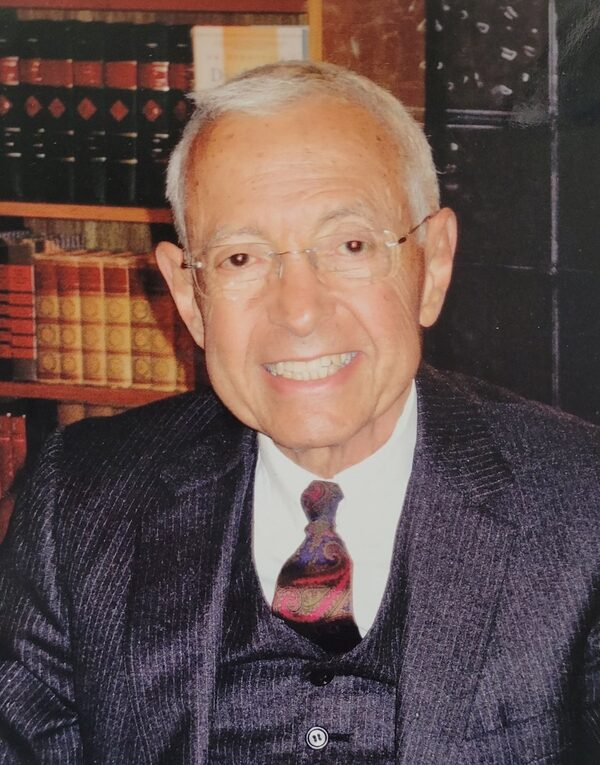

# 《伯恩斯坦醫師的糖尿病治療方法：血糖正常化的完整指南》第四版選譯
<!-- DS-V4F checked, 20260812-->
<!-- https://www.hachette.co.nz/richard-k-bernstein/dr-bernsteins-diabetes-solution-a-complete-guide-to-achieving-normal-blood-sugars-4th-edition -->
|   |   |
|---|---|
|`
source: www.hachette.co.nz/richard-k-bernstein/dr-bernsteins-diabetes-solution-a-complete-guide-to-achieving-normal-blood-sugars-4th-edition
`{=html}`\newline \scriptsize{source: www.hachette.co.nz/richard-k-bernstein/dr-bernsteins-diabetes-solution-a-complete-guide-to-achieving-normal-blood-sugars-4th-edition}`{=latex}|`
source: www.dignitymemorial.com/obituaries/forest-hills-ny/richard-bernstein-12340343
`{=html}`\newline \scriptsize{source: www.dignitymemorial.com/obituaries/forest-hills-ny/richard-bernstein-12340343}`{=latex}|

* 以下是從《伯恩斯坦醫師的糖尿病治療方法》第四版（《Dr. Bernstein's Diabetes Solution: The complete guide to achieving normal blood sugars》,4th edition, Little, Brown & Company, 2011）選擇性地翻譯我自己覺得有趣的段落或部分章節；這本書目前沒有中文版，如果有興趣且可以進行英文閱讀的讀者請務必取得參閱，相信會對疾病治療有極大的幫助（電子書版本目前仍可購買取得）。  

  Richard Bernstein醫師已於2025年4月15日離世，享壽90歲。

* This post is a selected Chinese translation from 《Dr. Bernstein's Diabetes Solution》, 4th edition, Little, Brown & Company, 2011. I just choose paragraphs and partial chapters, which interest me, as materials for personal translation exercises. If there is anyone who is interested in this endocrine disorder, please go get this book and read it thoroughly. The knowledge and treatments in it should have great therapeutic value on this disease and its complications.  

  Dr. Bernstein died on April 15, 2025, at 90 years of age.

* 伯恩斯坦醫師油管：[https://www.youtube.com/\@DrRichardKBernstein](https://www.youtube.com/@DrRichardKBernstein)

* 譯者簡介：  
林詠盛(Louis)，1985年生，高中肄業。14歲時精神狀況出現嚴重問題，遲至19歲才被發現罹患第一型糖尿病、並隨即接受傳統治療。30歲後身心狀況急劇惡化，但有幸於35歲時接觸到Bernstein的著作及斷食、極低碳水飲食等治療方法，不僅精神狀況有所改善、傳統治療的後遺症及併發症也獲得了極大的療癒。

* About the Translator:  
Louis Lin (Lin Yung-sheng), born in 1985, left secondary school without completing studies. From around the age of fourteen, he suffered from serious psychological difficulties; it was only at nineteen that he was diagnosed with type 1 diabetes, after which he commenced conventional medical treatment. His physical and mental health deteriorated sharply after his thirtieth year, yet at thirty-five he was fortunate enough to encounter Dr. Bernstein's writings together with therapeutic approaches including intermittent fasting and a very-low-carbohydrate/high-fat diet. These not only alleviated his psychiatric symptoms but also brought about a marked recovery from the adverse effects and complications of the conventional treatment he had earlier received.

\- [louisophie@gmail.com](mailto:louisophie@gmail.com)  
\- [louisophie.github.io/withinretreat/Article-list.html](https://louisophie.github.io/withinretreat/Article-list.html)  
\- [withinretreat.louisophie-gitlab.workers.dev](https://withinretreat.louisophie-gitlab.workers.dev)  
\- [x.com/louisophie_](https://x.com/louisophie_)  
\- [withinretreat.blogspot.com](https://withinretreat.blogspot.com)  
\- [louisophie.wordpress.com](https://louisophie.wordpress.com)  
\- #糖尿病治療 #飲食科學 #糖尿病 #中文翻譯 #diabetes #dietary #translation #RichardKBernstein  
\- Re-edited in Aug. 2026

`
`{=html} <!-- Horizontal line for html-exporting  -->
`\newpage`{=latex}

### 書籍簡介

自1997年第一版發行至今，本書早已成為糖尿病患者治療與血糖控制的聖經：作者使用不同於傳統治療的革新方法，不只幫助了許多病患達成被他人視為不可能的血糖正常化目標，自己更是本書治療方法的最佳代言人。他於12歲時罹患第一型糖尿病，後在任職一間成功企業的執行長與工程師期間，他嘗試了各種治療方法來將自己的血糖穩定控制下來，並成功逆轉了困擾長達十多年的長期併發症。作者在45歲時，為了能夠發表他的治療論文而申請就讀醫學院，之後便開始行醫治療其他的糖尿病患者。

在此新版書中，伯恩斯坦醫師用平易近人的言語詳細介紹了他的治療方法，除了可使血糖穩定正常外，對糖尿病併發症也可以有效預防乃至逆轉；他在書中也舉出了許多新型的治療儀器、胰島素藥劑、治療藥物與營養補充品的相關資訊。作者也解釋了肥胖與第二型糖尿病之間的關係，並指出打破肥胖與胰島素阻抗之惡性循環的實際方法；另外作者也提到了腸泌素類似物（incretin mimetics）`¹`{=html}`\footnote{譯注：此即GLP-1（類升糖素胜肽-1）。GLP-1的使用後遺症報告與數據目前（2026）仍在持續增加，用藥前請務必查閱相關論文及報導。
。}`{=latex}的使用細節，目的在減緩患者碳水化合物欲求及過食問題、以期能夠較快速且容易地減重。伯恩斯坦醫師尤其著重於飲食治療，在書中不只解釋了須避免的食物、也會詳細說明餐點的內容設計原則，書末更提供了50道低碳水、高蛋白質的佳餚食譜。

作者在書中也討論了各項治療的最新科學進展，包括胰島素阻抗、血糖測量方法、胃輕癱（gastroparesis）、新式減重藥物與運動技巧等等的重要知識。這是一本能夠同時幫助第一及第二型糖尿病患者，協助其控制好並正常化血糖的唯一指南，目的在幫助糖尿病患者主宰自己的疾病，並過上更好、更健康的人生。
`
¹譯注：此即GLP-1（類升糖素胜肽-1）。GLP-1的使用後遺症報告與數據目前（2026）仍在持續增加，用藥前請務必查閱相關論文及報導。
`{=html}

### 作者簡介
`
source: www.youtube.com/post/Ugkx7it7hP_XiZq9gD7XFYqeysNxdwYai2K5
`{=html}
`\vspace{-0.8em}\includegraphics[width=0.3\linewidth]{./youtube.jpg}`{=latex}
`{\scriptsize source: \url{www.youtube.com/post/Ugkx7it7hP_XiZq9gD7XFYqeysNxdwYai2K5}}`{=latex}

Richard K. Bernstein（理查·伯恩斯坦）醫師是當代治療糖尿病及其併發症最重要的人物之一。他於紐約市的Mamaroneck（馬馬羅內克）以自己的專科診所來專門治療糖尿病與糖尿病前期的病患，同時也是American College of Nutrition（美國營養學會）、American College of Endocrinology（美國內分泌學會）、American College of Certified Wound Specialists（美國認證傷口專科人員學會）會員，並擔任Albert Einstein College of Medicine（阿爾伯特·愛因斯坦醫學院）教師。伯恩斯坦醫師目前已罹患糖尿病超過60年之久。
`

`{=html}
<!-- ii -->

### 「一個理論不管有多切題完善，仍然無法抹去現實世界發生的真相。」——Jean Martin Charcot（尚-馬丁·沙可）。
`\vspace{4em}`{=latex}

### 謹以此紀念並獻給我最敬愛的朋友：

`

Heinz I. Lippmann（海因茨·李普曼）醫師、 Ephraim Friedman（艾弗拉姆·弗里德曼）醫師及 Samuel M. Rosen（薩繆爾·羅森）醫師， 
因為您們始終堅定地認為，糖尿病患者也應該要擁有一般人正常的血糖值。
`{=html}
`\vspace{-0.8em}
{\large\textbf{Heinz I. Lippmann（海因茨·李普曼）醫師、\\
Ephraim Friedman（艾弗拉姆·弗里德曼）醫師及\\
Samuel M. Rosen（薩繆爾·羅森）醫師，\\
因為您們始終堅定地認為，糖尿病患者也應該要擁有一般人正常的血糖值。}}
\vspace{2em}`{=latex}
`\newpage`{=latex}
`

`{=html}
`
—————— 
`{=html}
