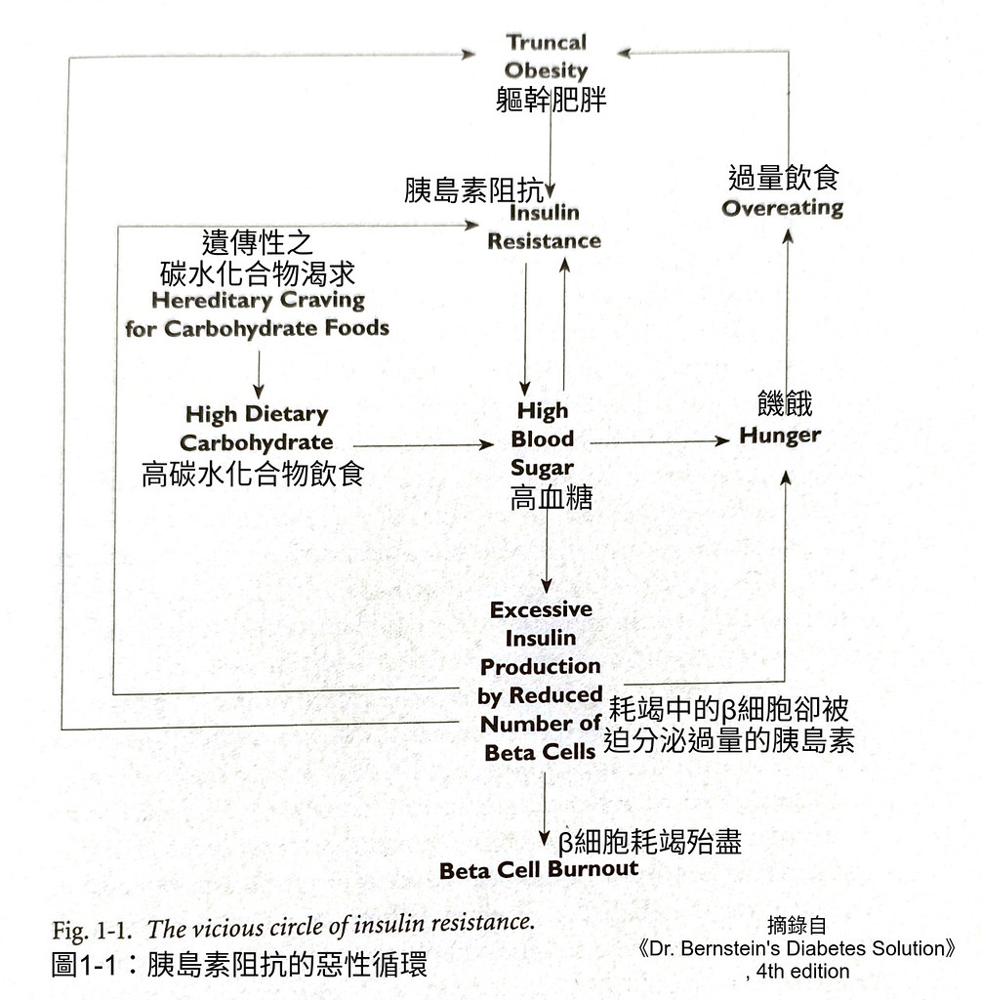
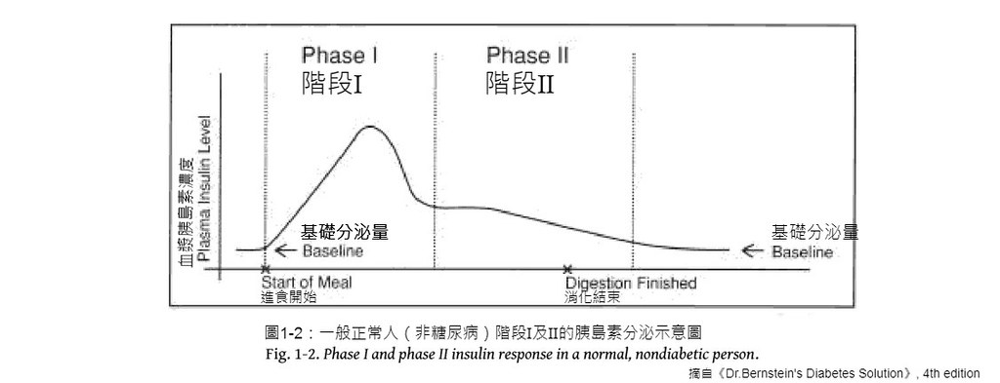
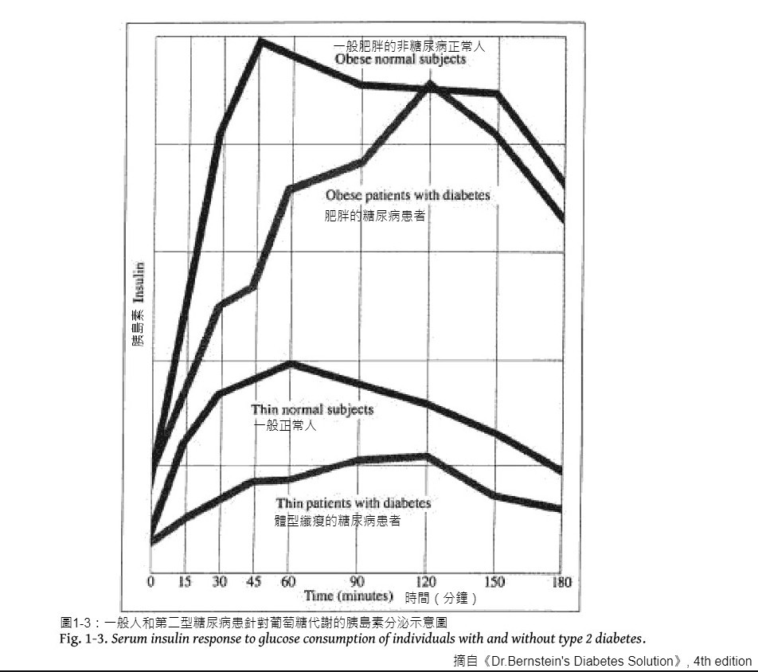

## 單元01

```{=html}
<p style="margin-top:-0.8em; font-weight:bold; font-size:2em;">
糖尿病基礎知識
</p>
```
```{=latex}
\vspace{-0.4em}
{\LARGE\textbf{糖尿病基礎知識}}
\vspace{2em}
```
︙  
︙  
︙  
 
正在閱讀本書的讀者，可能是您或您的伴侶最近被診斷出有相關疾病，或是長期有血糖問題、但卻沒有得到適當治療，而造成諸如視力減退、足部疼痛、肩膀僵硬、陽痿或不持久、侷限性肺疾(restrictive lung disease)、髖部和雙腳疼痛、或是心腎問題等等的併發症。無論讀者您是什麼樣的狀況，有一個觀念非常地重要，就是糖尿病本身這個慢性疾病目前仍是無法被治癒，但卻是完全能加以治療、且各種併發症都能夠完全避免的。像我得第一型糖尿病到現在已經65年了^[譯註：本書2011年出版。]，且這種胰島素依賴性的糖尿病（IDDM）一般而言又遠比第二型、即非胰島素依賴性的糖尿病（NIDDM）更為嚴重，雖然兩者同樣都會對生命造成極大的威脅^[原註：過去有一段時期許多人認為第一型和第二型這樣的分類方式早已不合時宜、應該要用胰島素依賴或非依賴的名稱來區分，可是這又造成了解釋不明的情形而漸漸為人所不喜，因為雖然大多數的第二型病患不用注射胰島素，但仍有不少這些所謂非胰島素依賴性的病人要注射胰島素來作為治療手段之一。另一種分類使用了「自體免疫糖尿病（autoimmune diabetes）」來稱呼第一型病患和「胰島素阻抗糖尿病（insulin-resistant diabetes）」來指明第二型，而這樣的用詞當然精確得多，只是要完全取代簡單的第一、二型分法卻不是那麼容易，而且更麻煩的是最近有研究發現，大多數的第二型糖尿病患也有自體免疫的問題。]。在我那年代大多數的第一型患者早就因為單一或多種的併發症而往生了，可是我這個多年的第一型糖尿病患者卻比大多數比我還年輕的一般正常人都還要健康，而不是處在長期臥病在床或是因病離職的狀態（或是最常見因病死亡的情形）；我一天要工作12個小時，中間還會穿插外出旅行、乘船活動和強力體能的訓練。可是無論如何我並非有什麼特殊能力之人，如果我有辦法控制好我的疾病，讀者您一定也可以。

接下來的段落我會簡單介紹糖尿病的概況，包括在一般正常狀況下身體調控血糖的機制、並說明在糖尿病患者身上到底是發生了什麼事情。在隨後的單元我會討論飲食、運動、和藥物的使用及影響，且讀者會發現到，像對前兩者的說明並不是所謂一而再、再而三的老生常談，而是和醫學教育下的舊觀念完全相反的東西。在書中的許多方法技巧可以幫助病患讓痛苦的併發症不再惡化甚至可以治癒、並能夠預防其它併發症的發生。書裡頭我們也會討論到目前在市面上的新療法和新藥物，並說明它們對血糖控制、減緩肥胖與改善過食問題的療效優劣為何。

### 身體機能的平衡與失衡

糖尿病是身體自我調節系統中，其中一個功能或是部份功能失控的表現樣態，同時造成其它自我調節能力的失衡，又因為全身上下大概沒有任何器官組織可以逃脫高血糖造成的危害，因此常會出現如骨質疏鬆症或皮膚繃硬的情形、過敏和關節僵硬也很常見；血糖高的人除了會有各種併發症，這些病症又會去影響身體其它的器官，其中包括了大腦，因此可能會造成病患短期記憶能力的受損、也會有情緒低落的狀況發生。

#### 胰島素和功用

胰臓是糖尿病研究的重中之重，解剖的人體位置在腹部後半的空腔中，大小大概一個手掌左右，為一巨大的腺體，會製造各種人體荷爾蒙和消化酵素，其中最重要的是負責胰島素的生產、儲存和分泌；即便是一般對糖尿病所知不多的民眾，多少都知道這個人體激素的存在和重要性，知道要有它人體才能活下來。但許多人可能不了解的是，很高比例的糖尿病患是不用注射胰島素就可加以治療的。

胰島素由胰臓的β細胞製造，而它有促進血糖進入體內數以十億計細胞的能力（胰島素會刺激細胞的葡萄糖轉運蛋白移動到細胞表面以增加血糖進入細胞的機會），而調控血糖高低也被視為胰島素的主要功能；它也有刺激大腦下視丘的作用，進而影響到人們的饑餓和飽足感；胰島素也會促進脂肪細胞把血液中的葡萄糖和脂肪酸變成脂肪並加以吸收儲存以供需要時使用。事實上胰島素是人體合成增生的荷爾蒙，為組織和器官成長所不可或缺（原註：合成（anabolic）代謝和分解（catabolic）代謝兩類荷爾蒙在體內互相協調合作，分別負責增生和裂解各式組織），且即使是在進食前、葡萄糖尚未進入血液中，胰島素仍持續地被分泌釋放出來，只是當量過多時會造成生長過度，造成像是肥胖和血管組織細胞的增大；它同時也和其它激素維持正／逆調控的平衡狀態。其它的細節在後續段落會再加以討論。

胰島素嚴格調控血糖的其它方法是促進人體肝臓和肌肉的糖原（glycogen，即肝糖）儲存與分解：當血糖過低時，身體就會分解這種澱粉類的人造物質來拉高血糖值，甚至血糖只有略微的下降（如激烈運動後或斷食）也是如此；而糖原分解成葡萄糖的過程（糖原分解，glycogenolysis）是由胰臓α細胞分泌的荷爾蒙升糖素（glucagon）所控制，只要肌肉或肝臓因升糖素而把糖原分解成葡萄糖，血糖就會開始上升。而當體內的葡萄糖和糖原皆被耗盡時，肝臓便會把體內儲存在肌肉和一些重要器官中的蛋白質轉變成葡萄糖（腎臓和小腸也會執行小部份的轉化工作）（譯註：蛋白質轉變成葡萄糖的過程稱為糖質新生glyconeogenesis）。

#### 胰島素與第一型糖尿病

不過近90年前（譯註：本書2011年出版）胰島素才開始被用於第一型糖尿病患身上，以取代患者自身所剩無幾甚至是完全沒有胰島素的情形，否則的話下場必為死路一條，而這可由大多數在確診後不出幾個月即死亡得知。在欠缺胰島素的情況下，血糖會飇升至高毒性的危害程度，各種細胞也會因無法利用血糖而導致其養份不足；更有甚者，基礎胰島素分泌的不足或是完全缺乏會導致肌肉和重要臓器的蛋白質經由肝、腎及小腸而加速糖質新生，再使血糖更加居高不下，而腎臓同時也為了要把大量的糖分排出體外而造成頻尿，病患會因此感到口渴不止、甚至會有脫水的情形發生；最後整個饑餓的身體就這樣一直把蛋白質轉換成葡萄糖而陷入惡性循環之中。

古希臘人把糖尿病形容成人體會融化變成糖水的疾病；而當身體組織沒辦法利用血糖時，脂肪就會被分解來產生能量，並會生成酮體這種副產品，而當其累積濃度過高就會產生毒性，且腎臓為了要把多餘酮體排出體外，又會再使水份流失的情形更加地嚴重（詳情請參閱單元21〖脫水及其疾病與感染的處理〗中有關酮酸中毒（ketoacidosis）和高滲透壓昏迷（hyperosmolar coma）的部份）。

即使到了今天第一型糖尿病仍是非常嚴重的疾病，若沒有正確地使用胰島素加以治療便會死亡；只是有了胰島素之後，現在仍有兩種情形會在病患身上發生：一種是因為血糖過低而在短時間內致命，像是開車時因判斷力降低或是失去意識而發生事故；另一種則是緩慢而痛苦地死亡，如因長期血糖控制不良造成的心、腎相關併發症。以我自己為例，在我找到方法控制好血糖之前，我有好幾次因低血糖而造成車禍的經驗；我現在還能夠活著寫下這些東西，純粹只是運氣好使然而已。

第一型糖尿病發病成因至今仍無法完全明瞭，但有研究指出這是一種自體免疫疾病，因免疫系統攻擊胰臓β細胞造成胰鳥素分泌出了問題。只是病因為何暫且不論，它造成的致命性後果卻是可以完全加以預防的；愈早被發現，愈早把血糖穩定下來，病患的整體生活就會愈輕鬆。事實上許多的第一型糖尿病剛被診斷出來時，身體都還有能力可以分泌少量的胰島素，而這裡的一個重要觀念是：如果疾病可以愈早治療且使用正確的治療方法，病患殘餘僅存的胰島素分泌能力往往都能夠保留下來。第一型糖尿病通常在45歲前發生且往往突如其來地降臨在病人身上，並伴隨著體重大量減輕、口渴不止和頻尿；只是現在我們知道表面看起來是突然出現，它對身體的影響卻很早就開始了，且在許多常規商用實驗室做的體檢數據都能夠偵測出來。當然愈早發現就愈有機會在疾病的早期階段積極地加以治療，便能夠終止病情惡化乃至避免最後的突然爆發。像我自己體內已經分泌不出高於檢測數值最低標的胰島素了，原因是在我糖尿病發病第一年的高糖尿病徵，就已經把我胰臓分泌胰島素的能力給徹底耗竭殆盡了；所以為了活命，我便需要注射胰島素，不然只有死路一條。但是我堅定認為且從我醫治的病人身上得到確認，要是當初我發病就診時能夠獲得現在我教給病人的飲食訓練和治療方法，我剩餘的胰島素分泌能力是非常有機會可以保留至今的，而我對胰島素的注射劑量也就能夠減輕，在血糖的控制上也就會更加輕鬆許多了。

#### 血糖正常化即是回復身體平衡

︙

︙

︙

人總是會死，但是我們不要死於諸如失明、截肢這種緩慢又痛苦的糖尿病併發症，這從我自己和病患的經驗裡頭都可以完全同意這個想法。

糖尿病控制與併發症試驗（DCCT）是一個由美國國家衛生院（NIH）轄下的糖尿病與消化和腎臟疾病協會(NIDDK)在1983年執行的10年研究計劃，目的是在測量第一型糖尿病患在血糖控制有所進步的狀況下，對身體會有多大的影響；實驗中病人血糖被盡可能維持在所謂「正常」的範圍內（我自己病人的血糖值遠比這些受密集治療的研究對象要更加正常多了，原因就在於我們要求的低碳水化合物飲食），並被觀察到有極大的長期併發症減緩效果。研究人員預估像是視網膜病變可能會達到33.5%、即⅓的停止惡化，但令人吃驚的是，他們發現到對於早期的該病症，有高達75%的減緩效果，而對其它的併發症也有同樣巨大的功效，也因此他們決定提早公佈實驗數據以利社會大眾；這些數據包括了50%的腎病變減緩、神經受損有60%減緩、心血管疾病有35%減緩，且這些功效在實驗結束的多年以後仍持續存在。這些數據在會議上公布時我人正坐在台下，許多的醫生為此而高聲歡呼，可是對於我所堅持的糖尿病患應有和正常人一樣血糖值的論點報以不屑一顧態度的，就正是這同一批人。事實上我對血糖控制的功效更加地堅定，就跟我許多的病人一樣，若有著真正正常的血糖值，所有的這些併發症都可以得到100%的減緩作用。參與DCCT患者的起始平均年齡是27歲，如果他們年紀再大些或是研究時間再拉長一點，在心血管和其它併發症的減緩率應會再往上提升。也就是說要是可以把血糖控制在完全正常的範圍內，所有的糖尿病併發症就可以完全的避免。無論如何，糖尿病控制與併發症試驗是有價值的，因為這說明了積極監測和控制血糖至正常值的重要性，且愈早開始愈好，投入的時間與金錢也可以不用像實驗數據所呈現的那麼巨大。

#### 胰島素阻抗的第二型糖尿病

除了上述的第一型外，最常見的就屬於第二型糖尿病了。依美國糖尿病協會數據，有90～95%的糖尿病患都屬於第二型，且在65至74歲的美國人中有高達¼有此疾病；另外一份2002年耶魯大學的研究指出有25%的肥胖青少年也有這類型的問題。

（近期有一個新型態的糖尿病前期疾病叫作成人隱匿遲發性自體免疫糖尿病(LADA)，這種類型糖尿病大都發生在35歲之後，並只有輕微的症狀，發病原因可能是因為在他們體內有檢測出第一型糖尿病胰臓β細胞的谷氨酸脫羧酶自身抗體(GADA)，而且最終這些症狀會發展成完全的糖尿病，並需要注射胰島素加以治療，且這些病徵完全發作時，他們往往比第一型糖尿病患更加嚴重些。）

第二型糖尿病中約有80%的患者過重，且大致分為三種形態，分別是腹部肥胖、軀幹肥胖以及內臓肥胖；另外20%沒有內臓肥胖的患者實際上有輕微第一型糖尿病的現象，他們生產胰島素的胰臓β細胞多少受到了損害（原註：近期有研究指出有的第二型糖尿病患者也發生了一定程度上的β細胞免疫反應）；若有更好的研究可以證明此一現象，那麼就表示所有的第二型糖尿病患都有肥胖的問題（肥胖定義為在給定身高、體格和性別的條件下，體重超出理想重量的20%以上）。

第一型糖尿病的發生原因到現在都還有待商榷，但第二型糖尿病基本上人們就了解得比較完整。如前所述，第二型又有一個賦有意義叫作「胰島素阻抗糖尿病」的名稱，而肥胖——尤其是內臓肥胖——和胰島素阻抗這種身體無法有效利用胰島素來運送葡萄糖至細胞中的現象有著密不可分的關係。基因在這裡有相當程度的影響，並造成絕大多數有肥胖問題的人同時有胰島素阻抗的情形，甚至更嚴重會加重胰臓負擔、到最後耗竭掉所有β細胞為止，就和圖1-1所示的惡性循環一樣；請注意圖中碳水化合物飲食對問題惡化的關鍵角色。以上在單元12會有更詳細的討論。



綜合而言，胰島素阻抗至少來自於遺傳因素和體內送往肝臓血管中的高濃度脂肪（由腹部脂肪分解而成的三酸甘油脂）；在實驗室中，短暫的胰島素阻抗現象可以在動物中直接從肝臓動脈注射三酸甘油脂而製造出來（原註：有新證據指出肌細胞內脂肪（intramyocyte fat）也是造成胰島素阻抗的重要因素）。腹部脂肪和系統性發炎有關，因身體對胰島素的需求增加，於是胰臓便分泌更多的胰島素而形成高胰島素血症（hyperinsulinemia），並進一步間接地出現了高血壓且對整個循環系統造成破壞；而血液中的高胰島素會抑低調節（down-regulate）全身細胞的胰島素受器，消弱其原有的功能，結果這種對胰島素的耐受性（tolerance）又使胰島素阻抗更加地嚴重。簡而言之，遺傳加發炎加送往肝臓的脂肪造成了胰島素阻抗，且血液胰島素濃度跟著上升，接著使腹部脂肪細胞增生更多油脂，再進一步增加血液運往肝臓的三酸甘油脂並加劇發炎情形，再使胰島素阻抗更加地嚴重，胰島素又再被迫大量分泌而出。這就是一種惡性循環，只是這裡面的頭號戰犯——脂肪，來源卻不是飲食中的油脂。事實上，三酸甘油脂一直都在血液中循環著全身血管運行，只是會出現高濃度的現象，主因是碳水化合物飲食和既有的體內脂質而非食物脂肪造成（在單元09〖基礎食物分類〗會討論更多碳水化合物、脂肪和胰島素阻抗的問題），而這裡所謂的體內脂肪即是指內臓肥胖，就是造成問題的最主要原因。因為特定類型脂肪大量集中在腸道周圍（即臓器）而形成嚴重的胰島素阻抗，最後身體因胰島素分泌跟不上而造成血糖失控；有內臓肥胖的男性病患往往會出現腹部腰圍大於臀圍的現象，女性則是以腰圍不小於80%的臀圍尺吋為判定標準。

第一和第二型糖尿病在治療上有許多共同之處，但兩者有一些地方明顯不同。第二型發病過程較緩慢且不易在初期就馬上被人發現，總是要到出現了高血壓、視覺問題或是重複感染（原註：如女性在早期血糖稍微偏高時常會有陰部的感染現象，會造成刺癢或灼燒感）等併發症才會注意到，而且這種疾病在早期的血糖值只要小幅度偏離正常範圍，身體的許多器官如神經、血管、心臓、眼睛等就已經受到了損害；也因為有這種潛藏的性質，又不像第一型若未接受治療就會融化成糖水並在短短數月間死去，此類疾病常被稱為沉默的殺手。第二型人數眾多，造成心臓病、中風、截肢的人數可能比第一型還要多，更不用說也是其它如高血壓、心血管疾病、腎衰竭、失明和勃起障礙的主要成因，又常因為病情進展緩慢而未獲治療或治療不積極，更使其各式併發症狀加劇。在治療方法上，多數的第二型病人不需要注射胰島素，原因是由於胰島素阻抗的關係，他們體內的胰島素濃度往往高於一般正常人，只是血糖無法降至正常數值（可是脂肪增生的能力卻不受影響），若再加上沒有得到正確治療的方法，最終他們胰臓的β細胞會被完全耗竭，結果就會和第一型糖尿病患一樣，要靠注射胰島素才能夠存活下來。

### 正常人和糖尿病患的血糖值

高血糖是糖尿病最明顯的病徵及造成各種長期性併發症的根源，因此理解血糖的來源和身體使用的機制，對疾病治療是有意義的。在飲食上血糖的供給分別來自碳水化合物和蛋白質，而糖類為一種簡單的碳水化合物，在食用後會刺激大腦產生許多神經傳導物質（主要是血清素serotonin；大腦透過這些物質和身體進行溝通），而使人有舒緩焦慮、感到平和甚至是狂喜的情緒反應，所以對這些神經傳導物質有濃度不平衡或是敏感性太高的人，吃糖很容易會有成癮的情形發生；當血糖偏低時，身體也會由肝、腎、及小腸透過糖質新生把蛋白質轉換成葡萄糖，只是速度緩慢且效率不彰，且這個生化機制沒有辦法逆轉，也就是說身體沒有辦法把葡萄糖轉變成蛋白質。脂肪也沒有辦法轉變成糖類（譯註：食用脂肪也會刺激糖質新生但影響輕微），但藉由胰島素的作用，脂肪細胞卻能夠把葡萄糖轉變成飽合脂肪。 　　就味道而言，蛋白質當然不像碳水化合物有著刺激情緒的作用；小孩並不會在雜貨店內跳上跳下要求母親買牛排或魚類當零食而是會要餅乾。食用蛋白質仍會使血糖上升，但作用卻是相當緩慢且幅度有限，而這就是我們糖尿病患可加以利用以使血糖正常化的利器。

#### 一般正常人的血糖

一般人或是大多數第二型糖尿病患在未進食的情況下，胰臟會持續分泌低濃度的胰島素，這也就是所謂的基礎胰島素分泌，而這樣的分泌量可以抑制體內蛋白質（在肌肉和重要器官中）轉變成葡萄糖的糖質新生作用，也因此能夠使得血糖保持穩定而不會失控上升；正常人的血糖值總是維持在一個固定的範圍內且不易有太大的變動，其值大約是在70～95mg/dl（毫克／百毫升）間，以單一數值而言大部份的人則是在83mg/dl左右上下升降；有時候血糖會短暫地驟升至160mg/dl或跌落至65mg/dl，但對一般非糖尿病的人來說，這種大幅度的升降是很少會發生的。在一些糖尿病文章中會把所謂的「正常」血糖值定義在60～120mg/dl之間，有的甚至會高到140mg/dl，可是一般正常人是不會有這種數值的，除非是食用大量的碳水化合物才會如此。像這樣所謂的「正常」完全是相對而言的東西，對於一般醫師的診療上則會是「成本效益」的考量：一方面是飯後血糖值140mg/dl並沒有被認定為罹患糖尿病，而這些人在一段時間過後體內的胰島素仍會把血糖降至合理的範圍，因此多數的醫師不願意浪費他們寶貴的時間在這種人身上，最多只會告誡對方要減重或是注意糖類的攝取，可是實際上這種血糖值常常高達140mg/dl的人，往往很容易會變成徹底的第二型糖尿病；在我的從醫生涯中，我還有看過平均血糖值在120mg/dl、即所謂「非糖尿病」的人身上，發現到多種糖尿病併發症的例子。

我們舉一個例子來說明一般正常人身體使用胰島素的模式：一個非糖尿病患（我們叫她Alice）在晚間就寢的過程中，身體會持續分泌基礎胰島素（也就是餐前濃度的胰島素）以維持整晚血糖的穩定並抑制糖質新生作用；當早起進食時，早餐內容包括塗了果醬的吐司和柳橙汁一杯（碳水化合物）及煎蛋一顆（蛋白質），而當糖類和澱粉經唾液和小腸的酵素作用，葡萄糖即開始進入血液中，而胰臟也就跟著受到刺激（甚至只是食物進入腸胃時也會有相同的現象）並開始分泌胰島素顆粒（insuline granule）以把上升的血糖濃度給壓下來（見圖1-2），這就是圖中階段Ⅰ的情形；這種胰島素的快速分泌可以迅速調節血糖回降並進一步避免後續碳水化合物造成的波動。在第Ⅰ階段胰島素用畢後，胰臟會重新製造新的胰島素而進入第Ⅱ階段，但其效力卻緩慢得多，其目的在對應蛋白質（如煎蛋）因糖質新生作用而緩慢生成的葡萄糖產出。



在一般非糖尿病患身上，胰島素作為一種介質而能夠有效地透過刺激葡萄糖轉運蛋白在細胞內的移動而使胞外的葡萄糖進入胞內（這是一種特化的蛋白質，它會穿透細胞膜外抓取葡萄糖進入細胞內），細胞就可以利用來執行各種秏能的工作；沒有胰島素的幫助，細胞只能攫取到非常少量的葡萄糖，身體就會因能源不足而無法正常運作。

只要葡萄糖持續進入Alice的血液中，胰臟的β細胞就會不停地分泌胰島素，而其中一部分的葡萄糖會被合成為糖原（一種澱粉類的物質）並被儲存在肌肉和肝臟中；而在糖原的身體儲量額滿後，血液中過量的葡萄糖便會被轉化成飽和脂肪儲存起來。在Alice下一餐（如午餐）進食前，血糖可能會略微偏低，這時候她胰臟的α細胞就會開始分泌升糖素，使得肌肉和肝臟把糖原釋出並分解出葡萄糖而使血糖回升；而減少的糖原存量會在進食時再次被補足。

這種三階段的胰島素分泌模式（基礎分泌、階段Ⅰ及Ⅱ）可以讓Alice的血糖質穩定地維持在安全的範圍，她的身體也可獲得足夠的能量；可是像這樣的混合餐點可以在她身上被完善地處理吸收，對第一和第二型糖尿病患卻完全不是這麼回事。

#### 第一型糖尿病的血糖

現在讓我們來看看像我這樣一個第一型的糖尿病患者，要是吃了一樣的早餐後會發生什麼事情。因為胰島素不足的關係，在睡前我必須注射長效的胰島素，在早上睡醒時才可能有正常的血糖值，但它並不會保持不變，而是會在起床後就開始上升；這種現象和進食無關，就算我沒吃早餐也會有一樣的狀況。我們的肝臟會一整天不斷持續地從血液中代謝掉胰島素，但這在早上起床後的數小時間其速率會加快，導致我注射的胰島素濃度跟著下降。這個現象被稱作「黎明現象」（dawn phenomenon）；對我而言就算沒吃早餐，我的血糖也會上升。對一般正常人而言，體內會多分泌胰島素來抵消被加速代謝的情形，可是對像我這種徹底的糖尿病患者，就必須好好監控黎明現象對身體血糖造成的影響，並學習如何用胰島素注射來處理血糖的狀況。

進食的消化過程基本上和Alice一樣，當唾液酵素開始分解果醬和果汁中的糖分時，我的血糖幾乎是立刻就開始上升，而就算只吃吐司，唾液、小腸的酵素和胃酸也會在極短的時間內把澱粉轉變成葡萄糖並進入血液中；但問題是我胰臟的β細胞已經分泌不出儀器可以偵測到的量了，當然也就沒有階段Ⅰ大量分泌積存胰島素的能力，我的血糖在沒有注射飯前胰島素的情況下就會快速上升，且這些葡萄糖並沒有辦法被轉化成糖原和脂肪被儲存起來，而是會被腎臟經由尿液給排出體外，但身體卻已經受到高血糖的傷害了；要是我沒有注射胰島素的話，沒有多久我就會耗竭而死。

像在這種狀況下，有一個問題會自然浮現而出：碳水化合物會造成血糖上升，那麼只要注射胰島素來互相抵消不就可以了嗎？答案是：這是做不到的！這種以注射胰島素來處理吃進糖類的血糖快速上升一直是個錯誤觀念，卻又常被那些所謂的健康護理專家奉為圭臬，因為不論是注射胰島素或甚至是使用胰島素幫浦，都和身體自然分泌的胰島素量能無法相提並論，也因此這種傳統的胰島素和飲食治療往往造成飯後的高血糖（譯註：或是低血糖），長期下來就會造成各式併發症，也等於是走上了一條緩慢、日益嚴重又無聲無息的死亡不歸路。在階段Ⅰ所分泌的胰島素幾乎是立即進入血液中，以極快的速度把血糖降至正常的範圍；但由於注射胰島素是經由脂肪或肌肉（還有靜脈，但不常見）進行輸送，因此身體吸收速度並不快，像現有的最速效胰島素（譯註：2011年）也要大約20分鐘藥效才會開始發揮，最大藥效出現時間約在數個小時之間，而這根本沒有辦法處理與避免在食用如麵包這種快速分解的碳水化合物所造成血糖上的各種身體危害。

這種飲食（即碳水化合物）造成的血糖迅速上升是第一型糖尿病最核心關鍵的問題。就我自己來說，我基本上己經沒有辦法產生胰島素了，所以我每次餐前都要先注射，但我仍從數十年前就開始不再吃大量或任何會快速分解的碳水化合物了，其目的就是要避免隨之而來的血糖上下波動和長期併發症；就算是用胰島素幫浦（單元19《積極胰島素治療》末有討論）的方式來進行注射，也沒有辦法做到像一般正常人一樣有穩定平衡的血糖區間。

相反地，因為我只吃早餐裡頭的蛋白質，我的血糖就不會快速上升至危害的濃度，而是會藉由比較緩慢的糖質新生慢慢地釋出葡萄糖，血糖上升速度也相對緩和些，因此只要小劑量的胰島素就能夠有效地對治，血糖上下振蕩的現象就可以避免（值得一提的是飲食脂肪對血糖沒有直接的影響，但卻會對碳水化合物的吸收有輕微減緩的作用）。

總地來說，我這樣的作法，即只吃蛋白質和少量碳水化合物（只吃分解緩慢類的）並配合胰島素注射，基本上可以看作是模仿正常人階段Ⅱ的生理反應，而這比起人為模擬階段Ⅰ的作法要容易許多且可行。

#### 第二型糖尿病的血糖

我們以第二型患者Bob為例來說明身體的現況。Bob高6尺（183公分）但重300磅（136公斤），且大部份的脂肪都累積在他的腹部；這種情形就如前所指出的，有80%以上的第二型都有過重的問題。要是今天他只有170磅（77公斤），可能就不會有相關的疾病了；但他己經有胰島素抗阻的現象，且其分泌量己經不足以維持正常的血糖濃度。如前所述，過重和胰島素抗阻有密切關係，其關連性不外乎是基因遺傳與內臟及全身脂肪跟肌肉的比值，尤其是後者的相關性更直接，因為比例愈高，其胰島素抗阻往往也愈嚴重；因此不管一個體重過重的人有沒有糖尿病的問題，相對於一個年齡和身高相同但身材正常適中的人來說，過重的身體會因各種原因（體重、糖類攝取和胰島素抗阻）而被迫分泌出高達2～3倍的胰島素(見圖1-3；許多有低脂肪量和高肌肉比率的運動員，對胰島素的需求和分泌就會相對較少）。也因為這種多年下來的大量分泌現象，Bob胰臟的功能已部份受到耗竭、儲存胰島素的能力下降甚至是完全失去，造成他在階段Ⅰ的胰島素反應不足，結果就造成雖然有大量的胰島素分泌、血糖卻沒有辦法維持在正常範圍的情形（有許多來我診間的病人是希望要治療肥胖問題而不是糖尿病，可是在檢查報告中卻發現到大多數這些所謂過重的「非糖尿病」患者卻有著稍徵偏高的糖化血色素（即平均血糖））。



接下來是Bob在起床並進食的生理運作：他在清醒後的血糖質可能是正常的（原註：對病情較輕微的第二型患者，起床時血糖（斷食血糖）往往都是正常的，只是在吃下碳水化合物的飯後血糖值通常會偏高），但因為胰島素抗阻的關係，他的血糖與Alice和我有著不同的反應。我們假設Bob食量比較大，他吃了二杯果汁、四片吐司及二顆蛋，而在幾乎吃下吐司和果汁的同時，他的血糖也會立即開始上升。但和我不同的是，Bob身體仍會分泌胰島素（胰臟會很辛苦地工作以滿足其基礎胰島素的需求），但在儲存的能力不足或消失的情況下，他階段Ⅰ的分泌會受到影響，但階段Ⅱ的分泌能力卻基本上可以運作，也就是說他的血糖終究能夠回復到正常的範圍，只是要花比較長的時間（可能是飯後好幾個小時），但在這個過程中身體就會受到高血糖的傷害。這種胰島素過量分泌的現象，不只是會造成脂肪的累積（胰島素是脂肪生成的激素），也會使Bob食慾旺盛而更加肥胖（胰島素也會刺激大腦中掌管進食行為的各個中樞），結果就會是如圖1-1所示的惡性循環：因為身體有胰島素抗阻，Bob的胰臟要分泌更多胰島素來處理碳水化合物造成的血糖快速上升，但這同時也會增加體內脂防的生成；在身體持續進行脂肪和糖原的轉換時，血液中其餘的葡萄糖卻無法被細胞有效地吸收利用，使得Bob的血糖值居高不下，而且他沒辦法有飽足感、於是只好又再度進食，β細胞又會再被迫分泌更多胰島素，然後大量的胰島素和大腦負責食慾控制的區域又會再驅使他吃更多的東西；他可能會再吃一片吐司沾果醬當點心、希望可以讓自己撐到午餐時間，但這又會再使他的血糖升高、β細胞又再度被迫工作，更不用說長期下來已有部份β細胞已被耗竭而讓其餘的負擔更重（原註：β細胞本身被過度刺激與高血糖造成的毒性環境都會導致其耗竭）；而且就算吃了東西，他的饑餓感還是不易得到滿足。總而言之，Bob的血糖值不會像我在沒有注射胰島素的情況一樣會無止盡地飈升，可是因為他只能藉由階段Ⅱ的分泌模式下去運作，他的飯後血糖必須要花數個小時（且沒有再進食的條件下）才能回復至正常的數值。


可是所謂飯後血糖正常值的認定卻有非常大的差異。我認為其值要是達到140mg/dl甚至高到200mg/dl，都是我完全無法接受的數字，但對於許多的醫師而言卻不值得花時間加以治療，因為第二型患者體內仍有足夠的胰島素而終究能夠把血糖降至正常或是「可接受」的程度；他們認為這種血糖「輕微」上升的現象只不過是葡萄糖耐性障礙（impaired glucose tolerance, IGT），最多採取的治療方法就只是「再觀察看看」而已。要是第二型病患、就像例子中的Bob，可以在胰臟的β細胞開始耗竭前就接受積極治療的話，那他就可以進行減肥、把血糖降低並保持平穩、進而能夠減輕胰臟的負擔，甚至有可能像我的一些病人一樣，在減重成功後就「治癒」了糖尿病。無論如何，我的信念是：在糖尿病的早期就要進行積極的治療並做好血糖的監測，如此可以替病患省下大量的時間與避免各式併發症造成的痛苦，也同時可以因病情得到緩和而使後續的治療變得輕鬆又易於執行。

### 未來可能的治療方法

在這一單元的最後我要討論一些糖尿病未來可能的治療方式（譯註：2011年）以作為患者在學習階段的強心針和參考之用；只是在這些技術成熟前，我們仍要保持理性且以維持血糖穩定為最重要的目標，並抱持樂觀的態度來看待日新月異糖尿病研究的發展。

第一個方法是在實驗室複製胰臟的β細胞後再植入病人體內以回復其原有的分泌功能；研究人員正持續把技術發展的更加完善，並往更容易執行和費用更符合成本效益的方向邁進。這項相關技術的早期研究是非常激勵人心的；以這個方法而言，在重新植入β細胞之後會有兩種情況：第一種是體內沒有發生自體免疫，則至少就理論上來說，病人算是永久治癒糖尿病了；第二種是有自體免疫攻擊的發生，而病人便需要再次植入細胞才行。

第二個方法也同樣令人期待且當下正在進行臨床試驗（clinical trials），也就是直接把在臟管內的β細胞前驅體（同樣也是一種細胞）經由簡單的肌肉注射投入特定的蛋白質來使其轉化成β細胞，也因此可以免去取出再植入的步驟。這個方法現在幾個研究中心持續進行實驗中，以觀察其實際效果（efficacy）與是否會有相關的後遺症發生。

第三種方法是在肝和腎臟中注入分泌胰島素的相關基因。這是一個很有機會成功的治療技術，在老鼠的實驗也成功治癒其糖尿病，只是在實際應用上還有一些困難尚待克服。

第四種同樣是填補β細胞不足的方法，是注射一系列的蛋白質到體內以刺激剩下的β細胞自我複製至原有的數量；這個技術同時由兩家互相競爭的公司進行研發，且在動物身上成功治癒了糖尿病。

以上這些治療方法都有一個共同的問題，那就是體內的免疫系統可能會把新生成的β細胞給再次催毀掉。其中一個有可能繞開此情形的作法，是想辦法把特定有攻擊性的白血球細胞給分離出來並加以研究其性質（我自己有一項分離技術的專利），再設法讓身體停止形成該種細胞。一般而言，大多數的糖尿病患甚至是大多數第一型患者，體內都還有可以增生複製的β細胞存在，只是它們新生出的細胞會馬上被白血球給破壞掉（其速度甚至會更快），而要是能把該白血球細胞給獨立分離出來並加以培養，就可以製造出疫苗並施打，進而使其免疫系統反過來對該白血球細胞加以摧毀，則病患僅存的β細胞就有機會可以增生，糖尿病也就可以被治癒了；但是這可能沒有辦法完全解決問題，因為這些「前糖尿病」患者可能每隔幾年就要進行一次抗體的注射，以防止β細胞被攻擊的情形再度發生。

以上所談的各種β細胞增生的治療方法，對許多像我這種第一型和其它一些糖尿病患者卻不一定適用，因為如果要獲得比較好的效果，病患體內必須要存有β細胞才行；但以我自己為例，在這六十多年的時間中，我的β細胞可能早已完全耗竭殆盡了，那這樣要如何進行治療呢？要是我的疾病有在更早期就被診斷出來（就算只早個一年也很好），而且當下馬上利用注射胰島素來把血糖給控制在正常範圍內，我就可以減輕殘存β細胞分泌的壓力，說不定還有機會能夠保留一些下來。

許多人（包括罹病孩童的家長）都視注射胰島素為畏途，因為在他們心中這表示他們（或是小孩）真的得到了糖尿病且病況到了危急的地步；病人或家長往往會病急亂投醫，想要看是否能在不使用胰島素注射的前提下來改善病情，但結果往往使得β細胞加速耗竭殆盡。在我們社會的普遍意識中（譯註：指美國）總是認為一但用藥，身體就沒有辦法重回健康的狀態了（這當然是毫無道理的），因此有的病患會希望改用其他「自然」的療法以避免打針、甚至到我要哀求拜託他們接受的地步。事實上，能夠使病人體內「自然」僅存的β細胞不被徹底耗盡，這就是最「自然」的狀態，而胰島素注射可以幫助病人維持β細胞的生存，這樣在未來隨著技術發展成熟，病患體內就有最好的藥物並隨時可以派上用場。但以上的條件是病人的β細胞還沒有被完全摧毀掉才行得通，而這又表示病人的血糖必須是在正常範圍內、且必要時願意接受胰島素的治療才行。
